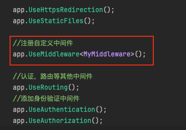
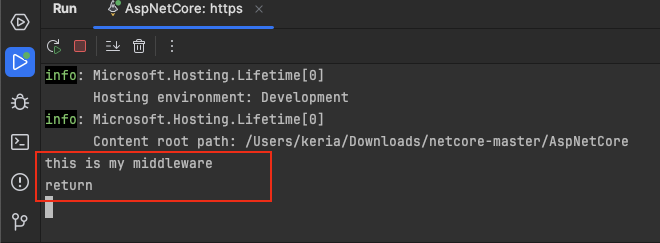
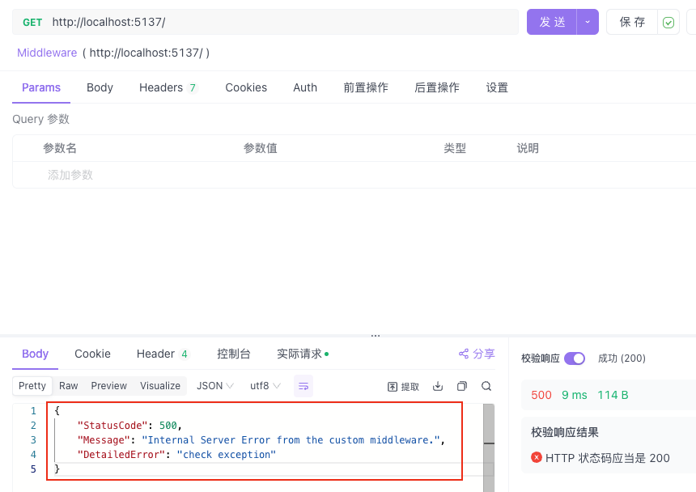
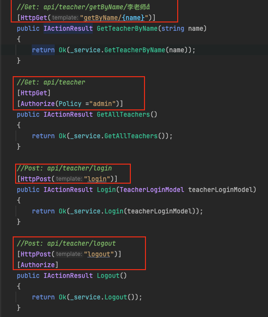

# 生命周期

ASP.NET Core 应用的生命周期由宿主控制。宿主负责应用启动和生命周期管理。生命周期的关键事件包括：

- **启动**：应用开始启动时，宿主构建服务容器，然后启动服务，包括 HTTP 服务器（如 Kestrel）。
- **运行**：应用处于运行状态，处理传入的请求。
- **停止**：应用接收到停止命令时，宿主将触发应用终止前的清理工作。


# 中间件

中间件是 ASP.NET Core 应用处理请求和响应的组件。中间件以管道方式组织，请求通过一系列中间件，每个中间件可以对请求进行处理并传递给下一个中间件，或者直接返回响应。原理图如下：


多个中间件时，中间件请求和相应的顺序相反

中间件的设置通常在 `Startup.Configure` 方法中配置，例如使用身份验证、错误处理、静态文件服务等。

```
public void Configure(IApplicationBuilder app)
{
    app.UseStaticFiles();
    app.UseRouting();
    //身份认证中间件
    app.UseAuthentication();
    app.UseAuthorization();
    
    app.UseEndpoints(endpoints => {
        endpoints.MapControllers();
    });
}
```


## 自定义中间件

### 第一个自定义中间件

在 ASP.NET Core 中，创建自定义中间件可以执行特定的功能，比如日志记录、异常处理、请求验证等，这些功能会在请求处理管道中的一个特定点执行。

自定义中间件类通常包含以下三个核心部分：

1. **构造函数**：接收依赖注入中提供的任何必需服务。
2. **Invoke 或 InvokeAsync 方法**：处理传入的 HTTP 请求，并可选择传递请求到下一个中间件。
3. **任意必需的附加方法或服务**：辅助完成特定任务。

下面是一个简单的中间件示例：

```
public class MyMiddleware
{
    private readonly RequestDelegate _next;

    public MyMiddleware(RequestDelegate next)
    {
        _next = next;
    }

    public async Task InvokeAsync(HttpContext context)
    {
        Console.WriteLine("this is my middleware");
        await _next(context);
        Console.WriteLine("return");
    }
}
```

1.构造函数接受一个 `RequestDelegate` 类型的参数 `next`。这个参数是一个代表管道中下一个中间件的委托。通过这种方式，中间件可以在完成它的任务后，调用此委托将控制权传递给管道中的下一个中间件。

2.在这个方法中，首先执行的是进入中间件时的操作，这里通过 `Console.WriteLine("this is my middleware");` 输出一条消息。随后，使用 `await _next(context);` 调用了管道中的下一个中间件。这一调用是异步的，意味着当前中间件将等待下一个中间件处理完成后再继续执行。处理完下一个中间件后，它输出 "return"，表示请求处理正在返回通过中间件链的路径。

下一步在`StartUp`中注册中间件



结果



> [!CAUTION]
>
> - **顺序**：中间件的注册顺序非常重要，因为它决定了请求的处理顺序。确保按逻辑正确的顺序注册中间件。
>   - **安全中间件**（如认证和授权）通常需要尽早执行，确保后续中间件处理的是已认证和授权的请求。
>   - **错误处理中间件**（如异常处理）应该早于可能抛出异常的中间件，以便能捕获和处理这些异常。
>   - **静态文件中间件**应该在诸如认证中间件之前执行，因为静态文件通常不需要认证，这样做可以减少不必要的处理延迟。
>   - **路由中间件**（`UseRouting`）应在定义了路由处理逻辑（如 `UseAuthentication`, `UseAuthorization`, 和 `UseEndpoints`）之前执行，这样后续中间件才能知道请求应由哪个路由处理。
> - **异步处理**：中间件的 `InvokeAsync` 方法应该是异步的，这有助于提高应用程序处理并发请求的能力。
> - **异常处理**：自定义中间件应适当处理异常，以避免中间件内部错误影响到整个请求处理流程。


### 全局异常捕获中间件

```
using System.Net;

namespace AspNetCore;

public class ExceptionHandlingMiddleware
{
    private readonly RequestDelegate _next;
    private readonly ILogger<ExceptionHandlingMiddleware> _logger;

    public ExceptionHandlingMiddleware(RequestDelegate next,ILogger<ExceptionHandlingMiddleware> logger)
    {
        _next = next;
        _logger = logger;
    }

    public async Task InvokeAsync(HttpContext context)
    {
        try
        {
            await _next(context); // 尝试执行下一个中间件
        }
        catch (Exception ex)
        {
            _logger.LogError(ex,"error occurred");
            await HandleExceptionAsync(context, ex); // 处理捕获的异常
        }
    }

    private static Task HandleExceptionAsync(HttpContext context, Exception exception)
    {
        context.Response.ContentType = "application/json";
        context.Response.StatusCode = (int)HttpStatusCode.InternalServerError;

        // 这里可以根据不同的异常类型来返回不同的消息或状态码
        var response = new
        {
            StatusCode = context.Response.StatusCode,
            Message = "Internal Server Error from the custom middleware.",
            DetailedError = exception.Message // 在生产环境中应谨慎输出详细错误信息
        };

        return context.Response.WriteAsync(Newtonsoft.Json.JsonConvert.SerializeObject(response));
    }
}
```

第二步，注册中间件

```
 //注册自定义的异常处理中间件
            app.UseMiddleware<ExceptionHandlingMiddleware>();
            
            app.UseHttpsRedirection();
            app.UseStaticFiles();

            //注册自定义中间件
            //app.UseMiddleware<MyMiddleware>();
            
            //认证，路由等其他中间件
            app.UseRouting();
            //添加身份验证中间件
            app.UseAuthentication();
            app.UseAuthorization();
            
            app.UseEndpoints(endpoints =>
            {
                endpoints.MapControllerRoute(
                    name: "default",
                    pattern: "{controller=Home}/{action=Index}/{id?}");
            });
```

把全局异常处理中间件尽可能放在前面，这样就可以确保后面的程序部分出错时，都能被全局异常处理中间件捕获。

效果图：




## 管道分支

不仅可以创建一个简单的线性中间件管道，还可以创建分支管道。这种机制允许在某个点基于某些条件（如请求的路径或头信息）将请求流引入一个单独的中间件分支。这通常是通过 `UseWhen` 或 `MapWhen` 方法实现的。

`Map` 用于根据**请求路径**创建管道分支。例如对于来自特定 URL 路径的请求执行一组特定的中间件操作。

```
public void Configure(IApplicationBuilder app)
{
    app.Map("/api", apiApp =>
    {
        apiApp.UseMiddleware<AuthenticationMiddleware>();  // 只有 /api 路径的请求需要通过这个中间件
        apiApp.UseMiddleware<AuthorizationMiddleware>();
    });

    app.UseMiddleware<LoggingMiddleware>();  // 所有请求都会通过这个中间件
}
```

在这个例子中，只有当请求路径以 `/api` 开头时，请求才会进入 `Map` 创建的分支，并且只有在这个分支中才会使用认证和授权中间件。

`MapWhen` 方法提供了更多的灵活性，允许基于请求的**其他属性（如查询字符串、头信息等）**来创建分支。

```
public void Configure(IApplicationBuilder app)
{
    app.MapWhen(context => context.Request.Query.ContainsKey("param"), appBranch =>
    {
        // 只处理包含特定查询参数的请求
        appBranch.UseMiddleware<SpecialHandlingMiddleware>();
    });

    app.UseMiddleware<RegularMiddleware>();  // 所有请求都会通过这个中间件
}
```

`UseWhen`与 `MapWhen` 相似，`UseWhen` 允许在满足特定条件时执行一个中间件分支，但与 `MapWhen` 不同的是，`UseWhen` 不会阻止请求流回到主管道中。这意味着请求可以继续在主管道中流动，即使它也被发送到了一个分支中。

```
public void Configure(IApplicationBuilder app)
{
    app.UseWhen(context => context.Request.Path.StartsWithSegments("/api"), apiBranch =>
    {
        apiBranch.UseMiddleware<ApiMiddleware>();  // API 相关的处理
    });

    app.UseMiddleware<CommonMiddleware>();  // 所有请求，包括经过上述 API 分支的，都会经过这个中间件
}
```


## 中间件的高级主题

1. **内联中间件**：

   - 除了定义中间件类，你还可以直接在 `Configure` 方法中使用 Lambda 表达式来定义内联中间件。这种方式适合实现简单的功能，无需创建单独的中间件类。

   ```
   app.Use(async (context, next) => {
       // 做一些事情之前
       await next();
       // 做一些事情之后
   });
   ```

2. **条件中间件**：

   - 中间件不必总是对所有请求执行。使用条件逻辑（例如 `MapWhen` 或在内联中间件中使用条件语句），可以基于请求的特定属性（如路径、头信息、HTTP 方法等）决定是否执行某个中间件。

3. **性能考虑**：

   - 由于中间件是请求处理的核心部分，不当的使用可能会影响应用的性能。例如，尽量避免在中间件中进行复杂的计算或阻塞操作。如果需要，考虑异步中间件或后台服务。

4. **错误和异常处理**：

   - 创建专门的错误处理中间件来集中管理异常和错误响应。这可以帮助你更好地控制应用程序的错误输出和日志记录。

   ```
   app.UseExceptionHandler("/Error");
   app.UseStatusCodePagesWithReExecute("/Error/{0}");
   ```

5. **安全实践**：

   - 使用中间件增强应用的安全性。例如，使用 HTTPS 重定向中间件（`UseHttpsRedirection`）和严格传输安全中间件（`UseHsts`）。

6. **自定义中间件的依赖注入**：

   - 中间件可以从依赖注入容器中解析依赖，这使得中间件可以利用同一种依赖注入机制，如服务、配置等。

7. **响应缓存和压缩**：

   - 利用中间件来实现响应的缓存（`UseResponseCaching`）和压缩（`UseResponseCompression`），以提高响应速度和减少带宽消耗。

8. **动态中间件构建**：

   - 有时可能需要根据运行时数据动态构建中间件。这可以通过构建自定义的中间件工厂或使用条件逻辑来实现。

> [!TIP]
>
> - **精简中间件**：每个中间件都应该只负责一件事情，保持简单和专注。
> - **组织和文档**：对每个中间件的作用、条件和执行顺序进行良好的文档记录，使团队成员能够快速理解和维护。
> - **测试**：为中间件编写单元和集成测试，确保它们按预期工作，尤其是涉及安全和数据完整性的逻辑。


# 依赖注入

ASP.NET Core 内建了依赖注入（DI）容器，它提供了一个方法来解耦组件和其依赖关系。服务（依赖）在应用启动时注册到 DI 容器中，并在需要时由容器自动提供给请求它们的组件。

服务的注册通常在 `Startup.ConfigureServices` 方法中完成。

```
public void ConfigureServices(IServiceCollection services)
{
    services.AddControllers();
    services.AddSingleton<IMyService, MyService>();
}
```


# 控制器

控制器是 MVC（模型-视图-控制器）模式中的“C”部分，负责处理请求并返回响应。在 ASP.NET Core 中，控制器类派生自 `Controller` 或 `ControllerBase`，并处理来自路由的请求。

```
public class HomeController : Controller
{
    public IActionResult Index()
    {
        return View();
    }
}
```


# 路由

其实就是将客户端的url请求映射到控制器的动作。通俗一点讲，路由就是用来根据网页url地址找到处理用户请求的程序代码的一套规则。

ASP.NET Core 中支持两种主要的路由配置方式：**传统路由**（有时也称为常规路由或集中式路由）和**属性路由**。

## 传统路由

传统路由通常在 `Startup.cs` 文件的 `Configure` 方法中配置，通过定义路由模板来集中管理路由。这种方式允许你在一个地方定义所有路由规则，适合应用于简单的路由逻辑。它使用路由表来匹配来自客户端的 URL 到相应的控制器动作。

```
app.UseEndpoints(endpoints =>
{
    endpoints.MapControllerRoute(
        name: "default",
        pattern: "{controller=Home}/{action=Index}/{id?}");
        
    //下面这行代码跟上面三行代码的效果一样
    //endpoints.MapDefaultControllerRoute()；
});
```

- {controller=Home}:指明默认映射到Home控制器，就是HomeController
- {action=Index}:指明默认映射到Index方法
- {id=?}:指明路经参数，？代表可选，id参数可有可无


## 属性路由

属性路由允许在控制器或者控制器的动作方法上直接使用特定的属性来定义路由。非常适合构建复杂的应用程序和 RESTful API。

以下是代码示例：




在这个例子中，基础路由是由`api/teacher`，`GetAllTeachers`方法可以通过`api/teacher`或`API/TEACHER`来访问，因为路由不区分大小写。但是在这里我添加了`Authorize`路由，`[Authorize(Policy='admin')]`表示策略名是`admin`，只有符合此策略的用户才有权限访问这个方法。这里我的策略如下图：

表示只有编号为`T2024002`的用户，才能访问这个方法。

此外，在代码中我使用了**RESTFul风格****编写

常见的HTTP谓词模版有

- `[HttpGet]`：`Get`请求通常用来**请求获取数据**，多次 GET 请求的效果应该是相同的，也称为**幂等**
- `[HttpPost]`：`Post`请求通常用于**提交数据**，POST 请求**不是幂等**的，意味着同样的请求被多次发送可能会创建多个资源。
- `[HttpPut]`：`Put`请求通常用于**更新数据**，PUT 请求应提供资源的完整更新数据，而不是部分数据，并且是**幂等**的。
- `[HttpDelete]`：`Delete`请求通常用于**删除数据**，DELETE 请求是**幂等**的，应该确保删除指定的资源。如果资源已被删除或不存在，应该返回相同的状态。
- `[HttpHead]`：`Head`请求用于**获取资源的元信息**，与 `GET` 方法类似，但服务器在响应中不返回消息体。它主要用于在不下载内容的情况下获取资源的元数据，如检查资源的类型或最后修改时间等。
- `[HttpPatch]`：`HttpPatch`请求用于**对资源进行部分更新**。与 `PUT` 不同，`PATCH` 允许部分修改而无需提供完整的资源数据，`PATCH` 请求**不是幂等**的。
- `[HttpOptions]`：`HttpPatch`请求用于**描述目标资源的通信选项**。这通常用于探测和检查允许的方法或其他 API 的支持性问题，尤其是在**跨域请求**的场景中。


## 总结

两种路由方式各有优势：

- **传统路由**优点在于集中管理和简单应用的场景下的高效性。
- **属性路由**提供了更大的灵活性和精确控制，特别适用于大型或复杂应用的开发。

可以根据实际应用的需求选择适合的路由策略，或者根据不同的场景混合使用这两种路由方式。


# 启动过程

启动过程是从运行应用程序的那一刻开始的。主要步骤包括：

- **构建宿主**：通过 `Host.CreateDefaultBuilder` 方法设置并构建宿主。
- **配置服务**：在 `Startup.ConfigureServices` 方法中配置应用需要的所有服务。
- **配置中间件管道**：在 `Startup.Configure` 方法中设置处理 HTTP 请求的中间件管道。

```
public static IHostBuilder CreateHostBuilder(string[] args) =>
    Host.CreateDefaultBuilder(args)
        .ConfigureWebHostDefaults(webBuilder =>
        {
            webBuilder.UseStartup<Startup>();
        });
```