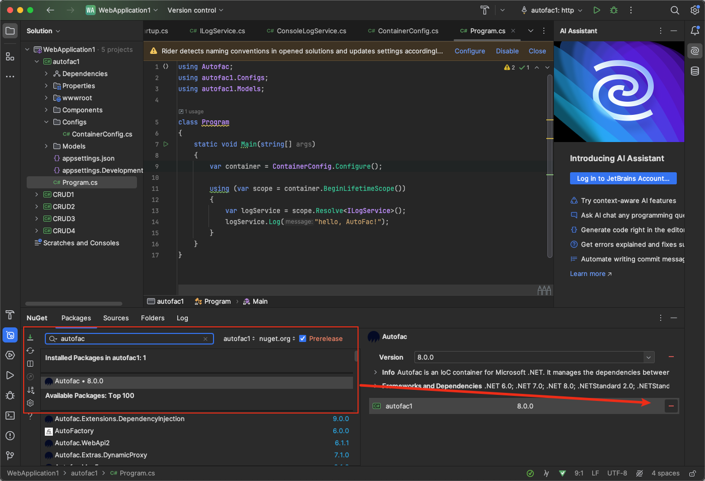
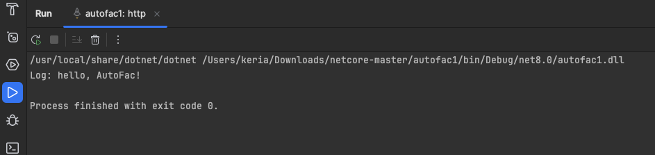

# 前置知识

## IoC(控制反转)

由于本人第一门语言是java，Spring框架中很重要的两个概念就是IoC和Aop。

IoC有三个重要的概念，一是容器概念，二是控制反转，三是依赖注入DI，这里粗略地介绍一下个人理解。

IoC：

- 在传统模式的编程中，对象A依赖于对象B，那么对象A在初始化或者运行到某一点的时候，必须自己主动去创建对象B或者使用已经创建的对象B。无论是创建还是使用对象B，控制权都在自己手上。
- 而在IoC模式中，对象A和对象B失去了直接联系，当对象A运行到需要对象B的时候，IoC容器会主动创建一个对象B注入到对象A需要的地方。
- 通过对比，对象A获得依赖对象B的过程由主动变成了被动，控制权倒过来了，所以就叫”控制反转“

DI：

- DI(依赖注入)是实现IoC的一种方式，指程序运行时容器动态地将依赖关系注入到组件中，而不是自己创建。


# AutoFac的一些理解

- 在 Java 生态系统中，与 AutoFac 类似的依赖注入框架是 Spring Framework 的一部分，特别是 Spring DI（依赖注入）模块。Spring Framework 提供了广泛的依赖注入功能，通过它可以定义和管理应用程序中对象之间的依赖关系。
- 在 Java 中的 Bean 类似于 AutoFac 里的“组件”（Component）。在 AutoFac 中，组件是被注册到依赖注入容器中的对象，通常是服务或实例的实现。这些组件是应用程序中的基本构建块，容器负责创建和管理它们的生命周期。

### Spring Framework 和 AutoFac 的相似之处：

1. **依赖注入**：Spring 和 AutoFac 都提供依赖注入功能，允许开发者将组件的创建和配置的责任从使用组件的客户端代码中解耦出来。
2. **容器管理**：两者都使用“容器”概念来管理应用中的组件实例，容器负责实例化、配置、组装以及管理对象的生命周期。
3. **配置方式**：Spring 和 AutoFac 都支持基于注解和基于 XML 的配置方式，以便开发者可以选择最适合项目的配置方式。
4. **生命周期管理**：这两个框架都支持复杂的生命周期管理，包括单例和原型等不同的作用域管理。

总的来说：AutoFac是一个为.NET提供依赖注入的框架。


# 生命周期

在一个使用 AutoFac 的.NET应用程序中，对象和服务的创建通常是通过一个叫做“容器”的东西来管理的。这个容器负责创建对象，解决它们的依赖关系，并在不需要它们时适当地销毁它们。

1. **生命周期和作用域**：在应用程序运行时，可以通过创建一个**子生命周期范围来使用你注册的组件**，这有点像创建一个临时的小容器。这样做的好处是，当这个临时容器的生命周期结束时，它可以自动销毁其中的对象，释放相关资源，从而避免内存泄漏。

2. **解析对象**：想象你需要一个对象来执行某个任务，例如写日期。你会告诉容器：“嘿，我现在需要一个写日期的对象”。容器会查看它的注册信息，找出如何创建这个对象，并且确保所有这个对象所需的其他对象（比如输出设备）也会被创建。

3. **使用和释放**：在你用完这个对象后，比如写完日期，你不需要手动销毁它。因为你是在一个临时的子生命周期范围内创建它的，当这个范围结束时，容器会自动为你清理这个对象和它依赖的其他对象。

   

## 常见的生命周期选项

### 1. 实例生命周期选项 (Instance Per Lifetime Scope)

这是 Autofac 中最基本的生命周期管理策略之一。当你注册一个组件时，可以指定它应该每个生命周期作用域 (Lifetime Scope) 产生一个新实例。这意味着，每次通过一个特定的生命周期作用域解析组件时，都会得到一个新的实例，但在同一生命周期作用域内解析多次时，将返回相同的实例。

```
csharpCopy code
builder.RegisterType<MyService>().InstancePerLifetimeScope();
```

通俗解释例子：当我进入一个咖啡店，每次进店都会给我制作一杯新鲜制作的咖啡，但是只要我一直在店里，无论我点多少次咖啡，给的都是同一杯咖啡。

### 2. 单例生命周期 (Single Instance)

在这个生命周期中，注册的组件在第一次被解析时创建一个实例，之后不论在哪个生命周期作用域中解析，都会返回这个相同的实例。这适用于那些状态不变、共享的服务。

```
csharpCopy code
builder.RegisterType<MySingletonService>().SingleInstance();
```

通俗解释例子：每次进店都会给我同一杯咖啡。

### 3. 每次请求 (Instance Per Dependency)

每次请求解析时，都会创建一个新的组件实例。这种模式类似于无状态服务，每次使用都是全新的，不会有状态被保留。

```
csharpCopy code
builder.RegisterType<MyTransientService>().InstancePerDependency();
```

通俗解释例子：每次我点咖啡时，店都会给我新鲜制作中一杯。

### 4. 匹配生命周期作用域 (Instance Per Matching Lifetime Scope)

可以指定组件实例应当在某些特定的生命周期作用域下创建和存在。这在你有多层作用域，例如在一个Web请求中有多个子作用域时非常有用。

```
csharpCopy code
builder.RegisterType<MyScopedService>().InstancePerMatchingLifetimeScope("myScope");
```

通俗解释例子：就像进入一个大商场，只有在某些特定的店（作用域）里，才会给我提供咖啡。

### 5. 每次请求一个新实例，但具有共享的依赖 (Owned Instances)

有时你可能需要每次解析时创建一个新的实例，但这些实例共享一些相同的依赖。这可以通过 `Owned<T>` 实现，这样可以保持依赖对象的共享，而服务本身每次都是新的。

```
csharpCopy code
builder.RegisterType<MyService>().AsSelf();
builder.Register(c => new MyComponent(c.Resolve<Owned<MyService>>()));
```

通俗解释例子：尽管咖啡的口味多种多样，但是奶和糖都是从一个大容器里拿的，这个容器是共享的。


# 其他

## builder和container的区别

在讨论涉及到 "容器" 的不同上下文时，尤其是在像 AutoFac 这样的依赖注入（DI）框架中，"builder" 和 "container" 这两个术语有着明显不同的角色和用途。了解这些差异对于正确使用依赖注入框架至关重要。这里主要以 AutoFac 为例来解释这两个概念。

### Builder（构建器）

在 AutoFac 以及其他依赖注入框架中，`ContainerBuilder` 是一个用来创建和配置容器的工具。你可以把它看作是一个工厂，它负责准备和构造 `Container`，其中包含所有的服务和配置。`Builder` 的主要任务是注册依赖关系、中间件、拦截器等，并最终构造一个容器。

- **作用**：负责配置和准备容器，包括服务的注册。
- **用法**：在应用程序启动时使用，通常不会在应用程序的其他部分使用。
- **示例**：使用 AutoFac 的 `ContainerBuilder` 来注册服务和创建容器。

```
var builder = new ContainerBuilder();
builder.RegisterType<SomeService>().As<IService>();
var container = builder.Build();  // 创建容器
```

### Container（容器）

`Container` 是依赖注入框架中的核心对象，它存储了所有注册的服务及其依赖关系。一旦容器被创建（通常是通过一个 `Builder`），它就被用来解析依赖关系，即创建对象的实例，并注入所需的依赖。

- **作用**：容器实例在整个应用程序的生命周期中持续存在，用于解析请求的依赖项。
- **用法**：在需要服务实例时使用，比如在请求处理或对象创建时。
- **示例**：使用 AutoFac 的容器来解析服务。

```
var service = container.Resolve<IService>();  // 从容器获取服务实例
```

### 区别总结

- **功能角色**：`Builder` 是创建和配置 `Container` 的工具，而 `Container` 是用于依赖注入和服务解析的实体。
- **使用时机**：`Builder` 在应用程序的配置阶段使用，仅用于设置和构建 `Container`；而 `Container` 在应用程序的运行阶段被频繁使用，用于服务的实例化和依赖解析。
- **配置与执行**：`Builder` 关联配置阶段，`Container` 关联执行阶段。

理解这两个概念的区别有助于更有效地使用依赖注入框架，并能更好地理解如何组织和管理应用程序中的服务依赖。


# Demo：用AutoFac框架实现在控制台上输出日志信息

1.在Nuget中导入AutoFac依赖包



2.创建接口 `ILogService` 和实现类 `LogService`

```
public interface ILogService
{
    void Log(string message);
}

public class LogService : ILogService
{
    public void Log(string message)
    {
        Console.WriteLine($"Log: {message}");
    }
}
```

3.配置AutoFac容器，在其中注入依赖关系

```
using Autofac;

public class ContainerConfig
{
    public static IContainer Configure()
    {
    		//构建容器builder
        var builder = new ContainerBuilder();
        
        //将 LogService 类注册为满足 ILogService 接口的依赖
        builder.RegisterType<LogService>().As<ILogService>();
    
        return builder.Build();
    }

}
```

4.使用容器

在应用程序启动程序中，使用容器来解析依赖并使用他们

```
using Autofac;

class Program
{
    static void Main(string[] args)
    {
    		//构建容器
        var container = ContainerConfig.Configure();

				//使用容器
        using (var scope = container.BeginLifetimeScope())
        {
            var logService = scope.Resolve<ILogService>();
            logService.Log("Hello, AutoFac!");
        }
    }

}
```

在这个例子中，`Main` 方法中创建了一个容器作用域，然后从容器中解析了 `ILogService` 的实例，并调用了 `Log` 方法来输出一条消息。

5.运行效果截图




