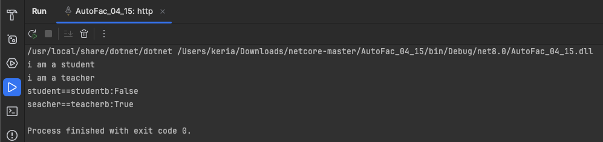

# 前置知识

## IoC(控制反转)

由于本人第一门语言是java，Spring框架中很重要的两个概念就是IoC和Aop。

IoC有三个重要的概念，一是容器概念，二是控制反转，三是依赖注入DI，这里粗略地介绍一下个人理解。

IoC：

- 在传统模式的编程中，对象A依赖于对象B，那么对象A在初始化或者运行到某一点的时候，必须自己主动去创建对象B或者使用已经创建的对象B。无论是创建还是使用对象B，控制权都在自己手上。
- 而在IoC模式中，对象A和对象B失去了直接联系，当对象A运行到需要对象B的时候，IoC容器会主动创建一个对象B注入到对象A需要的地方。
- 通过对比，对象A获得依赖对象B的过程由主动变成了被动，控制权倒过来了，所以就叫”控制反转“

DI：

- DI(依赖注入)是实现IoC的一种方式，指程序运行时容器动态地将依赖关系注入到组件中，而不是自己创建。


# AutoFac的一些理解

- 在 Java 生态系统中，与 AutoFac 类似的依赖注入框架是 Spring Framework 的一部分，特别是 Spring DI（依赖注入）模块。Spring Framework 提供了广泛的依赖注入功能，通过它可以定义和管理应用程序中对象之间的依赖关系。
- 在 Java 中的 Bean 类似于 AutoFac 里的“组件”（Component）。在 AutoFac 中，组件是被注册到依赖注入容器中的对象，通常是服务或实例的实现。这些组件是应用程序中的基本构建块，容器负责创建和管理它们的生命周期。
- 

### Spring Framework 和 AutoFac 的相似之处：

1. **依赖注入**：Spring 和 AutoFac 都提供依赖注入功能，允许开发者将组件的创建和配置的责任从使用组件的客户端代码中解耦出来。
2. **容器管理**：两者都使用“容器”概念来管理应用中的组件实例，容器负责实例化、配置、组装以及管理对象的生命周期。
3. **配置方式**：Spring 和 AutoFac 都支持基于注解和基于 XML 的配置方式，以便开发者可以选择最适合项目的配置方式。
4. **生命周期管理**：这两个框架都支持复杂的生命周期管理，包括单例和原型等不同的作用域管理。

总的来说：AutoFac是一个为.NET提供依赖注入的框架。


# 生命周期

在一个使用 AutoFac 的.NET应用程序中，对象和服务的创建通常是通过一个叫做“容器”的东西来管理的。这个容器负责创建对象，解决它们的依赖关系，并在不需要它们时适当地销毁它们。

1. **生命周期和作用域**：在应用程序运行时，可以通过创建一个**子生命周期范围来使用你注册的组件**，这有点像创建一个临时的小容器。这样做的好处是，当这个临时容器的生命周期结束时，它可以自动销毁其中的对象，释放相关资源，从而避免内存泄漏。

2. **解析对象**：想象你需要一个对象来执行某个任务，例如写日期。你会告诉容器：“嘿，我现在需要一个写日期的对象”。容器会查看它的注册信息，找出如何创建这个对象，并且确保所有这个对象所需的其他对象（比如输出设备）也会被创建。

3. **使用和释放**：在你用完这个对象后，比如写完日期，你不需要手动销毁它。因为你是在一个临时的子生命周期范围内创建它的，当这个范围结束时，容器会自动为你清理这个对象和它依赖的其他对象。

   

## 常见的生命周期选项

### 1. 实例生命周期选项 (Instance Per Lifetime Scope)

这是 Autofac 中最基本的生命周期管理策略之一。当你注册一个组件时，可以指定它应该每个生命周期作用域 (Lifetime Scope) 产生一个新实例。这意味着，每次通过一个特定的生命周期作用域解析组件时，都会得到一个新的实例，但在同一生命周期作用域内解析多次时，将返回相同的实例。

```
csharpCopy code
builder.RegisterType<MyService>().InstancePerLifetimeScope();
```

通俗解释例子：当我进入一个咖啡店，每次进店都会给我制作一杯新鲜制作的咖啡，但是只要我一直在店里，无论我点多少次咖啡，给的都是同一杯咖啡。

### 2. 单例生命周期 (Single Instance)

在这个生命周期中，注册的组件在第一次被解析时创建一个实例，之后不论在哪个生命周期作用域中解析，都会返回这个相同的实例。这适用于那些状态不变、共享的服务。

```
csharpCopy code
builder.RegisterType<MySingletonService>().SingleInstance();
```

通俗解释例子：每次进店都会给我同一杯咖啡。

### 3. 每次请求 (Instance Per Dependency)

每次请求解析时，都会创建一个新的组件实例。这种模式类似于无状态服务，每次使用都是全新的，不会有状态被保留。

```
csharpCopy code
builder.RegisterType<MyTransientService>().InstancePerDependency();
```

通俗解释例子：每次我点咖啡时，店都会给我新鲜制作中一杯。

### 4. 匹配生命周期作用域 (Instance Per Matching Lifetime Scope)

可以指定组件实例应当在某些特定的生命周期作用域下创建和存在。这在你有多层作用域，例如在一个Web请求中有多个子作用域时非常有用。

```
csharpCopy code
builder.RegisterType<MyScopedService>().InstancePerMatchingLifetimeScope("myScope");
```

通俗解释例子：就像进入一个大商场，只有在某些特定的店（作用域）里，才会给我提供咖啡。

### 5. 每次请求一个新实例，但具有共享的依赖 (Owned Instances)

有时你可能需要每次解析时创建一个新的实例，但这些实例共享一些相同的依赖。这可以通过 `Owned<T>` 实现，这样可以保持依赖对象的共享，而服务本身每次都是新的。

```
csharpCopy code
builder.RegisterType<MyService>().AsSelf();
builder.Register(c => new MyComponent(c.Resolve<Owned<MyService>>()));
```

通俗解释例子：尽管咖啡的口味多种多样，但是奶和糖都是从一个大容器里拿的，这个容器是共享的。


## 单例和每次请求实践

```
using Autofac;
using AutoFac_04_15.Models;

//构造器
var builder = new ContainerBuilder();

//注册服务
builder.RegisterType<Student>().Named<IPeople>("student").InstancePerDependency();
builder.RegisterType<Teacher>().Named<IPeople>("teacher").SingleInstance();

//构建容器
var container = builder.Build();

//使用容器
using (var scope = container.BeginLifetimeScope())
{
    var student = scope.ResolveNamed<IPeople>("student");
    var teacher = scope.ResolveNamed<IPeople>("teacher");
    
    var studentb = scope.ResolveNamed<IPeople>("student");
    var teacherb = scope.ResolveNamed<IPeople>("teacher");
    
    student.shout();
    teacher.shout();
    
    Console.WriteLine($"student==studentb:{student == studentb}");
    Console.WriteLine($"seacher==teacherb:{teacher == teacherb}");
}
```

我把学生注册为**每次请求**，把老师注册为**单例**

结果如下图：




# 服务注册

## 注册依赖时As（）和AsSelf的区别

```
builder.RegisterType<SomeType>().As<IService>();
```

这行代码将`SomeType`注册为通过`IService`接口进行解析。这意味着当依赖注入系统需要一个`IService`实例时，它将创建一个`SomeType`的实例来满足这个需求。在这种情况下，如果不能直接解析`SomeType，因为`SomeType`没有被注册为可以直接解析的类型，只能通过`IService`接口来解析。

```
builder.RegisterType<SomeType>().AsSelf().As<IService>();
```

这行代码同时注册`SomeType`作为自己的类型和作为`IService`接口的实现。这意味着既可以通过`IService`接口解析`SomeType`，也可以直接通过`SomeType`本身解析。它允许依赖注入容器可以根据请求的具体类型来返回相同的实例。

- 如果想隐藏实现细节并且通过接口编程，那么第一种方法是更好的选择。
- 如果需要更多的灵活性或在特定情况下需要访问具体类的功能，那么第二种方法会更适合。

在实际开发中，大多数情况下推使用第一种写法，这样有助于保持代码的模块性和可维护性。

### 简单比喻

有一家餐厅。如果有人点了一个“素食汉堡”（即`IService`），根据第一种注册方式，只知道需要去后厨做一个“豆类汉堡”（即`SomeType`）。顾客不能指定他们想要的具体汉堡类型，他们只能得到菜单上定义好的“素食汉堡”。

但如果使用第二种方式注册，顾客可以要一个“素食汉堡”，也可以直接要一个“豆类汉堡”。这样后厨就可以根据顾客的具体请求来准备食物。

## 默认注册

如果多个组件公开相同的服务，**Autofac 将使用最后注册的组件作为该服务的默认提供者**：

```
builder.RegisterType<ConsoleLogger>().As<ILogger>();
builder.RegisterType<FileLogger>().As<ILogger>();
```

在这种情况下，`FileLogger`将是默认值，`ILogger`因为它是最后一个注册的。

要覆盖此行为，请使用`PreserveExistingDefaults()`修饰符：

```
builder.RegisterType<ConsoleLogger>().As<ILogger>();
builder.RegisterType<FileLogger>().As<ILogger>().PreserveExistingDefaults();
```

在这种情况下，`ConsoleLogger`将是默认的，`ILogger`因为稍后注册`FileLogger`使用了`PreserveExistingDefaults()`。


# 装配扫描

Autofac 可以使用约定来查找和注册程序集中的组件。可以扫描并注册单个类型，也可以专门扫描Autofac 模块。

```
var dataAccess = Assembly.GetExecutingAssembly();
//这行代码获取了当前执行程序集（即当前代码所在的程序集）的 Assembly 对象。这个对象将被用来指定要注册的类型所在的程序集。

builder.RegisterAssemblyTypes(dataAccess)
       .Where(t => t.Name.EndsWith("Repository"))
       .AsImplementedInterfaces();
//这几行代码解释：
RegisterAssemblyTypes 方法指定了要注册的程序集，即 dataAccess 变量表示的程序集。

Where 方法，指定了一个条件，表示只有当类型的名称以 "Repository" 结尾时才会被注册。这个条件是一个 Lambda 表达式，接受一个 Type 参数 t，表示正在遍历的每个类型。

AsImplementedInterfaces 方法，表示注册的每个类型应该实现的接口。它告诉 Autofac，将每个被注册的类型视为实现了其接口，并将这些接口作为服务类型。
```

每个`RegisterAssemblyTypes()`调用仅应用一组规则 -`RegisterAssemblyTypes()`如果需要注册多组不同的组件，则需要多次调用。

## 装配扫描的好处

当有大量的服务类需要注册到依赖注入容器时，使用装配扫描可以减少手动注册的工作量，并提高代码的可维护性。下面是一个具体的例子：

假设有一个 Web 应用程序，其中有很多服务类需要注册到 Autofac 容器中。这些服务类都遵循一定的命名规范，比如它们的类名都以 "Service" 结尾。

可以使用装配扫描来自动注册这些服务类。示例代码如下：

```
var assembly = typeof(SomeService).Assembly;

var builder = new ContainerBuilder();
builder.RegisterAssemblyTypes(assembly)
       .Where(t => t.Name.EndsWith("Service"))
       .AsImplementedInterfaces()
       .InstancePerLifetimeScope();
```

在这个例子中，假设 `SomeService` 是项目中的一个服务类，它位于与其他服务类相同的程序集中。我们首先获取了 `SomeService` 类所在的程序集，并传递给 `RegisterAssemblyTypes()` 方法。然后，使用 `Where()` 方法来筛选出符合条件的服务类，即类名以 "Service" 结尾的类。最后，使用 `AsImplementedInterfaces()` 方法将这些服务类注册为其实现的接口，并使用 `InstancePerLifetimeScope()` 方法指定了生命周期范围。

通过这样做，Autofac 将自动扫描指定程序集中的类型，并注册符合条件的服务类到容器中。这样做不仅节省了手动注册的时间和工作量，而且使得服务类的添加、删除或修改更加方便和高效。


# 解决服务

## 具有反射分量的参数

假设有一个名为 `ConfigReader` 的组件，它具有一个构造函数，需要一个 `configSectionName` 参数，但这个参数在注册时不可用，只能在运行时提供。

首先，定义一个 `ConfigReader` 类，它具有一个带有 `configSectionName` 参数的构造函数。这个构造函数用来接收配置节的名称，并在实例化时将其存储起来。

```
public class ConfigReader : IConfigReader
{
  public ConfigReader(string configSectionName)
  {
    // Store config section name
  }

  // ...read configuration based on the section name.
}
```

可以将参数传递给`Resolve()`调用，如下所示：

```
var reader = scope.Resolve<ConfigReader>(new NamedParameter("configSectionName", "sectionName"));
```

与注册时参数一样，`NamedParameter`示例中的 将会映射到相应的命名构造函数参数，假设组件`ConfigReader`是使用反射注册的。

如果您有多个参数，只需通过以下`Resolve()`方法将它们全部传入：

```
var service = scope.Resolve<AnotherService>(
                new NamedParameter("id", "service-identifier"),
                new TypedParameter(typeof(Guid), Guid.NewGuid()),
                new ResolvedParameter(
                  (pi, ctx) => pi.ParameterType == typeof(ILog) && pi.Name == "logger",
                  (pi, ctx) => LogManager.GetLogger("service")));
```


## 隐式关系类型

|              关系              |                     类型                      |                             意义                             |
| :----------------------------: | :-------------------------------------------: | :----------------------------------------------------------: |
|           *A*需要*B*           |                      `B`                      |                           直接依赖                           |
|    *A*在未来某个时刻需要*B*    |                   `Lazy<B>`                   |                          延迟实例化                          |
|  *A*需要*B*直到未来的某个时刻  |                  `Owned<B>`                   | [受控寿命](https://autofac.readthedocs.io/en/latest/advanced/owned-instances.html) |
|      *A*需要创建*B的实例*      |                   `Func<B>`                   |                          动态实例化                          |
| *A*向*B提供**X*和*Y*类型的参数 |                 `Func<X,Y,B>`                 |                         参数化实例化                         |
|      *A*需要各种各样的*B*      | `IEnumerable<B>`, `IList<B>`,`ICollection<B>` |                             枚举                             |
|  *A*需要了解*X*关于*B的信息*   |            `Meta<B>`和`Meta<B,X>`             | [元数据查询](https://autofac.readthedocs.io/en/latest/advanced/metadata.html) |
|     *A*需要根据*X*选择*B*      |                 `IIndex<X,B>`                 | [键控服务](https://autofac.readthedocs.io/en/latest/advanced/keyed-services.html)查找 |

### 1.延迟实例化

当需要在对象的生命周期中延迟加载某个依赖项，或者某个依赖项的创建成本较高时，延迟实例化就会变得很有用。下面是一个实际编程中可能用到延迟实例化的例子：

假设一个页面需要显示用户的个人信息，需要从数据库中加载用户的详细信息。但是，加载用户信息的成本可能较高，因为需要执行一些复杂的查询或者涉及到大量的数据。

在这种情况下，可以使用延迟实例化来实现懒加载用户信息的功能。示例代码如下：

```
public class UserProfilePage
{
    private readonly Lazy<UserService> _userService;

    public UserProfilePage(Lazy<UserService> userService)
    {
        _userService = userService;
    }

    public void DisplayUserInfo(string userId)
    {
        // 调用用户服务来获取用户信息
        var userInfo = _userService.Value.GetUserInfo(userId);

        // 将用户信息显示在页面上
        // displayUserInfo(userInfo);
    }
}

public class UserService
{
    public UserInfo GetUserInfo(string userId)
    {
        // 执行一些复杂的查询或者涉及到大量的数据，加载用户信息
        // return userInfo;
        return new UserInfo();
    }
}

public class UserInfo
{
    // 用户信息的属性
}
```

在这个例子中，`UserProfilePage` 类需要显示用户的个人信息，但是加载用户信息的成本较高。因此，在构造函数中使用了 `Lazy<UserService>` 类型的参数来延迟实例化 `UserService` 对象。当调用 `DisplayUserInfo()` 方法时，才会实际调用 `UserService` 对象的方法来加载用户信息。这样就实现了懒加载用户信息的功能，在页面加载时不会立即执行昂贵的用户信息加载操作，只有在需要显示用户信息时才会进行加载。

### 2.受控生命周期

假设开发一个 Windows 服务，这个服务需要定期执行某个任务，比如清理临时文件夹或者发送邮件。为了执行这个任务，需要一个定时器（比如 `System.Timers.Timer`），但是定时器的创建和管理可能比较复杂，而且你希望在服务关闭时能够正确地释放定时器资源。

在这种情况下，可以使用受控生命周期来管理定时器对象。示例代码如下：

```
public class MyService : IDisposable
{
    private readonly Timer _timer;

    public MyService()
    {
        _timer = new Timer(60000); // 创建一个定时器，每分钟触发一次
        _timer.Elapsed += Timer_Elapsed;
        _timer.Start();
    }

    private void Timer_Elapsed(object sender, ElapsedEventArgs e)
    {
        // 定时器触发时执行任务
        Console.WriteLine("定时任务执行中...");
    }

    public void Dispose()
    {
        _timer.Stop(); // 停止定时器
        _timer.Dispose(); // 释放定时器资源
    }
}
```

在这个例子中，`MyService` 类负责管理定时器对象，它在构造函数中创建了一个定时器，并且在对象被释放时（调用 `Dispose()` 方法时）停止定时器并释放资源。这样，在 Windows 服务关闭时，可以调用 `Dispose()` 方法来释放定时器资源，确保不会产生资源泄漏或者未预期的行为。

通过这种方式，可以在需要时使用受控生命周期来管理对象的资源，确保在对象不再需要时能够正确释放资源，从而提高应用程序的性能和稳定性。

### 3.动态实例化

当需要根据条件动态创建不同实例时，动态实例化也非常有用。以下是示例：

假设开发一个游戏，游戏中有不同类型的敌人，每种敌人都有自己的特点和行为。在这种情况下，你可以使用动态实例化来根据不同的条件（比如玩家等级、游戏进度等）创建不同类型的敌人。

```
public class EnemySpawner
{
    private readonly Func<PlayerLevel, IEnemy> _enemyFactory;

    public EnemySpawner(Func<PlayerLevel, IEnemy> enemyFactory)
    {
        _enemyFactory = enemyFactory;
    }

    public void SpawnEnemy(PlayerLevel playerLevel)
    {
        // 根据玩家等级动态创建不同类型的敌人，并将其生成到游戏场景中
        var enemy = _enemyFactory(playerLevel);
        enemy.Spawn();
    }
}

public enum PlayerLevel
{
    Beginner,
    Intermediate,
    Advanced
}

public interface IEnemy
{
    void Spawn();
}

public class BeginnerEnemy : IEnemy
{
    public void Spawn()
    {
        Console.WriteLine("生成初级敌人");
    }
}

public class IntermediateEnemy : IEnemy
{
    public void Spawn()
    {
        Console.WriteLine("生成中级敌人");
    }
}

public class AdvancedEnemy : IEnemy
{
    public void Spawn()
    {
        Console.WriteLine("生成高级敌人");
    }
}
```

在这个例子中，`EnemySpawner` 类负责生成敌人，并根据玩家等级动态创建不同类型的敌人对象。通过构造函数接收一个 `Func<PlayerLevel, IEnemy>` 参数，用于创建敌人对象。在 `SpawnEnemy()` 方法中，根据玩家等级调用 `_enemyFactory` 函数来创建敌人对象，并将其生成到游戏场景中。

通过这种方式，可以根据玩家等级动态生成不同类型的敌人，并根据游戏进度和玩家等级来调整游戏难度。


### 4.参数实例化

参数化实例化在实际编程中通常用于根据运行时提供的参数来创建对象实例。一个常见的例子是根据用户输入或配置文件中的参数来动态创建不同类型的对象。

例如开发一个日志记录系统，系统需要根据用户配置的日志级别来选择不同的日志记录器。在这种情况下，可以使用参数化实例化来根据配置的日志级别来创建相应的日志记录器。

以下是一个示例代码：

```
public enum LogLevel
{
    Info,
    Warning,
    Error
}

public interface ILogger
{
    void Log(string message);
}

public class ConsoleLogger : ILogger
{
    public void Log(string message)
    {
        Console.WriteLine($"[Console] {message}");
    }
}

public class FileLogger : ILogger
{
    private readonly string _filePath;

    public FileLogger(string filePath)
    {
        _filePath = filePath;
    }

    public void Log(string message)
    {
        File.AppendAllText(_filePath, $"[File] {message}" + Environment.NewLine);
    }
}

public class LogManager
{
    private readonly Func<LogLevel, ILogger> _loggerFactory;

    public LogManager(Func<LogLevel, ILogger> loggerFactory)
    {
        _loggerFactory = loggerFactory;
    }

    public void LogMessage(LogLevel logLevel, string message)
    {
        var logger = _loggerFactory(logLevel);
        logger.Log(message);
    }
}
```

在这个例子中，有两种类型的日志记录器：`ConsoleLogger` 和 `FileLogger`。`LogManager` 类负责根据日志级别来选择相应的日志记录器，并调用其 `Log()` 方法来记录日志。

`LogManager` 类的构造函数接收一个 `Func<LogLevel, ILogger>` 参数，用于创建日志记录器。在 `LogMessage()` 方法中，根据日志级别调用 `_loggerFactory` 函数来创建相应的日志记录器对象。

通过这种方式，你可以根据配置的日志级别来动态选择日志记录器类型，从而实现日志记录系统的灵活配置。例如，如果用户配置的日志级别是 `Error`，那么就会创建一个 `FileLogger` 对象来记录日志到文件中。


### 5.枚举

在实际编程中，使用枚举类型（例如 `IEnumerable<T>`、`IList<T>`、`ICollection<T>` 等）的依赖关系通常用于以下情况：

1. **插件系统**: 某些应用程序可能支持插件系统，允许用户或开发人员编写自定义插件来扩展应用程序的功能。在这种情况下，主应用程序可能需要加载并使用所有已注册的插件。使用枚举类型的依赖关系，可以注册所有的插件实现，并将它们注入到主应用程序中。
2. **消息处理器**: 就像你在 Autofac 文档中提到的那样，消息处理器是另一个常见的用例。例如，一个消息处理系统可能需要处理多种类型的消息，并且针对每种消息类型可能有不同的处理逻辑。使用枚举类型的依赖关系，可以注册所有的消息处理器实现，并将它们注入到消息处理系统中，以便根据消息类型动态选择相应的处理器。
3. **事件处理器**: 类似于消息处理器，事件处理器用于处理应用程序中的事件。例如，一个事件驱动的系统可能有多个事件处理器，每个处理器负责处理特定类型的事件。使用枚举类型的依赖关系，可以注册所有的事件处理器实现，并将它们注入到事件处理系统中，以便根据事件类型动态选择相应的处理器。

下面是一个简单的示例，演示了如何在实际编程中使用枚举类型的依赖关系：

假设正在开发一个插件系统，允许用户编写自定义插件来扩展应用程序的功能。每个插件都实现了一个特定的接口，并且主应用程序需要加载并使用所有已注册的插件。以下是示例代码：

```
// 插件接口
public interface IPlugin
{
    void Execute();
}

// 插件实现类
public class PluginA : IPlugin
{
    public void Execute()
    {
        Console.WriteLine("执行插件A的功能...");
    }
}

public class PluginB : IPlugin
{
    public void Execute()
    {
        Console.WriteLine("执行插件B的功能...");
    }
}

// 主应用程序
public class Application
{
    private readonly IEnumerable<IPlugin> _plugins;

    public Application(IEnumerable<IPlugin> plugins)
    {
        _plugins = plugins;
    }

    public void Run()
    {
        Console.WriteLine("主应用程序开始运行...");
        foreach (var plugin in _plugins)
        {
            plugin.Execute();
        }
        Console.WriteLine("主应用程序运行结束。");
    }
}
```

在这个例子中，`Application` 类是主应用程序，它的构造函数接收一个 `IEnumerable<IPlugin>` 参数，用于注入所有已注册的插件。在 `Run()` 方法中，主应用程序遍历所有插件并调用它们的 `Execute()` 方法来执行插件的功能。

通过这种方式，轻松地注册和管理所有的插件实现，并将它们注入到主应用程序中，从而扩展了应用程序的功能。


### 6.元数据查询

在实际编程中，元数据查询通常用于根据服务的附加信息来做出决策。以下是一个简单的示例，演示了如何在 Autofac 中使用元数据查询：

假设开发一个插件系统，每个插件都有一个**唯一的标识符**和一个描述信息。主应用程序需要根据插件的标识符来选择相应的插件进行加载和执行。在这种情况下，你可以使用元数据查询来将插件的标识符与插件实例关联起来，并根据标识符来选择相应的插件。

以下是示例代码：

```
csharpCopy code
// 插件接口
public interface IPlugin
{
    void Execute();
}

// 插件元数据类
public class PluginMetadata
{
    public string Id { get; set; }
    public string Description { get; set; }
}

// 插件实现类
public class PluginA : IPlugin
{
    public void Execute()
    {
        Console.WriteLine("执行插件A的功能...");
    }
}

public class PluginB : IPlugin
{
    public void Execute()
    {
        Console.WriteLine("执行插件B的功能...");
    }
}

// 主应用程序
public class Application
{
    private readonly Meta<IPlugin, PluginMetadata>[] _plugins;

    public Application(Meta<IPlugin, PluginMetadata>[] plugins)
    {
        _plugins = plugins;
    }

    public void Run(string pluginId)
    {
        Console.WriteLine($"主应用程序开始运行，插件标识符为：{pluginId}");

        foreach (var pluginMeta in _plugins)
        {
            if (pluginMeta.Metadata.Id == pluginId)
            {
                pluginMeta.Value.Execute();
                break;
            }
        }

        Console.WriteLine("主应用程序运行结束。");
    }
}
```

在这个例子中，`IPlugin` 接口表示插件的功能，`PluginMetadata` 类表示插件的元数据，包括插件的标识符和描述信息。主应用程序 `Application` 的构造函数接收一个 `Meta<IPlugin, PluginMetadata>[]` 参数，用于注入所有已注册的插件以及它们的元数据。

在 `Run()` 方法中，主应用程序根据传入的插件标识符遍历所有插件，并通过元数据查询找到匹配的插件实例，并调用其 `Execute()` 方法来执行插件的功能。

通过这种方式，可以轻松地根据插件的标识符来选择相应的插件进行加载和执行，从而实现了插件系统的动态配置和管理。

#### 枚举和元数据查询的区别

当你有一堆东西时，比如一堆插件或者消息处理器，你可能需要把它们都拿来用。这就像在超市里拿一堆东西放在购物车里一样，你需要遍历这堆东西并逐个处理。这就是枚举。枚举让你能够**一次性**拿到一堆东西，然后你可以**逐个处理**它们。

而元数据查询则不是简单地把一堆东西放在购物车里，而是在每个东西上贴了一个**标签**，比如标识符或者描述信息。当你需要从这堆东西中挑**选出特定的一个**时，你可以查看这些标签，然后根据标签的内容来做出选择。

简而言之，枚举就像是把一堆东西放在一起，你可以逐个处理它们；而元数据查询则是在这些东西上贴上标签，你可以根据标签的内容来选择你需要的那个东西。


### 7.键控服务查找

当需要根据某些特定的标识符或者条件来选择服务实例时，可以使用键控服务查找。这在某些特定场景下非常有用，比如在监控系统中，可能需要根据设备类型或者设备ID来选择相应的监控服务。

假设开发一个监控系统，用于监控不同类型的设备，比如摄像头、传感器等。每种设备都有不同的监控服务来处理它们的监控数据。在这种情况下，可以使用键控服务查找来根据设备类型选择相应的监控服务。

以下是一个简单的示例：

```
// 设备接口
public interface IDevice
{
    string Id { get; }
    string Type { get; }
}

// 摄像头类
public class Camera : IDevice
{
    public string Id { get; set; }
    public string Type => "Camera";
}

// 传感器类
public class Sensor : IDevice
{
    public string Id { get; set; }
    public string Type => "Sensor";
}

// 监控服务接口
public interface IMonitorService
{
    void Monitor(IDevice device);
}

// 监控摄像头的服务
public class CameraMonitorService : IMonitorService
{
    public void Monitor(IDevice device)
    {
        Console.WriteLine($"Monitoring camera with ID: {device.Id}");
    }
}

// 监控传感器的服务
public class SensorMonitorService : IMonitorService
{
    public void Monitor(IDevice device)
    {
        Console.WriteLine($"Monitoring sensor with ID: {device.Id}");
    }
}

// 主应用程序
public class Application
{
    private readonly IIndex<string, IMonitorService> _monitorServices;

    public Application(IIndex<string, IMonitorService> monitorServices)
    {
        _monitorServices = monitorServices;
    }

    public void Run(IDevice device)
    {
        if (_monitorServices.TryGetValue(device.Type, out var monitorService))
        {
            monitorService.Monitor(device);
        }
        else
        {
            Console.WriteLine($"No monitor service available for device type: {device.Type}");
        }
    }
}
```

在这个例子中，`IDevice` 接口表示设备，它有一个标识符 `Id` 和一个类型 `Type`。`IMonitorService` 接口表示监控服务，它有一个 `Monitor()` 方法用于监控设备。`CameraMonitorService` 和 `SensorMonitorService` 分别是监控摄像头和传感器的具体实现。

在 `Application` 类中，通过构造函数注入了一个键控服务查找，它可以根据设备类型选择相应的监控服务。在 `Run()` 方法中，根据设备类型选择相应的监控服务进行监控。


# 其他

## builder和container的区别

在讨论涉及到 "容器" 的不同上下文时，尤其是在像 AutoFac 这样的依赖注入（DI）框架中，"builder" 和 "container" 这两个术语有着明显不同的角色和用途。了解这些差异对于正确使用依赖注入框架至关重要。这里主要以 AutoFac 为例来解释这两个概念。

### Builder（构建器）

在 AutoFac 以及其他依赖注入框架中，`ContainerBuilder` 是一个用来创建和配置容器的工具。你可以把它看作是一个工厂，它负责准备和构造 `Container`，其中包含所有的服务和配置。`Builder` 的主要任务是注册依赖关系、中间件、拦截器等，并最终构造一个容器。

- **作用**：负责配置和准备容器，包括服务的注册。
- **用法**：在应用程序启动时使用，通常不会在应用程序的其他部分使用。
- **示例**：使用 AutoFac 的 `ContainerBuilder` 来注册服务和创建容器。

```
var builder = new ContainerBuilder();
builder.RegisterType<SomeService>().As<IService>();
var container = builder.Build();  // 创建容器
```

### Container（容器）

`Container` 是依赖注入框架中的核心对象，它存储了所有注册的服务及其依赖关系。一旦容器被创建（通常是通过一个 `Builder`），它就被用来解析依赖关系，即创建对象的实例，并注入所需的依赖。

- **作用**：容器实例在整个应用程序的生命周期中持续存在，用于解析请求的依赖项。
- **用法**：在需要服务实例时使用，比如在请求处理或对象创建时。
- **示例**：使用 AutoFac 的容器来解析服务。

```
var service = container.Resolve<IService>();  // 从容器获取服务实例
```

### 区别总结

- **功能角色**：`Builder` 是创建和配置 `Container` 的工具，而 `Container` 是用于依赖注入和服务解析的实体。
- **使用时机**：`Builder` 在应用程序的配置阶段使用，仅用于设置和构建 `Container`；而 `Container` 在应用程序的运行阶段被频繁使用，用于服务的实例化和依赖解析。
- **配置与执行**：`Builder` 关联配置阶段，`Container` 关联执行阶段。

理解这两个概念的区别有助于更有效地使用依赖注入框架，并能更好地理解如何组织和管理应用程序中的服务依赖。


# Demo：用AutoFac框架实现在控制台上输出日志信息

1.在Nuget中导入AutoFac依赖包


2.创建接口 `ILogService` 和实现类 `LogService`

```
public interface ILogService
{
    void Log(string message);
}

public class LogService : ILogService
{
    public void Log(string message)
    {
        Console.WriteLine($"Log: {message}");
    }
}
```

3.配置AutoFac容器，在其中注入依赖关系

```
using Autofac;

public class ContainerConfig
{
    public static IContainer Configure()
    {
    		//构建容器builder
        var builder = new ContainerBuilder();
        
        //将 LogService 类注册为满足 ILogService 接口的依赖
        builder.RegisterType<LogService>().As<ILogService>();
    
        return builder.Build();
    }

}
```

4.使用容器

在应用程序启动程序中，使用容器来解析依赖并使用他们

```
using Autofac;

class Program
{
    static void Main(string[] args)
    {
    		//构建容器
        var container = ContainerConfig.Configure();

				//使用容器
        using (var scope = container.BeginLifetimeScope())
        {
            var logService = scope.Resolve<ILogService>();
            logService.Log("Hello, AutoFac!");
        }
    }

}
```

在这个例子中，`Main` 方法中创建了一个容器作用域，然后从容器中解析了 `ILogService` 的实例，并调用了 `Log` 方法来输出一条消息。

5.运行效果截图


