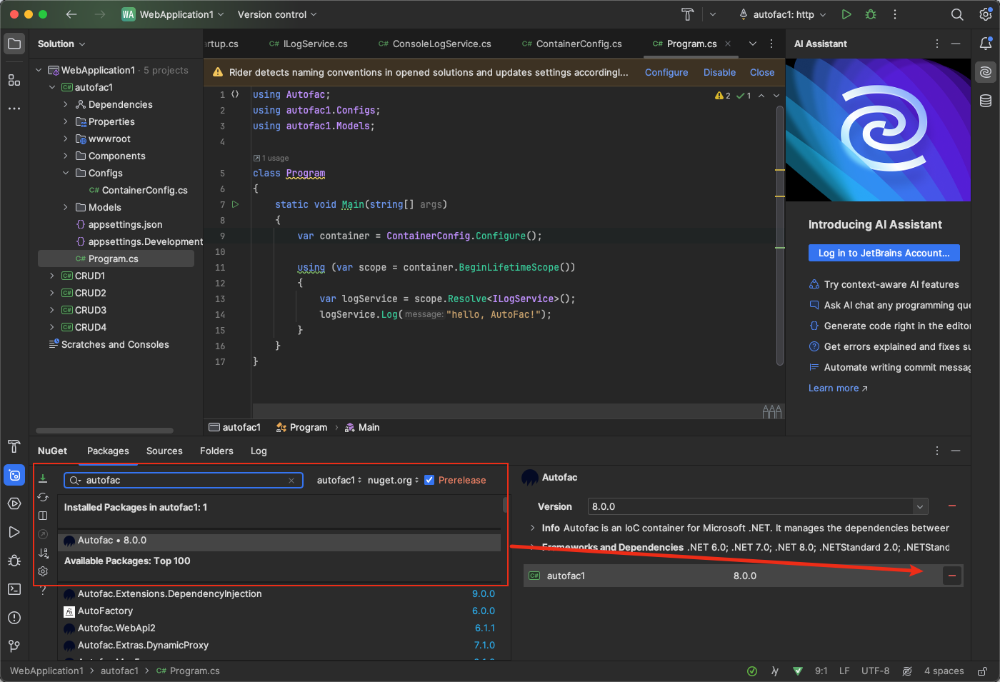

# AutoFac的一些理解

- 在 Java 生态系统中，与 AutoFac 类似的依赖注入框架是 Spring Framework 的一部分，特别是 Spring DI（依赖注入）模块。Spring Framework 提供了广泛的依赖注入功能，通过它可以定义和管理应用程序中对象之间的依赖关系。
- 在 Java 中的 Bean 类似于 AutoFac 里的“组件”（Component）。在 AutoFac 中，组件是被注册到依赖注入容器中的对象，通常是服务或实例的实现。这些组件是应用程序中的基本构建块，容器负责创建和管理它们的生命周期。

### Spring Framework 和 AutoFac 的相似之处：

1. **依赖注入**：Spring 和 AutoFac 都提供依赖注入功能，允许开发者将组件的创建和配置的责任从使用组件的客户端代码中解耦出来。
2. **容器管理**：两者都使用“容器”概念来管理应用中的组件实例，容器负责实例化、配置、组装以及管理对象的生命周期。
3. **配置方式**：Spring 和 AutoFac 都支持基于注解和基于 XML 的配置方式，以便开发者可以选择最适合项目的配置方式。
4. **生命周期管理**：这两个框架都支持复杂的生命周期管理，包括单例和原型等不同的作用域管理。

总的来说：AutoFac是一个为.NET提供依赖注入的框架。


# Demo：用AutoFac框架实现在控制台上输出日志信息

1.在Nuget中导入AutoFac依赖包



2.创建接口 `ILogService` 和实现类 `LogService`

```
public interface ILogService
{
    void Log(string message);
}

public class LogService : ILogService
{
    public void Log(string message)
    {
        Console.WriteLine($"Log: {message}");
    }
}
```

3.配置AutoFac容器，在其中注入依赖关系

```
using Autofac;

public class ContainerConfig
{
    public static IContainer Configure()
    {
    		//构建容器builder
        var builder = new ContainerBuilder();
        
        //将 LogService 类注册为满足 ILogService 接口的依赖
        builder.RegisterType<LogService>().As<ILogService>();
    
        return builder.Build();
    }

}
```

4.使用容器

在应用程序启动程序中，使用容器来解析依赖并使用他们

```
using Autofac;

class Program
{
    static void Main(string[] args)
    {
    		//构建容器
        var container = ContainerConfig.Configure();

				//使用容器
        using (var scope = container.BeginLifetimeScope())
        {
            var logService = scope.Resolve<ILogService>();
            logService.Log("Hello, AutoFac!");
        }
    }

}
```

在这个例子中，`Main` 方法中创建了一个容器作用域，然后从容器中解析了 `ILogService` 的实例，并调用了 `Log` 方法来输出一条消息。

5.运行效果截图


# 其他

## builder和container的区别

在讨论涉及到 "容器" 的不同上下文时，尤其是在像 AutoFac 这样的依赖注入（DI）框架中，"builder" 和 "container" 这两个术语有着明显不同的角色和用途。了解这些差异对于正确使用依赖注入框架至关重要。这里主要以 AutoFac 为例来解释这两个概念。

### Builder（构建器）

在 AutoFac 以及其他依赖注入框架中，`ContainerBuilder` 是一个用来创建和配置容器的工具。你可以把它看作是一个工厂，它负责准备和构造 `Container`，其中包含所有的服务和配置。`Builder` 的主要任务是注册依赖关系、中间件、拦截器等，并最终构造一个容器。

- **作用**：负责配置和准备容器，包括服务的注册。
- **用法**：在应用程序启动时使用，通常不会在应用程序的其他部分使用。
- **示例**：使用 AutoFac 的 `ContainerBuilder` 来注册服务和创建容器。

```
var builder = new ContainerBuilder();
builder.RegisterType<SomeService>().As<IService>();
var container = builder.Build();  // 创建容器
```

### Container（容器）

`Container` 是依赖注入框架中的核心对象，它存储了所有注册的服务及其依赖关系。一旦容器被创建（通常是通过一个 `Builder`），它就被用来解析依赖关系，即创建对象的实例，并注入所需的依赖。

- **作用**：容器实例在整个应用程序的生命周期中持续存在，用于解析请求的依赖项。
- **用法**：在需要服务实例时使用，比如在请求处理或对象创建时。
- **示例**：使用 AutoFac 的容器来解析服务。

```
var service = container.Resolve<IService>();  // 从容器获取服务实例
```

### 区别总结

- **功能角色**：`Builder` 是创建和配置 `Container` 的工具，而 `Container` 是用于依赖注入和服务解析的实体。
- **使用时机**：`Builder` 在应用程序的配置阶段使用，仅用于设置和构建 `Container`；而 `Container` 在应用程序的运行阶段被频繁使用，用于服务的实例化和依赖解析。
- **配置与执行**：`Builder` 关联配置阶段，`Container` 关联执行阶段。

理解这两个概念的区别有助于更有效地使用依赖注入框架，并能更好地理解如何组织和管理应用程序中的服务依赖。