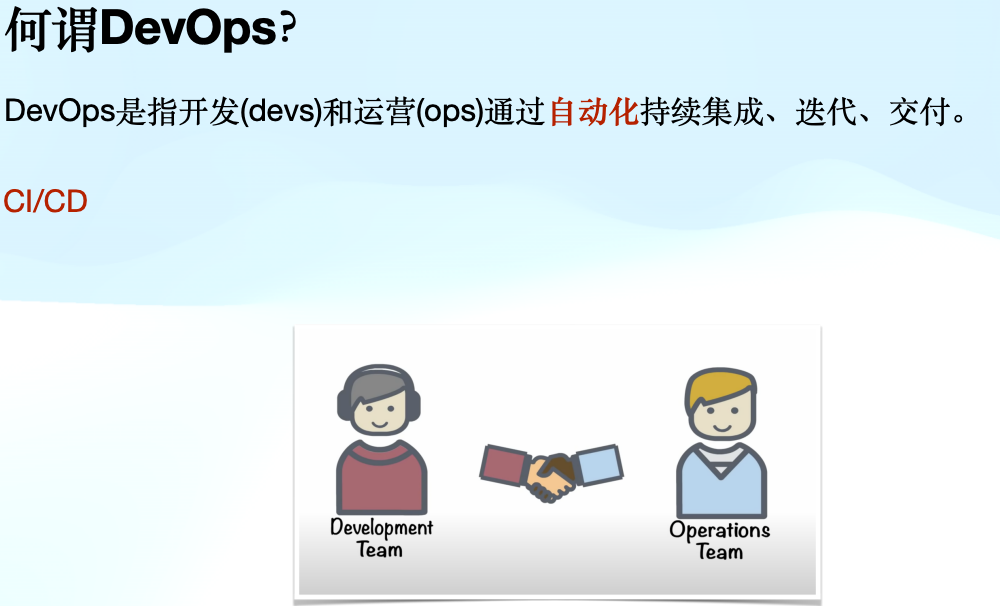

## DevOps

- Dev即Development；Ops即Operations。
- DevOps和CI/CD是现代软件开发和交付过程中非常关键的概念，它们共同目标是提高软件开发的效率和速度，同时保持高质量的标准。
- DevOps是一种文化和实践，旨在促进开发(Dev)和运维(Ops)团队之间的协作和通信，从而加快和优化软件开发和交付过程。DevOps主张自动化软件开发的各个阶段，包括构建、测试、部署和监控，以提高效率和效果。这种方法鼓励持续改进和高质量的软件开发。

## CI/CD

- CI/CD是DevOps实践中的一个核心组成部分，代表持续集成（Continuous Integration）和持续交付（Continuous Delivery）/持续部署（Continuous Deployment）。CI/CD的目标是通过自动化的方式，使软件开发和发布过程更加快速、平滑和可靠。
- 持续集成（CI）：是指开发人员频繁地（可能是每天多次）将代码更改合并到共享仓库中。每次合并后，自动执行构建和测试过程，以尽早发现并解决问题，确保软件质量。
  - 简单来说，就是每次代码变动提交合并后，借助自动化，基于提前定义好的流程进行构建操作
  - 一般用Jenkins实现CI
- 持续交付（CD）：紧跟CI，自动化将通过CI的软件版本部署到类似生产的环境中进行额外的测试和验证。这确保了软件可以随时准备发布。
- 持续部署（另一个CD）：是持续交付的延伸，不仅自动化测试，还自动化将通过所有测试的软件版本部署到生产环境中。这意味着每次提交都有可能直接发布给最终用户，实现了真正的自动化流程。

## 使用DevOps的好处

- 降低出错几率：传统模式较多人手行为，随着项目的复杂度增大出错的概率越大，DevOps通过自动化流程极大减少出错的概率。
- 降本提效：减少传统模式需要频繁跟运维人员的沟通成本，提高效率，可以更快地将代码推向市场。
- 更加专注：自动化流程让开发员可以把时间更加专注于开发上面。
- 驱动力：DevOps会令开发员愿意写更多的测试，没有自动化持续集成的项目会缺少写测试的动力。
- 领悟和提升：DevOps的思想可以让开发员更好得理解Generic和Functional。

# 个人理解

## DevOps

- 想象你在一个餐厅工作，其中厨师负责制作菜肴（开发团队），服务员负责将菜肴送到顾客手中（运维团队）。如果厨师和服务员沟通不畅，菜肴可能会准备错误，或者送到顾客手中时已经冷掉了。DevOps就像是改善厨师和服务员之间沟通的方法，确保他们作为一个团队共同工作，以便菜肴能快速、热乎且正确地送达顾客手中。
- 简单来说，DevOps是一种让软件开发人员（制作产品的人）和运维人员（将产品交付给用户的人）更好合作的方式，目的是让软件更快地、没有错误地交付给用户。

## CI/CD

- 这里的CI/CD就像是餐厅里自动化的传送带系统。
- 持续集成（CI）：每当厨师做好一道菜，就立即通过一个自动传送带送到一个检查站，那里会快速检查这道菜是否达到标准——比如味道是否合格，温度是否适宜。这就保证了所有菜肴在出菜前都是符合要求的。
- 持续交付/部署（CD）：一旦菜肴通过检查，它可以自动被送到适当的桌子上（交付），或者直接上到顾客桌上（部署）。这个过程是自动的，确保每份菜肴都可以迅速且准确地送达。
- 总的来说，DevOps是帮助厨师和服务员更好合作的方法，而CI/CD则是让整个制作和送餐过程自动化的系统。这样一来，餐厅可以更快地提供高质量的服务，顾客也会更满意。

