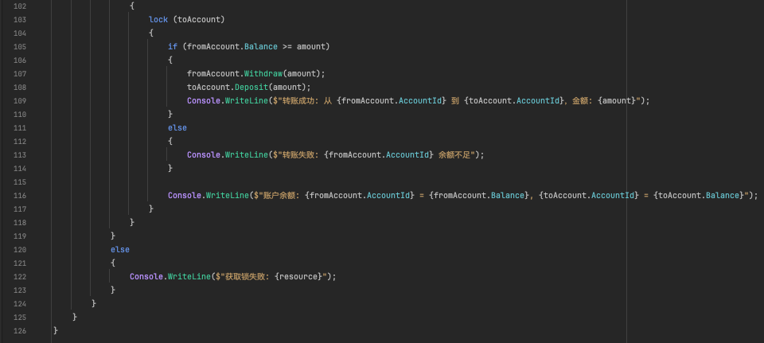

# 入门案例

# 为什么要分布式锁

例如有一个秒杀功能

最初始的业务逻辑代码通常是根据库存数量 。	

- 如果库存数量大于0 -> 扣减库存，秒杀成功；

- 否则 -> 秒杀失败。

  

这时会出现有一个商品的stock数量只有1个，但是卖出了好几份的问题。

原因：在多线程并发的情况下同时对一个资源进行读写，造成数据不一致问题。

## 改进

加一把同步锁，就不会出现超卖的问题了。

原因：多个线程并发执行时，只有持有锁的线程可以操作库存，其他线程同时进来会进行一个互斥，需要等持有锁的进程处理完之后，其他线程才能正常的进行处理。

这种方法在单机环境下可以有效解决超卖问题。然而，随着用户越来越多，服务器压力越来越大，性能到达了瓶颈。需要用到Nginx负载均衡将服务器进行水平扩展，即增加多台服务器来分摊请求压力。

这时吞吐量是上来了，但是又出现了超卖的问题。

**原因**：同步锁是JVM级别的，**只能在单个JVM进程内生效，锁住单个进程**。但是经过分布式部署之后，每台服务器在并发的情况下各自处理请求，无法同步管理共享资源的访问。只能锁住一个线程。例如，当服务器A持有同步锁时，服务器B仍然可以同时访问库存数据。

为了解决跨服务器的并发问题，**这时需要用到分布式锁的技术**。分布式锁能够在多个节点之间协调共享资源的访问，从而保证即使在多台服务器之间进行并发操作，也不会发生数据冲突。

常见的有redis和zookeeper。

# Redis实现分布式锁

## SetNX原理

1. 尝试设置一个锁键，如果键不存在则成功获取锁；

2. 如果键已经存在，则说明锁被其他进程持有，当前进程需要等待或重试。

   

## SetNX实现

一定要加上**过期时间**，这样第一个服务器挂掉了之后，也会随着时间把锁匙放，不会影响到其他服务器。避免因进程意外宕机导致的锁永远无法释放问题。

这时又会出现两个问题

1. **锁自动过期与任务未完成**：如果任务尚未执行完毕但锁已经过期释放，可能会导致多个进程同时获得锁，进而造成并发问题。
2. **删除锁的竞态条件**：进程在删除锁时，可能会删除其他进程意外释放的锁，从而破坏锁的互斥性。

## Redission

Redisson组建提供了这两个问题的解决方案

Redisson组件是基于Redis的一个高级分布式工具，它提供了更高级别的锁机制来解决上述问题：

- **看门狗机制**：在锁未被显式释放的情况下，自动延长锁的有效时间，确保任务在完成之前不会因锁过期导致资源争用。
- **原子操作**：通过Redis的Lua脚本，确保获取和释放锁的操作是原子的，避免竞态条件。

# 用RedLock实现一个银行转账的Demo

## 实体类

## Program

结果：

