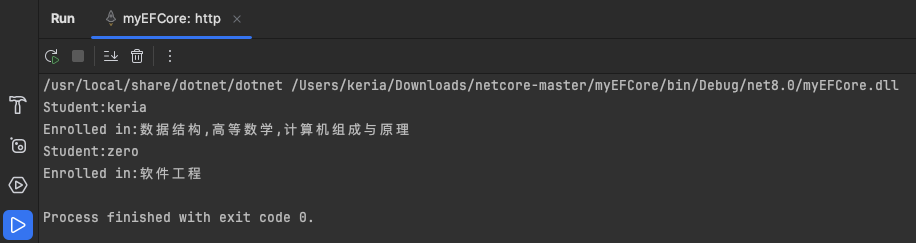

全称：EntityFrameworkCore

Entity Framework Core（EF Core）是一个流行的、开源的、轻量级、可扩展的数据访问技术，由微软开发。它是传统 Entity Framework 的下一代版本，但是完全重写，以提供更好的性能和更高的灵活性。EF Core 是一个对象关系映射（ORM）框架，它允许开发者使用 .NET 对象来操作数据库，而无需写大量的 SQL 代码。

# 核心功能

**1. 支持多种数据库**： EF Core 支持多种数据库提供程序，如 Microsoft SQL Server、SQLite、PostgreSQL、MySQL 和更多。这通过不同的数据库提供程序包实现，开发者可以根据需要选择合适的提供程序。

**2. 对象关系映射（ORM）**： 通过 ORM，开发者可以使用 C# 或其他 .NET 语言编写类来代表数据库中的表，类的实例对应于表中的行。EF Core 管理这些类与数据库表之间的映射关系，使得开发者可以高效地操作数据。

**3. LINQ 查询**： EF Core 使用 LINQ（语言集成查询）作为查询数据的主要方法。开发者可以编写类型安全的 C# 查询来检索、更新和删除数据，EF Core 会将这些查询转换为对应的 SQL 查询。

**4. 迁移支持**： EF Core 提供了强大的迁移支持，允许开发者在应用程序的开发过程中追踪数据库模式的变更，并且能够将这些变更应用到实际的数据库上。这是通过一系列迁移脚本实现的，这些脚本可以自动生成或手动编辑。

**5. 性能优化**： EF Core 设计时考虑了性能，相比老版的 Entity Framework，它在许多方面进行了优化，例如查询效率更高，内存占用更少。

**6. 轻量级和模块化**： EF Core 是模块化设计的，这意味着它的核心功能较少，只包括最必要的部分，其他功能如懒加载、级联删除等可以通过扩展包添加。


# 我的第一个EFCore应用

这里我有三张表，分别是：

学生表：


课程表：


课程关系表


现在，我想用EFCore进行数据查询，查询学生所对应的课程关系

实体类如下：

```
using System.ComponentModel.DataAnnotations.Schema;

namespace myEFCore.Models;

public class Student
{
    [Column("id")]
    public int StudentId { get; set; }
    [Column("name")]
    public string Name { get; set; }
    public List<StudentCourse> StudentCourses { get; set; }
    
}

public class Course
{
    [Column("id")]
    public int CourseId { get; set; }
    [Column("name")]
    public string Name { get; set; }
    public List<StudentCourse> StudentCourses { get; set; }
}

public class StudentCourse
{
    [Column("student_id")]
    public int StudentId { get; set; }
    public Student Student { get; set; }

    [Column("course_id")]
    public int CourseId { get;set; }
    public Course Course { get; set; }
}
```

数据库连接代码如下：

```
public class SchoolContext : DbContext
{
    public DbSet<Student> Students { get; set; }
    public DbSet<Course> Courses { get; set; }
    
    public SchoolContext(DbContextOptions<SchoolContext> options)
        :base(options)
    {
    }
    protected override void OnModelCreating(ModelBuilder modelBuilder)
    {
        //定义多对多的关联表
        modelBuilder.Entity<StudentCourse>()
            .HasKey(sc => new { sc.StudentId, sc.CourseId });
        
        modelBuilder.Entity<StudentCourse>()
            .HasOne<Student>(sc => sc.Student)
            .WithMany(s => s.StudentCourses)
            .HasForeignKey(sc => sc.StudentId);

        modelBuilder.Entity<StudentCourse>()
            .HasOne<Course>(sc => sc.Course)
            .WithMany(c => c.StudentCourses)
            .HasForeignKey(sc => sc.CourseId);
        
        // 设置实体的表名为单数
        modelBuilder.Entity<Student>().ToTable("Student");
        modelBuilder.Entity<Course>().ToTable("Course");
        modelBuilder.Entity<StudentCourse>().ToTable("StudentCourse");
    }
}
```

程序入口代码如下：

```
class Program{
    static void Main(string[] args)
    {
        var optionsBuilder = new DbContextOptionsBuilder<SchoolContext>();
        optionsBuilder.UseMySql("Server=localhost;Database=keria4.11;User=root;Password=123456;",
            ServerVersion.AutoDetect("Server=localhost;Database=keria4.11;User=root;Password=123456;"));

        using (var context = new SchoolContext(optionsBuilder.Options))
        {
            //加载所有学生及相关的课程
            var studentsWithCourses = context.Students
                .Include(s => s.StudentCourses)
                .ThenInclude(sc => sc.Course)
                .ToList();

            foreach (var Student in studentsWithCourses)
            {
                var courseNames = Student.StudentCourses
                    .Select(sc => sc.Course.Name)
                    .ToList();
                
                Console.WriteLine($"Student:{Student.Name}");
                //为了学生的所有课程在同一行显示，使用 String.Join() 方法将列表中的课程名称合并成一个由逗号分隔的字符串
                Console.WriteLine($"Enrolled in:{String.Join(",",courseNames)}");
            }
        }
    }
}
```

查询结果如下：


