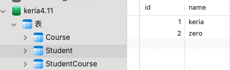

# 简介，操作方式

全称：EntityFrameworkCore

Entity Framework Core（EF Core）是一个流行的、开源的、轻量级、可扩展的数据访问技术，由微软开发。它是传统 Entity Framework 的下一代版本，但是完全重写，以提供更好的性能和更高的灵活性。EF Core 是一个对象关系映射（ORM）框架，它允许开发者使用 .NET 对象来操作数据库，而无需写大量的 SQL 代码。

可以用面向对象的方式来操作数据库。有DBFirst、ModelFirst、CodeFirst三种模式，EF与实体映射的原理是反射。EF操作数据库大致有三步：

1.封装了数据库的统一入口，EF上下文；

2.把对实体的操作放入上下文中；

3.把对实体操作产生的变化生成Sql脚本执行到数据库中；


# 核心概念：状态跟踪

状态跟踪是EF对操作数据库的一种优化, 主要思想是:把所有的model都进行状态跟踪, 这样就不用时刻把修改的操作更新到数据库，进而降低了数据库的压力。需要进行数据库更新的状态有：Added、Modified、Detached

EF的实体状态总共有5种：Added、Deleted、Modified、Detached、unChanged

①. **unChanged**：属性值与数据库中属性值相同，没有发生任何变化，首次查询出来的实体的状态值为unChanged

②. **Modified**：实体中的某些属性的值或所有属性值与数据库中的发生了变化

A：从数据库中查询出来的实体，直接改实体属性的值, 可以将实体状态改为 Modified。

B：自己创建的实体，必须先Attach一下，直接改实体属性的值，才可以将实体状态改为 Modified。

③. **Added**: 实体将由上下文跟踪，但是在数据库中还不存在,

Add()和 AddRange方法可以将实体状态变为：Added

④. **Deleted**:实体将由上下文跟踪并存在于数据库中，但是已被标记为在下次调用 SaveChanges 时从数据库中删除。

A：从数据库中查询出来的实体，通过Remove方法, 可以将实体状态改为 Deleted。

B：自己创建的实体，必须先Attach一下，然后Remove方法，才可以将实体状态改为 Deleted。

⑤. **Detached**: 调用AsNoTracking方法，取消实体状态追踪

https://blog.csdn.net/sinolover/article/details/104278942

# 核心功能

**1. 支持多种数据库**： EF Core 支持多种数据库提供程序，如 Microsoft SQL Server、SQLite、PostgreSQL、MySQL 和更多。这通过不同的数据库提供程序包实现，开发者可以根据需要选择合适的提供程序。

**2. 对象关系映射（ORM）**： 通过 ORM，开发者可以使用 C# 或其他 .NET 语言编写类来代表数据库中的表，类的实例对应于表中的行。EF Core 管理这些类与数据库表之间的映射关系，使得开发者可以高效地操作数据。

**3. LINQ 查询**： EF Core 使用 LINQ（语言集成查询）作为查询数据的主要方法。开发者可以编写类型安全的 C# 查询来检索、更新和删除数据，EF Core 会将这些查询转换为对应的 SQL 查询。

**4. 迁移支持**： EF Core 提供了强大的迁移支持，允许开发者在应用程序的开发过程中追踪数据库模式的变更，并且能够将这些变更应用到实际的数据库上。这是通过一系列迁移脚本实现的，这些脚本可以自动生成或手动编辑。

**5. 性能优化**： EF Core 设计时考虑了性能，相比老版的 Entity Framework，它在许多方面进行了优化，例如查询效率更高，内存占用更少。

**6. 轻量级和模块化**： EF Core 是模块化设计的，这意味着它的核心功能较少，只包括最必要的部分，其他功能如懒加载、级联删除等可以通过扩展包添加。


# 我的第一个EFCore应用

这里我有三张表，分别是：

学生表：



课程表：


课程关系表


现在，我想用EFCore进行数据查询，查询学生所对应的课程关系

实体类如下：

```c#
using System.ComponentModel.DataAnnotations.Schema;

namespace myEFCore.Models;

public class Student
{
    [Column("id")]
    public int StudentId { get; set; }
    [Column("name")]
    public string Name { get; set; }
    public List<StudentCourse> StudentCourses { get; set; }
    
}

public class Course
{
    [Column("id")]
    public int CourseId { get; set; }
    [Column("name")]
    public string Name { get; set; }
    public List<StudentCourse> StudentCourses { get; set; }
}

public class StudentCourse
{
    [Column("student_id")]
    public int StudentId { get; set; }
    public Student Student { get; set; }

    [Column("course_id")]
    public int CourseId { get;set; }
    public Course Course { get; set; }
}
```

数据库连接代码如下：

```c#
public class SchoolContext : DbContext
{
    public DbSet<Student> Students { get; set; }
    public DbSet<Course> Courses { get; set; }
    
    public SchoolContext(DbContextOptions<SchoolContext> options)
        :base(options)
    {
    }
    protected override void OnModelCreating(ModelBuilder modelBuilder)
    {
        //定义多对多的关联表
        modelBuilder.Entity<StudentCourse>()
            .HasKey(sc => new { sc.StudentId, sc.CourseId });
        
        modelBuilder.Entity<StudentCourse>()
            .HasOne<Student>(sc => sc.Student)
            .WithMany(s => s.StudentCourses)
            .HasForeignKey(sc => sc.StudentId);

        modelBuilder.Entity<StudentCourse>()
            .HasOne<Course>(sc => sc.Course)
            .WithMany(c => c.StudentCourses)
            .HasForeignKey(sc => sc.CourseId);
        
        // 设置实体的表名为单数
        modelBuilder.Entity<Student>().ToTable("Student");
        modelBuilder.Entity<Course>().ToTable("Course");
        modelBuilder.Entity<StudentCourse>().ToTable("StudentCourse");
    }
}
```

程序入口代码如下：

```c#
class Program{
    static void Main(string[] args)
    {
        var optionsBuilder = new DbContextOptionsBuilder<SchoolContext>();
        optionsBuilder.UseMySql("Server=localhost;Database=keria4.11;User=root;Password=123456;",
            ServerVersion.AutoDetect("Server=localhost;Database=keria4.11;User=root;Password=123456;"));

        using (var context = new SchoolContext(optionsBuilder.Options))
        {
            //加载所有学生及相关的课程
            var studentsWithCourses = context.Students
                .Include(s => s.StudentCourses)
                .ThenInclude(sc => sc.Course)
                .ToList();

            foreach (var Student in studentsWithCourses)
            {
                var courseNames = Student.StudentCourses
                    .Select(sc => sc.Course.Name)
                    .ToList();
                
                Console.WriteLine($"Student:{Student.Name}");
                //为了学生的所有课程在同一行显示，使用 String.Join() 方法将列表中的课程名称合并成一个由逗号分隔的字符串
                Console.WriteLine($"Enrolled in:{String.Join(",",courseNames)}");
            }
        }
    }
}
```

查询结果如下：


# EF Core是如何操作实体属性的

EF Core在访问实体类的属性时，优先会尝试直接访问属性对应的字段（成员变量），而不是通过属性的getter和setter方法。如果EF Core能够根据命名规则找到对应的字段，它就会直接操作该字段；如果找不到对应的字段，EF Core才会通过属性的getter和setter方法来读写属性值。

假设有一个实体类`Student`，如下所示：

```c#
public class Student
{
    private string _name;

    public int Id { get; set; }

    public string Name
    {
        get { return _name; }
        set { _name = value; }
    }
}
```

在这个例子中，`Name`属性有一个私有字段`_name`来存储实际的数据。根据约定，EF Core会尝试直接访问`_name`字段，而不是通过`Name`属性的getter和setter方法来访问数据。

### 命名规则

EF Core使用一些约定来推断字段的名称，例如：

1. 属性名的前面加上下划线 `_`：`_Name`
2. 属性名的小写形式：`name`
3. 属性名前面加 `m_` 前缀：`m_Name`
4. 属性名的小写形式并前面加 `_`：`_name`

如果EF Core能够根据这些规则找到对应的字段，它会直接访问该字段。例如：

- 对于属性`Name`，EF Core会首先尝试查找字段`_name`。
- 如果`_name`不存在，EF Core会尝试查找字段`name`。
- 如果`name`也不存在，EF Core会尝试查找字段`m_Name`，依此类推。

如果实体类没有符合命名规则的字段，例如：

```c#
public class Student
{
    public int Id { get; set; }

    public string Name { get; set; }
}
```

在这种情况下，EF Core找不到符合命名规则的字段，就会使用属性的getter和setter方法来访问`Name`属性的值。


# 其他内容

## Dapper与EF的区别

**Dapper** ： 开源的轻量级ORM框架，最大的优点就是执行效率快，因为它是直接对ADO.NET的Connection连接对象进行了扩展。

1. EF不用写sql,开发效率比较高,但是执行效率比Dapper低

2. Dapper 必须写sql,因为是基于ado.net, 所以执行效率很高

   

## SqlServer和MySql的区别

1. SQL Server 主要运行Windows下面, 是闭源的,相对可靠,安全性较好,但是比较昂贵,是微软的数据库产品。

2. Mysql体积小、相对便宜、开源，尤其是开放源码，跨平台（window、linux都可以用）。是甲骨文（Oracle）公司的数据库产品

3. 两者语法不同：比如返回指定几行记录

   - Sqlserver用Top；  		MySql用 limit返回当前时间；

   - Sqlserver用getdate() ；	MySql用now()；

4. 开发公司不同

   - SQLserverr是Microsoft（微软）的产品。

   - Mysql是 Oracle（甲骨文） 公司的产品


