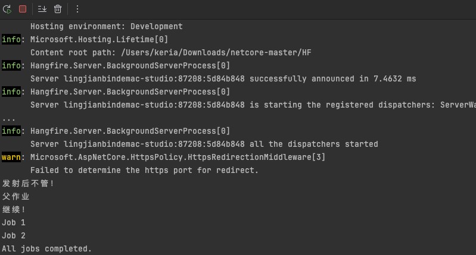

# Hangfire

提供了一个简单的 API，可以添加、删除和管理后台任务，同时也提供了一个可扩展的插件模型，允许自定义任务调度和执行行为

## 小demo

- 以使用`MySQL`作为存储为例

1. 通过`NuGet`导入相关包

   ```c#
   <PackageReference Include="Hangfire" Version="1.8.10" />
   <PackageReference Include="Hangfire.MySqlStorage" Version="2.0.3" />
   ```

2. Startup中配置

   ```c#
   public class StartUp
   {
       public StartUp(IConfiguration configuration)
       {
           Configuration = configuration;
       }
   
       public IConfiguration Configuration { get; }
       
       public void ConfigureServices(IServiceCollection services)
       {
           services.AddControllersWithViews();
           
           // 配置 Hangfire 使用 MySQL 作为存储
           services.AddHangfire(config =>
               config.UseStorage(
                   new MySqlStorage("Server=localhost;Database=HangfireTest;User=root;Password=123456;", 
                       new MySqlStorageOptions
                       {
                           // 你可以在这里配置其他选项
                       })));
           
           // 添加 Hangfire 服务
           services.AddHangfireServer();
       }
       
       public void Configure(IApplicationBuilder app, IWebHostEnvironment env)
       {
           if (env.IsDevelopment())
           {
               app.UseDeveloperExceptionPage();
           }
           
           app.UseHttpsRedirection();
           app.UseRouting();
           
           // 配置 Hangfire 仪表盘
           app.UseHangfireDashboard();
   
           // 调度一个每天下午4点20分执行的定时任务
           RecurringJob.AddOrUpdate<MyBackgroundJob>(job => job.Execute(), "20 16 * * *");
           
           app.UseAuthorization();
           
           // 其他中间件
           app.UseEndpoints(endpoints =>
           {
               endpoints.MapControllers();
           });
       }
   }
   ```

3. 具体逻辑

   ```c#
   public class MyBackgroundJob
   {
       public void Execute()
       {
           Console.WriteLine("后台任务正在执行...");
       }
   }	
   
   public class HomeController : Controller
   {
       // GET
       public string Index()
       {
           // 调度一个后台任务
           BackgroundJob.Enqueue<MyBackgroundJob>(job => job.Execute());
           return "success";
       }
   }
   ```

4. 调度Hangfire作业，并通过API断点来触发这些作业

   - ​	fire-and-forget：仅执行一次，创建之后立即执行

   - ​	dalayed：设定一个未来时间点，延迟作业只执行一次

   - ​	recurring：按照指定CRON计划多次触发

   ```c#
   [Route("api/[controller]")]
   public class JobsController : ControllerBase
   {
       [HttpGet("fire-and-forget")]
       public IActionResult FireAndForget()
       {
           var jobId = BackgroundJob.Enqueue(() => Console.WriteLine("发射后不管！"));
           return Ok($"Fire-and-forget job enqueued. Job ID: {jobId}");
       }
   
       [HttpGet("delayed")]
       public IActionResult Delayed()
       {
           var jobId = BackgroundJob.Schedule(() => Console.WriteLine("延迟！"), TimeSpan.FromDays(7));
           return Ok($"Delayed job scheduled. Job ID: {jobId}");
       }
   
       [HttpGet("recurring")]
       public IActionResult Recurring()
       {
           RecurringJob.AddOrUpdate("我的重复作业", () => Console.WriteLine("重复！"), Cron.Daily);
           return Ok("Recurring job added or updated.");
       }
   
       [HttpGet("continuation")]
       public IActionResult Continuation()
       {
           var parentJobId = BackgroundJob.Enqueue(() => Console.WriteLine("父作业"));
           BackgroundJob.ContinueJobWith(parentJobId, () => Console.WriteLine("继续！"));
           return Ok($"Continuation job scheduled after job ID: {parentJobId}");
       }
   
       [HttpGet("batch")]
       public IActionResult Batch()
       {
           // 模拟批处理作业
           var jobId1 = BackgroundJob.Enqueue(() => Console.WriteLine("Job 1"));
           var jobId2 = BackgroundJob.Enqueue(() => Console.WriteLine("Job 2"));
           BackgroundJob.ContinueJobWith(jobId2, () => Console.WriteLine("All jobs completed."));
   
           return Ok("Simulated batch job started.");
       }
   }
   ```

5. 启动项目，访问/hangfire路径。逐个访问JobsController里的接口

   

6.  数据库中多了很多表

   


控制台输出：


## 持久性

Hangfire 会将需要执行的后台作业和定时任务存储到持久化存储中，然后使用轮询来检查这些任务是否需要执行。这种方式与传统的定时器实现方式有所不同，因为它能够确保在应用程序重启或崩溃后，Hangfire 仍然能够继续执行尚未完成的任务。

Hangfire支持多种数据库

| Database            | NuGet包                |
| ------------------- | ---------------------- |
| `Sql Server`        | Hangfire.SqlServer     |
| `Mysql`             | Hangfire.MySqlStorage  |
| `PostgreSQL`        | Hangfire.PostgreSql    |
| `Redis`             | Hangfire.Pro.Redis     |
| `MongoDB`           | Hangfire.Mongo         |
| `SQLlite`           | Hangfire.SQLite        |
| `In-Memory Storage` | Hangfire.MemoryStorage |

## 仪表盘

### url映射

```c#
    // 配置 Hangfire 仪表盘
    app.UseHangfireDashboard();
```

**默认情况下，`UseHangfireDashboard()`会将仪表板`UI`界面映射到`/hangfire`路径上**

如果想要更改此映射路径，只需要在调用`UseHangfireDashboard()`时传递`URL`作为参数即可

```c#
		// 配置 Hangfire 仪表盘
		app.UseHangfireDashboard("/jobs");
```


### 返回站点

**在仪表板的`UI`界面，留有一个扩展的「返回站点连接」，可用它来引导我们返回应用程序的根`URL`，默认值为`/`**


如需更改这个根`URL`值，需在`UseHangfireDashboard()`时通过`DashboardOptions`类型的参数修改它

```c#
public void Configure(IApplicationBuilder app, IWebHostEnvironment env)
{
    app.UseHangfireDashboard("/hangfire", new DashboardOptions
    {
        DashboardTitle = "My Dashboard",
        AppPath = "/my-home-page",  // 设置返回站点链接
    });
}
```

### 多个仪表盘

```c#
		// 配置第一个仪表板
    app.UseHangfireDashboard("/hangfire-dashboard-1", new DashboardOptions
    {
        DashboardTitle = "Dashboard 1",
        // 其他配置...
    });

    // 配置第二个仪表板
    app.UseHangfireDashboard("/hangfire-dashboard-2", new DashboardOptions
    {
        DashboardTitle = "Dashboard 2",
        // 其他配置...
    });
```

### 仪表盘只读

**防止用户更改任何内容，默认情况只读是处于关闭状态的**

```c#
//开启仪表盘只读
app.UseHangfireDashboard("/hangfire", new DashboardOptions
{
    IsReadOnlyFunc = (DashboardContext context) => true
});
```


## 队列

在 Hangfire 中，队列是一个重要的概念，用于组织和管理后台作业的执行顺序和优先级。

**默认情况下，所有的作业都会被放入到名为`default`的队列中**

我们可以创建额外的队列，并将不同的作业放入这些队列中，以此来控制作业的执行顺序和优先级。

```c#
// 配置 Hangfire 服务器以处理默认队列和自定义队列    
services.AddHangfireServer(options =>
{
    options.Queues = new[] { "high-priority", "default", "low-priority" };
});

```

JobsController

```c#
    [HttpGet("enqueue-default")]
    public IActionResult EnqueueDefault()
    {
        BackgroundJob.Enqueue(() => Console.WriteLine("This is a default queue job"));
        return Ok("Default queue job enqueued.");
    }

    [HttpGet("enqueue-high-priority")]
    public IActionResult EnqueueHighPriority()
    {
        BackgroundJob.Enqueue(() => Console.WriteLine("This is a high priority job"), "high-priority");
        return Ok("High priority job enqueued.");
    }

    [HttpGet("enqueue-low-priority")]
    public IActionResult EnqueueLowPriority()
    {
        BackgroundJob.Enqueue(() => Console.WriteLine("This is a low priority job"), "low-priority");
        return Ok("Low priority job enqueued.");
    }
```


## 过滤器

允许在作业执行前后插入自定义逻辑。

过滤器可以用于日志记录、异常处理、性能监控、安全检查等。

Hangfire 提供了多种类型的过滤器，包括全局过滤器和作业级别的过滤器。


### 过滤器类型

1. **全局过滤器**：适用于所有作业。

2. **作业级别的过滤器**：仅适用于特定作业。

   

### 过滤器接口

Hangfire 提供了几个过滤器接口，可以在作业执行的不同阶段插入逻辑：

- **IClientFilter**：在作业创建之前和之后。
- **IServerFilter**：在作业执行之前和之后。
- **IElectStateFilter**：在作业状态更改时。
- **IApplyStateFilter**：在作业状态应用时。

创建一个实现 `IServerFilter` 接口的日志记录过滤器：

```c#
public class LoggingFilter : IServerFilter
{
    public void OnPerforming(PerformingContext filterContext)
    {
        Console.WriteLine($"Starting to perform job {filterContext.BackgroundJob.Id} at {DateTime.Now}");
    }

    public void OnPerformed(PerformedContext filterContext)
    {
        Console.WriteLine($"Finished performing job {filterContext.BackgroundJob.Id} at {DateTime.Now}");
    }
}
```

配置全局过滤器

```c#
    public void ConfigureServices(IServiceCollection services)
    {
        services.AddControllers();

        services.AddHangfire(config =>
        {
            config.UseStorage(
                new MySqlStorage(Configuration.GetConnectionString("DefaultConnection"),
                new MySqlStorageOptions
                {
                    // 你可以在这里配置其他选项
                }));

            // 添加全局过滤器
            config.UseFilter(new LoggingFilter());
        });

        services.AddHangfireServer(options =>
        {
            options.Queues = new[] { "high-priority", "default", "low-priority" };
        });
    }
```


## Cron表达式

Cron 表达式由五个字段组成，表示不同的时间单位：

```c#
* * * * * *
- - - - - -
| | | | | |
| | | | | +----- 一周中的第几天 (0 - 7) (Sunday=0 or 7)
| | | | +------- 月份 (1 - 12)
| | | +--------- 一个月中的第几天 (1 - 31)
| | +----------- 小时 (0 - 23)
| +------------- 分钟 (0 - 59)
+--------------- 秒 (0 - 59)
```

示例：

- `* * * * * *`：每秒执行一次

  `0 * * * * *`：每分钟的第 0 秒执行一次

  `0 0 * * * *`：每小时的第 0 分钟第 0 秒执行一次

  `0 0 0 * * *`：每天午夜执行一次

  `0 0 0 * * 0`：每周日午夜执行一次

  `0 0 0 1 * *`：每月的第一天午夜执行一次