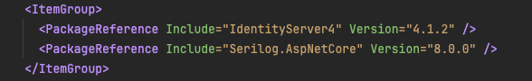
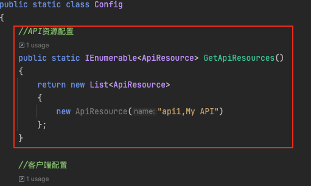
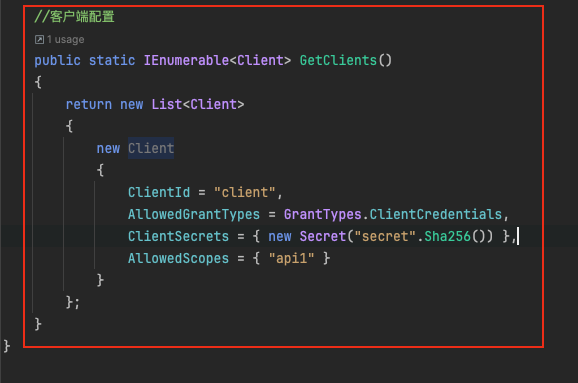
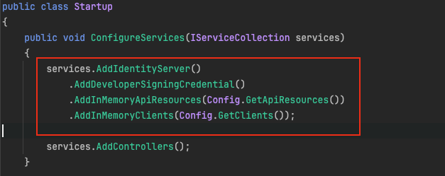
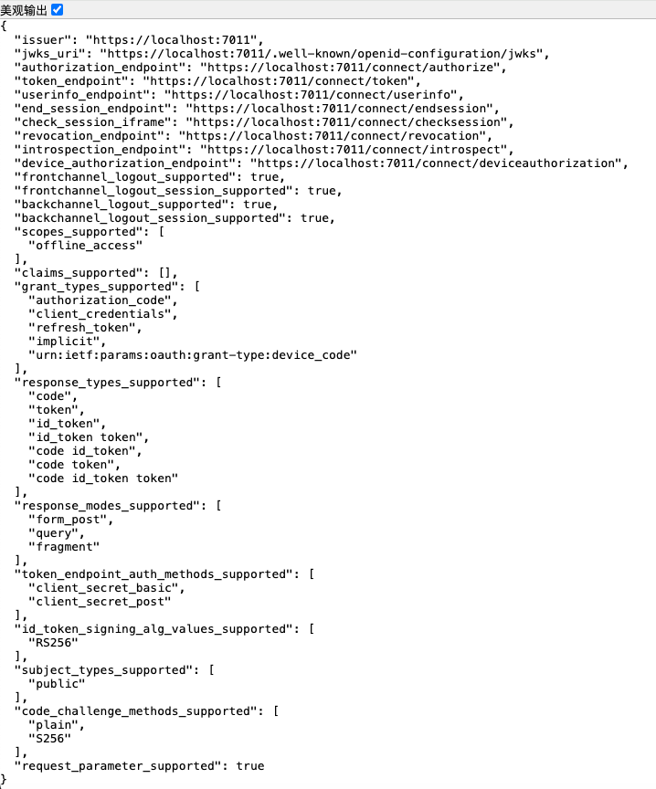
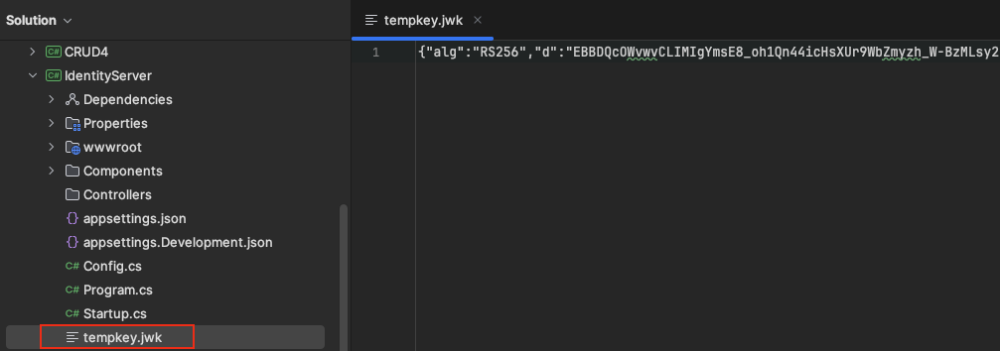

# IdentityServer

**IdentityServer** 是一个流行的开源身份认证和授权框架，它基于 OAuth 2.0 和 OpenID Connect 标准。IdentityServer 主要用于ASP.NET Core 应用程序，以帮助开发者安全地实现认证和授权功能。

大多数现代应用程序看起来或多或少像这样：


从部署角度说，IdentityServer（Authorization endPoint 和Token Endpoint）可以和被保护的web应用部署在统一台服务器上，也可以部署在单独的服务器上。

### 用户

也即资源所有者(Resource Owner)， A user is a human that is using a registered client to access resources

### 客户端

客户端是从IdentityServer请求令牌的软件，用于验证用户（请求身份令牌）或访问资源（请求访问令牌）。 
客户端可以是Web应用程序，本地移动或桌面应用程序(WPF)，SPA，服务器进程(console app)等。比如“云冲印”网站。

必须首先向IdentityServer注册客户端才能请求令牌(AddInMemoryClients(InMemoryConfiguration.GetClients())

```c#
IIdentityServerBuilder.AddInMemoryClients(IEnumerable<Client> clients)
```

### 资源

资源是想要保护的资源 ，两种最基本的资源类型：

- API资源，表示客户端想要调用的功能 ，通常被建模为Web API，但不一定。
- 用户身份数据标识信息(Identity Data，aka Claims)，比如姓名或邮件地址等。

资源部署在Resource server（资源服务器），即服务提供商存放用户生成的资源的服务器。它与认证服务器，可以是同一台服务器，也可以是不同的服务器。

# 入门案例

1. 导入两个包

   

2. 设置需要保护的api资源：告诉IdentityServer哪些部分是需要它来保护的

   

3. 设置客户端：指用来访问API的程序。会给这个程序一组密钥，它用这组密钥来证明自己有权访问那些被保护的API。

   

4. 配置服务器：设置IdentityServer的一些基本工作方式，比如它是怎样来访问程序的密钥是否正确，以及允许它访问哪些API

   

5. 编写program类：初始化和启动应用程序，包括配置和使用日志系统

```c#
using IdentityServer;
using IdentityServer.Components;
using Serilog;
using Serilog.Events;
using Serilog.Sinks.SystemConsole.Themes;

public class Program
{
    public static int Main(string[] args)
    {
        Log.Logger = new LoggerConfiguration()
            .MinimumLevel.Debug()
            .MinimumLevel.Override("Microsoft", LogEventLevel.Warning)
            .MinimumLevel.Override("Microsoft.Hosting.Lifetime", LogEventLevel.Information)
            .MinimumLevel.Override("System", LogEventLevel.Warning)
            .MinimumLevel.Override("Microsoft.AspNetCore.Authentication", LogEventLevel.Information)
            .Enrich.FromLogContext()
            // uncomment to write to Azure diagnostics stream
            //.WriteTo.File(
            //    @"D:\home\LogFiles\Application\identityserver.txt",
            //    fileSizeLimitBytes: 1_000_000,
            //    rollOnFileSizeLimit: true,
            //    shared: true,
            //    flushToDiskInterval: TimeSpan.FromSeconds(1))
            .WriteTo.Console(outputTemplate: "[{Timestamp:HH:mm:ss} {Level}] {SourceContext}{NewLine}{Message:lj}{NewLine}{Exception}{NewLine}", theme: AnsiConsoleTheme.Code)
            .CreateLogger();
        
        try
        {
            Log.Information("Starting host...");
            CreateHostBuilder(args).Build().Run();
            return 0;
        }
        catch (Exception ex)
        {
            Log.Fatal(ex, "Host terminated unexpectedly.");
            return 1;
        }
        finally
        {
            Log.CloseAndFlush();
        }
    }
    
    public static IHostBuilder CreateHostBuilder(string[] args) =>
        Host.CreateDefaultBuilder(args)
            .UseSerilog()
            .ConfigureWebHostDefaults(webBuilder =>
            {
                webBuilder.UseStartup<Startup>();
            });
}
```

输出结果：



首次启动时，IdentityServer 创建一个开发人员签名密钥，它是一个名为`tempkey.jwk`.不必将该文件签入源代码管理中，如果该文件不存在，则会重新创建该文件。



# 生活场景

## 快递员进小区

小区有门禁系统，进入的时候需要输入密码。每天都有快递员来送货。必须找到一个办法，让快递员通过门禁系统，进入小区。

有没有一种办法，让快递员能够自由进入小区，又不必知道小区居民的密码，而且他的唯一权限就是送货，其他需要密码的场合，他都没有权限？

### 授权机制的设计

1. 门禁系统的密码输入器下面，增加一个按钮，叫做"获取授权"。快递员需要首先按这个按钮，去申请授权。
2. 按下按钮以后，屋主的手机就会跳出对话框：有人正在要求授权。系统还会显示该快递员的姓名、工号和所属的快递公司。屋主确认请求属实，就点击按钮，告诉门禁系统，同意给予该快递员进入小区的授权。
3. 门禁系统得到确认以后，向快递员显示一个进入小区的令牌（access token）。令牌就是类似密码的一串数字，只在短期内（比如七天）有效。
4. 快递员向门禁系统输入令牌，进入小区。

有人可能会问，为什么不是远程为快递员开门，而要为他单独生成一个令牌？这是因为快递员可能每天都会来送货，第二天他还可以复用这个令牌。另外，有的小区有多重门禁，快递员可以使用同一个令牌通过它们。

### 令牌与密码的比较

令牌（token）与密码（password）的作用是一样的，都可以进入系统，但是有三点差异。

1. 令牌是短期的，到期会自动失效，用户自己无法修改。密码一般长期有效，用户不修改，就不会发生变化。
2. 令牌可以被数据所有者撤销，会立即失效。以上例而言，屋主可以随时取消快递员的令牌。密码一般不允许被他人撤销。
3. 令牌有权限范围（scope），比如只能进小区的二号门。对于网络服务来说，只读令牌就比读写令牌更安全。密码一般是完整权限。

上面这些设计，保证了令牌既可以让第三方应用获得权限，同时又随时可控，不会危及系统安全。注意，只要知道了令牌，就能进入系统。系统一般不会再次确认身份，所以令牌必须保密，泄漏令牌与泄漏密码的后果是一样的。 这也是为什么令牌的有效期，一般都设置得很短的原因。

# 互联网场景

有一个"云冲印"的网站，可以将用户储存在Google的照片，冲印出来。用户为了使用该服务，必须让"云冲印"读取自己储存在Google上的照片。 

问题是只有得到用户的授权，Google才会同意"云冲印"读取这些照片。那么，"云冲印"怎样获得用户的授权呢？

传统方法是，用户将自己的Google用户名和密码，告诉"云冲印"，后者就可以读取用户的照片了。这样的做法有以下几个严重的缺点。

> 1. "云冲印"为了后续的服务，会保存用户的密码，这样很不安全。
> 2. Google不得不部署密码登录，而我们知道，单纯的密码登录并不安全。
> 3. "云冲印"拥有了获取用户储存在Google所有资料的权力，用户没法限制"云冲印"获得授权的范围和有效期。
> 4. 用户只有修改密码，才能收回赋予"云冲印"的权力。但是这样做，会使得其他所有获得用户授权的第三方应用程序全部失效。
> 5. 只要有一个第三方应用程序被破解，就会导致用户密码泄漏，以及所有被密码保护的数据泄漏。

OAuth就是为了解决上面这些问题而诞生的，**OAuth 的核心就是向第三方应用颁发令牌**。


