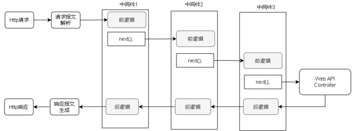
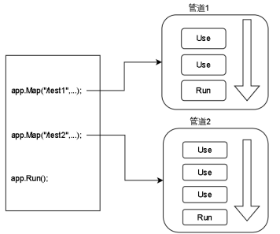
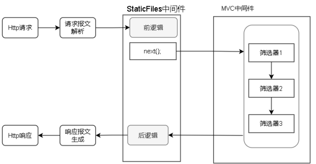

# 什么是中间件

中间件是ASP.NET Core的核心组件，MVC框架、响应内存、身份验证、CORS、Swagger等都是内置中间件



## 组成部分

中间件由**前逻辑**、**next**、**后逻辑**3部分组成。

- **前逻辑**：第一段要执行的逻辑代码
- **next**：指向下一个中间件的调用
- **后逻辑**：从下一个中间件执行返回所执行的逻辑代码

## 中间件的三个概念

**Map**、**Use**、**Run**

- **Map**：定义一个管道可以处理哪些请求
- **Use**和**Run**用来定义管道、一个管道由若干个Use和一个Run组成，每个Use引入一个中间件。Run用来执行最终的核心应用逻辑



## Filter和中间件的关系和区别

关系：

中间件是ASP.NET Core这个基础提供的功能，而Filter是ASP.NET Core MVC中提供的功能。ASP.NET Core MVC是由MVC中间件提供的框架，而Filter属于MVC中间件提供的功能。



区别：

- **中间件**：中间件是应用程序处理管道的一部分，能够处理应用程序接收到的所有HTTP请求，无论这些请求的目标是什么。中间件运行在一个更底层的级别，它不依赖于特定的框架（例如MVC），所以它不能直接处理MVC特有的概念，如Controller、Action等。

- **过滤器（Filter）**：过滤器只能处理特定于MVC框架的请求，也就是说，过滤器只能作用于Controller和Action方法。它们用于在执行控制器和动作方法之前或之后进行操作。因为过滤器运行在更高层次，它们可以访问MVC框架特有的概念和功能。

  ```c#
   [AuthonizationFilter()]
   public IActionResult Index()
   {
       return View();
   }
  ```

```c#
 [AuthonizationFilter()]
 public class HomeController : Controller
  {
        private ILogger<FirstController> _logger;

        public HomeController(ILogger<FirstController> logger)
        {
            _logger = logger;
        }
 }
```

### 使用建议

- **优先选择中间件**：中间件是应用程序处理管道的核心组件，因为它们能够处理所有的HTTP请求，是实现横切关注点的首选方式。使用中间件的好处是它们可以在应用程序的任何地方重用，且不依赖于特定的框架。
- **使用Filter的场景**：如果某个组件只针对MVC框架，或者需要调用一些MVC相关的类和功能（例如控制器、动作方法、模型绑定等），那么我们就应该选择使用过滤器。过滤器能够更好地与MVC框架集成，并在控制器和动作方法执行过程中进行操作。