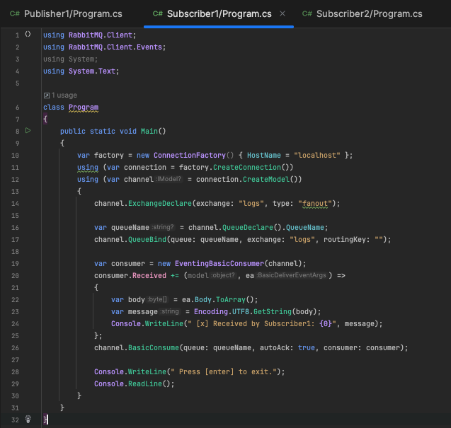
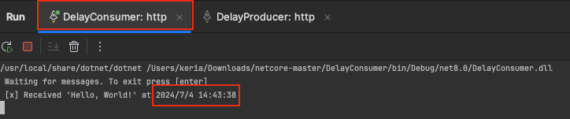

# RabbitMQ

RabbitMQ是一个开源的消息队列中间件，它实现了高级消息队列协议（AMQP）标准。它的作用是在分

布式系统中传递和存储消息，以实现不同应用程序之间的解耦和异步通信。具体来说，RabbitMQ提供了一个可靠的消息传递机制，允许生产者（发送者）将消息发送到一个或多

个称为Exchange的交换机上，然后将消息路由到一个或多个队列中。消费者（接收者）通过订阅队列来

接收和处理消息。

RabbitMQ的作用包括：

1. 解耦：RabbitMQ允许应用程序通过消息传递进行解耦。生产者和消费者之间不存在直接的依赖关

​	系，它们只需要知道如何与消息队列进行交互即可。

2. 异步通信：应用程序可以通过将消息发送到消息队列中实现异步通信。生产者将消息发送到队列后

​	立即返回，而不需要等待消费者的响应。

3. 削峰填谷：当生产者的速度超过消费者时，RabbitMQ可以帮助缓冲和平衡消息的流量，从而避免

​	系统过载。

4. 可靠性传输：RabbitMQ提供了多种机制来确保消息的可靠传输，包括持久化、消息确认和事务机

​	制等。

5. 消息路由和转发：RabbitMQ支持灵活的消息路由机制，可以根据不同的规则将消息路由到指定的

​	队列或交换机。

6. 扩展性和高可用性：通过构建RabbitMQ集群，可以实现高可用性和可扩展性，确保系统在节点故

​	障时仍能正常运行。

总之，RabbitMQ是一个功能强大的消息队列中间件，广泛应用于微服务架构、分布式系统、异步任务

处理、日志收集和实时数据处理等场景，提供了可靠、灵活和高效的消息传递机制。


## 主要组件

1. Producer（生产者）：生产者是消息的发送方，它将消息发送到RabbitMQ的交换机上。
2. Exchange（交换机）：交换机接收来自生产者的消息，并根据特定的规则将消息路由到一个或多

个队列中。常见的交换机类型有直连交换机（Direct Exchange）、主题交换机（Topic 

Exchange）、扇形交换机（Fanout Exchange）和头交换机（Headers Exchange）。

3. Queue（队列）：队列是RabbitMQ用于存储消息的容器。消费者可以订阅队列，从队列中获取消

息进行处理。

4. Binding（绑定）：绑定是交换机和队列之间的关联关系，它定义了消息的路由规则。绑定规定了

消息从交换机发送到哪个队列。

5. Consumer（消费者）：消费者从队列中接收消息，并处理这些消息。
6. Connection（连接）：连接是应用程序与RabbitMQ服务器之间的TCP连接。
7. Channel（通道）：通道是建立在连接之上的虚拟连接，用于在应用程序和RabbitMQ服务器之间

进行数据传输。通过使用通道，可以在同一个连接上创建多个独立的会话。

8. Virtual Host（虚拟主机）：虚拟主机是逻辑上的概念，用于将RabbitMQ服务器分割为多个独立的

部分，类似于操作系统中的命名空间。每个虚拟主机拥有自己的交换机、队列和绑定等。

9. Broker（代理）：代理是RabbitMQ服务器的核心组件，负责接收、路由和传递消息。它处理与生

产者和消费者之间的通信，并通过交换机将消息路由到队列。

以上是RabbitMQ的主要组件，它们共同构成了一个完整的消息队列系统，实现了可靠的消息传递和处

理。


## **RabbitMQ**有几种工作模式/应用场景

1.**simple**模式（即最简单的收发模式）


​	消息产生消息，将消息放入队列

​	消息的消费者(consumer) 监听 消息队列,如果队列中有消息,就消费掉,消息被拿走后,自动从队列中

​	删除(隐患 消息可能没有被消费者正确处理,已经从队列中消失了,造成消息的丢失，这里可以设置成手动的ack,	但如果设置成手动ack，处理完后要及时发送ack消息给队列，否则会造成内存溢出)。


2. **work**工作模式(资源的竞争)

   

   消息产生者将消息放入队列消费者可以有多个,消费者1,消费者2同时监听同一个队列,消息被消费。

   C1 C2共同争抢当前的消息队列内容,谁先拿到谁负责消费消息(隐患：高并发情况下,默认会产生某

   一个消息被多个消费者共同使用,可以设置一个开关(syncronize) 保证一条消息只能被一个消费者使

   用)。

   

3.  **publish/subscribe**发布订阅(共享资源)

   

   每个消费者监听自己的队列；

   生产者将消息发给broker，由交换机将消息转发到绑定此交换机的每个队列，每个绑定交换机的队

   列都将接收到消息。

   

4. **routing**路由模式

   

   消息生产者将消息发送给交换机按照路由判断,路由是字符串(info) 当前产生的消息携带路由字符(对

   象的方法),交换机根据路由的key,只能匹配上路由key对应的消息队列,对应的消费者才能消费消息;根据业务功能定义路由字符串

   从系统的代码逻辑中获取对应的功能字符串,将消息任务扔到对应的队列中。

   业务场景:error 通知;EXCEPTION;错误通知的功能;传统意义的错误通知;客户通知;利用key路由,可以

   将程序中的错误封装成消息传入到消息队列中,开发者可以自定义消费者,实时接收错误;


## 如何保证消息不被重复消费

分析重复消费原因

**生产时消息重复**

​	由于生产者发送消息给MQ，在MQ确认的时候出现了网络波动，生产者没有收到确认，实际上MQ

已经接收到了消息。这时候生产者就会重新发送一遍这条消息。生产者中如果消息未被确认，或确

认失败，我们可以使用定时任务+（redis/db）来进行消息重试。

**消费时消息重复**

​	消费者消费成功后，再给MQ确认的时候出现了网络波动，MQ没有接收到确认，为了保证消息被

消费，MQ就会继续给消费者投递之前的消息。这时候消费者就接收到了两条一样的消息。

解决方案

- ​	让每个消息携带一个全局的唯一ID，即可保证消息的幂等性
- ​	消费者获取到消息后先根据id去查询redis/db是否存在该消息。
- ​	如果不存在，则正常消费，消费完毕后写入redis/db。
- ​	如果存在，则证明消息被消费过，直接丢弃。


# RabbitMQ的优缺点


# 实战


## 安装RabbitMQ等


1. macOS安装rabbitMQ通常推荐用Homebrew安装。打开终端，首先安装Homebrew：

```
/bin/bash -c "$(curl -fsSL https://raw.githubusercontent.com/Homebrew/install/HEAD/install.sh)"
```

过程可能会出现错误，

```
fatal: unable to access 'https://github.com/Homebrew/brew/': Failed to connect to github.com port 443 after 75020 ms: Couldn't connect to server
```

出现错误参考这个文档：https://www.cnblogs.com/mizhifei/p/16558406.html

2. 安装Homebrew成功后

   ```
   (echo; echo 'eval "$(/opt/homebrew/bin/brew shellenv)"') >> /Users/keria/.zprofile
   ```

3. 立即加载新的环境变量

   ```
   eval "$(/opt/homebrew/bin/brew shellenv)"
   ```

4. 验证Homebrew是否安装成功

   ```
   brew help
   ```

5. 接下来开始安装rabbitMQ

   ```
   brew install rabbitmq
   ```

6. 启动rabbitMQ

   ```
   brew services start rabbitmq
   ```

7. 启用rabbitMQ管理插件

   ```
   rabbitmq-plugins enable rabbitmq_management
   ```

8. 重启rabbitMQ

   ```
   brew services restart rabbitmq
   ```

9. 访问本地管理控制台，用户名和密码都是 guest

   http://localhost:15672


### 成功后显示页面


#### 页面介绍

- 六个选项卡

  - Overview：这里可以概览 RabbitMQ 的整体情况，如果是集群，也可以查看集群中各个节点的情况。包括 RabbitMQ 的端口映射信息等，都可以在这个选项卡中查看。
  - Connections：这个选项卡中是连接上 RabbitMQ 的生产者和消费者的情况。
  - Channels：这里展示的是“通道”信息，关于“通道”和“连接”的关系。
  - Exchange：这里展示所有的交换机信息。
  - Queue：这里展示所有的队列信息。
  - Admin：这里展示所有的用户信息。
- 右上角是页面刷新的时间，默认是 5 秒刷新一次，展示的是所有的 Virtual host

原文链接：https://blog.csdn.net/weixin_37833693/article/details/138725027


## 练手Demo（简单模式）

只有一个生产者，一个消费者队列。接收消息时只需要制定队列名，不需要制定发送到哪个Exchange。RabbitMQ会自动使用Virtual Host默认的Exchange

1. 创建两个csproj，一个Producer，一个Consumer。安装RabbitMQ.Client 包，版本不要太高，6.2.1就好好了

   ```
   dotnet add package RabbitMQ.Client
   ```

2. Producer

   

​	`ConnectionFactory`：创建与 RabbitMQ 服务器连接的工厂。这里指定了 `HostName` 为 `localhost`，表示	连接到本地的 RabbitMQ 服务器。

​	`CreateConnection()`：使用连接工厂创建一个连接。

​	`CreateModel()`：使用连接创建一个通道（channel）。通道是与 RabbitMQ 服务器进行通信的主要方式。

​	`QueueDeclare` 方法用于声明一个队列。如果队列不存在，则创建它。参数 `queue` 指定队列的名称。

`durable` 设置为 `false` 表示队列不是持久化的（服务器重启后不会保留）。`	exclusive` 设置为 `false` 表示队

列不是排他性的。`autoDelete` 设置为 `false` 表示队列不会自动删`arguments` 设置为 `null` 表示没有其他参

数。

​	`Encoding.UTF8.GetBytes` 方法将消息文本转换为字节数组。

​	`BasicPublish` 方法用于发送消息到指定的队列。`exchange` 设置为空字符串，表示使用默认交换机。

`routingKey` 指定队列的名称（在这种情况下为 "hello"）。`basicProperties` 设置为 `null`，表示没有指定其他

属性。`body` 是消息的字节数组。

3. Consumer

   

- ​	创建连接工厂、连接、通道、声明队列操作都一样

- ​	`EventingBasicConsumer` 类用于创建一个事件驱动的消费者。

- ​	`Received` 事件在消费者接收到消息时触发。`ea.Body.ToArray` 获取消息的字节数组。

- `Encoding.UTF8.GetString` 将字节数组解码为字符串。

- ​	开始消费消息：`BasicConsume` 方法用于开始从指定队列中消费消息。`queue` 指定队列的名称。`autoAck` 设置为 `true` 表示自动确认消息。`consumer` 是要使用的消费者。

- ​	`Console.WriteLine ()` 和 `Console.ReadLine ()`  两行代码时应用程序保持运行，直到按下回车键，
  从而保持消费者持续监听队列中的消息。

  

3. 运行并打开管理界面：


## 进阶Demo 发布/订阅模式（Pub/Sub）

通过交换机来路由消息到多个队列，并让多个消费者处理这些消息。

使用 `fanout` 交换机类型。`fanout` 交换机会将接收到的消息广播到所有绑定到它的队列。

1. Publisher

   

   ```
   channel.ExchangeDeclare(exchange: "logs", type: "fanout");
   ```

    声明一个名为logs的fanout类型的交换机，表示这是一个广播交换机，消息会被发送到所有绑定到该交换机的队列。

   

2. Subscriber1

   

   比之前的练手Demo类的Cosumer类多了一个创建交换机并将队列绑定到交换机的动作

   

3. Subscriber2


4. 运行项目验证

   出现声明的logs交换机

   

​	查看Queues队列，可以看到生产者和两个消费者创建的队列

​		随机生成的临时队列名（每个消费者一个临时队列）


​	查看Connections连接标签，可以看到生产者和两个消费者的连接

​	


## 进阶Demo 主题交换机（Topic Exchange）

使用主题交换机根据消息的路由键进行消息路由。

创建多个消费者，每个消费者订阅不同的主题模式。

展示如何利用路由键和绑定键实现复杂的消息过滤。

项目结构：

​	`Publisher` 项目：负责发送消息

​	`SubscriberError` 项目：负责接收错误日志

​	`SubscriberInfo` 项目：负责接收信息日志

​	`SubscriberAll` 项目：负责接收所有日志

1. TopicPublisher

   

2. SubscriberError

   

   ​	`SubscriberError` 绑定键为 `*.error`，接收所有路由键中第二部分是 `error` 的消息。

3. SubscriberInfo

   

   ​	`SubscriberInfo` 绑定键为 `*.info`，接收所有路由键中第二部分是 `info` 的消息。

   4. SubscriberAll
   
      

​		`SubscriberAll` 绑定键为 `#`，接收所有消息。


## 延迟队列Demo

延迟队列就是用到了死信交换机和TTL（消息存活时间）实现的。
如果消息超时未消费就会变成死信，在RabbitMQ中如果消息成为死信，队列可以绑定一个死信交换机，在死信交换机上可以绑定其他队列，在我们发消息的时候可以按照需求指定TTL的时间，这样就实现了延迟队列的功能了。
RabbitMQ有一种方式可以实现延迟队列，在RabbitMQ中安装一个死信插件，这样更方便一些，我们只需要在声明交互机的时候，指定这个就是死信交换机，然后在发送消息的时候直接指定超时时间就行了，相对于死
信交换机+TTL要省略了一些步骤。

#### 安装延迟插件

1. 到github上下载delay插件

   https://github.com/rabbitmq/rabbitmq-delayed-message-exchange/releases

   

2. 进入mac终端 查看rabbitMQ的安装目录

```
brew list rabbitmq
```


3. 复制下载好的插件放到plugins目录下

   

4. 在plugins目录下执行安装命令

   ```
   rabbitmq-plugins enable rabbitmq_delayed_message_exchange
   ```

​	出现以下内容就算成功

​	


此时出现一个问题，出现了这个成功的界面


但是管理界面却没有出现delay交换机。

查看自己的rabbitMQ日志

tail -f /opt/homebrew/var/log/rabbitmq/rabbit@localhost.log


没有看到任何与 `rabbitmq_delayed_message_exchange` 插件相关的特定错误或信息。


原因是我启用的rabbitMQ是docker安装的不是Homebrew安装的。重头来一次！


1. 使用curl下载插件（插件的版本号一定要跟rabbitMQ兼容）

   ```
   curl -LO https://github.com/rabbitmq/rabbitmq-delayed-message-exchange/releases/download/v3.13.0/rabbitmq_delayed_message_exchange-3.13.0.ez
   ```

2. 将下载的 `.ez` 文件复制到 Docker 容器中

   ```
   docker cp rabbitmq_delayed_message_exchange-3.13.0.ez rabbitmq_management:/plugins/
   ```

3. 进入Docker容器

   ```
   docker exec -it rabbitmq_management bash
   ```

4. 启用插件

   ```
   mv /plugins/rabbitmq_delayed_message_exchange-3.11.1.ez /usr/lib/rabbitmq/lib/rabbitmq_server-3.11.1/plugins/
   rabbitmq-plugins enable rabbitmq_delayed_message_exchange
   ```

5. 确认插件已经启用

   ```
   rabbitmq-plugins list
   ```

   

6. 此时rabbitMQ管理界面进入交换机页面，多了一个选项，说明真正成功了

   


#### 开始Demo

1. DelayProducer代码

   

2. DelayConsumer代码

   

3. 首先运行消费者，然后再运行生产者，从控制台可以看到，接收消息延迟了5秒。

   

​	
