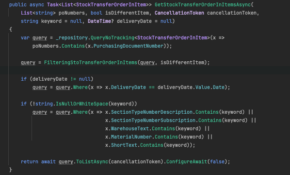
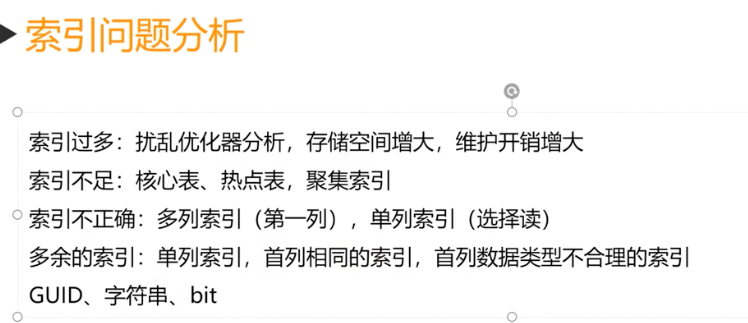
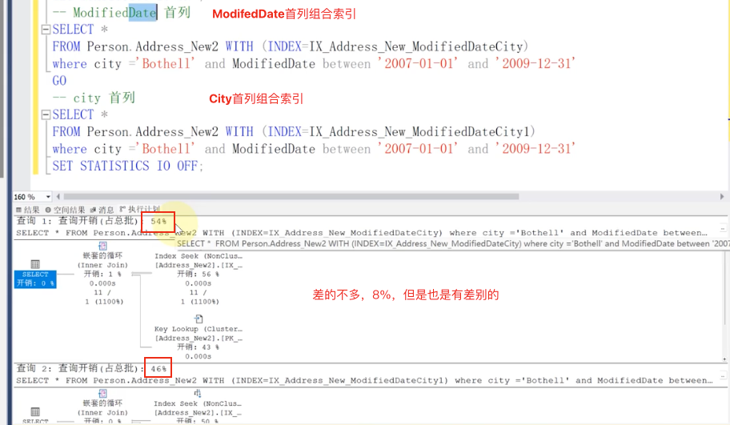
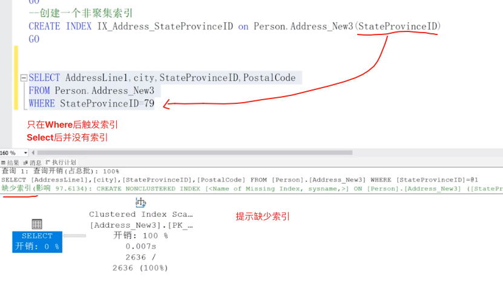
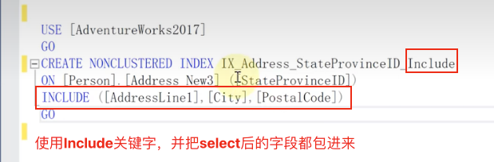
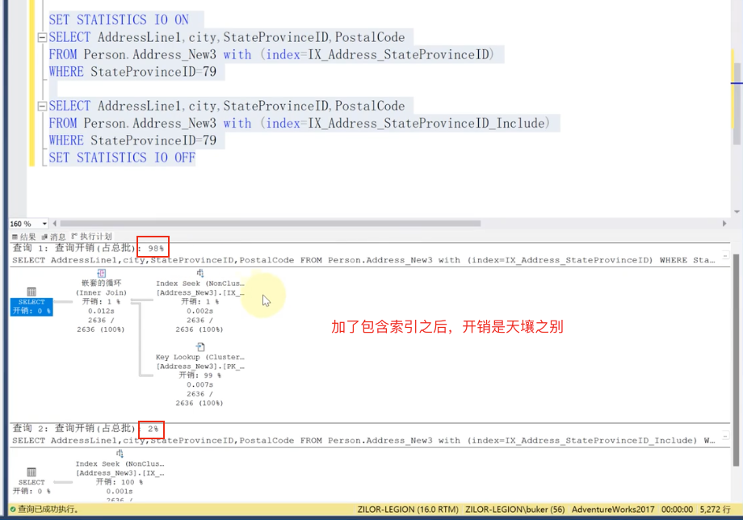
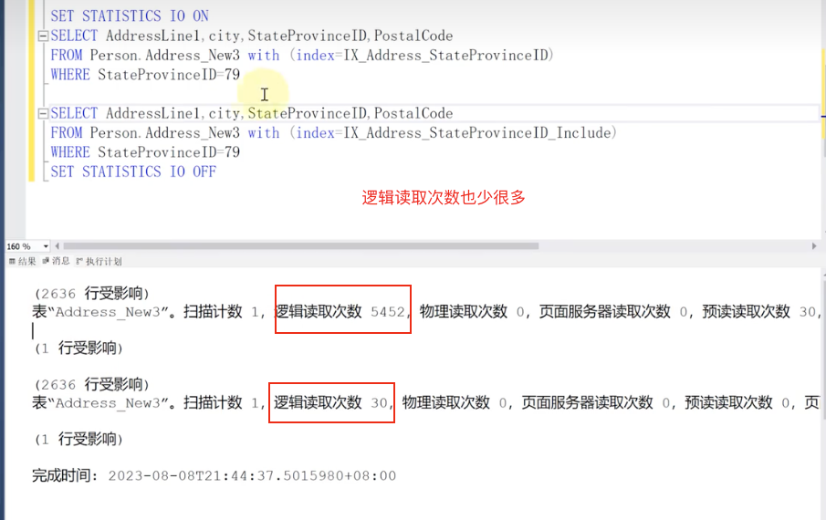
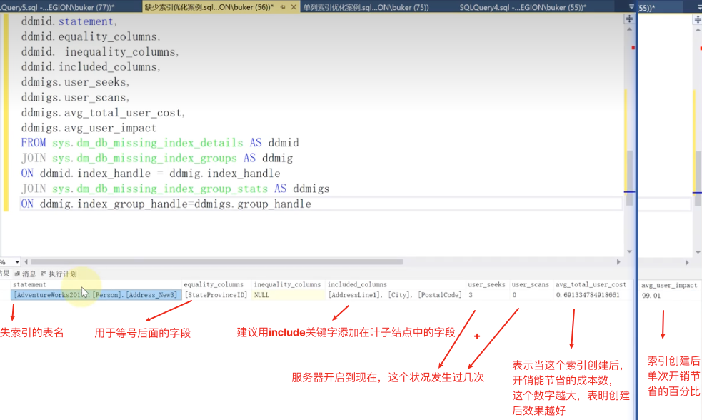

# 📚 EF Core 查询优化与 SQL 性能实践笔记


## 一、EF Core 中的查询等价 SQL



```c#
var query = _repository.QueryNoTracking<StockTransferOrderInItem>(x =>
    poNumbers.Contains(x.PurchasingDocumentNumber));
```

等价于：

```sql
SELECT * FROM StockTransferOrderInItem WHERE PurchasingDocumentNumber IN (poNumbers)
```

若只查询特定字段，使用 `.Select()` 投影性能更优：

```c#
var query = _repository.QueryNoTracking<StockTransferOrderInItem>(x =>
    poNumbers.Contains(x.PurchasingDocumentNumber))
    .Select(x => x.PurchasingDocumentNumber);
```

等价于：

```sql
SELECT PurchasingDocumentNumber FROM StockTransferOrderInItem WHERE PurchasingDocumentNumber IN (poNumbers)
```

> ✅ `.Select()` 字段越少，数据库返回的数据越小，性能越高。

若使用 AutoMapper 或 DTO，可以使用 `.ProjectTo<DtoType>(mapperConfig)` 进一步优化字段选择。

------


## 二、🧠延迟执行（Deferred Execution）

`IQueryable<T>` 是**延迟执行**（Lazy Evaluation）的，拼接的 `Where`、`Select`、`OrderBy` 等操作不会立即查询数据库，而是构建一个 SQL 查询的表达式树：

- `Where`
- `Select`
- `OrderBy`

真正执行 SQL 查询的是以下方法：

- `ToList()` / `ToListAsync()`
- `First()` / `FirstOrDefault()`
- `Count()` / `Any()`
- `Sum()` / `Max()` / `Min()` 等

------


## 三、SQL 操作性能分析

### 1. 查询性能

- `OrderBy` 性能依赖于排序字段的数据量大小
- `Distinct` 是对全字段 `GROUP BY`

### 2. 锁机制

- 查询（Query）：共享锁
- 更新（Update）：更新锁 → 实际更新时为排它锁
- 删除（Delete）：影响索引并产生大量日志，开销比 Update 大

> ⚠ 若要删除整张表，建议使用 `TRUNCATE TABLE`，可以减少日志量。

------


## 四、索引优化



### 1. 主键 vs 索引

- 主键主要保证数据一致性，对查询效率提升有限
- 性能主要依赖于索引：
  - **数量越少**
  - **碎片率越小**
  - **唯一度越高**

### 2. SARG 写法（可使用索引）

> SARG（Search Argument）= 能高效使用索引的写法

| ❌ 非SARG写法                | ✅ SARG写法                           |
| --------------------------- | ------------------------------------ |
| `WHERE UPPER(Column) = 'A'` | `WHERE Column = 'A' OR Column = 'a'` |
| `WHERE Column - 1 = 100`    | `WHERE Column = 101`                 |
| `LEFT(Column, 3) = 'ABC'`   | `WHERE Column LIKE 'ABC%'`           |


### 3. 组合索引

- **尽量避免多个单列索引**，应创建**组合索引**减少开销

- **选择索引首列**：看字段选择度（重复率越低越好）

  **索引的首列可以根据计算选择度来抉择**

  

  比如这里定义了city和ModifiedDate组合索引，单单计算他们的选择度，city的更低，说明重复率低，复用性高，可以选择用city作为组合索引的首列

  

- 补充：若字段中大量为 NULL，不建议作为索引首列

### 4. 包含索引（Included Index）

- 


​	可以右键点击 ”缺少索引详细信息“ 会提示我们应该创建怎么样的索引




- 加了incluede索引后，执行结果：






- 可通过 SQL Server 的“缺少索引详细信息”提示，右键快速查看推荐索引
- 包含索引能减少回表操作，提升性能

------


## 五、SQL Server动态管理视图（DMV）查询索引缺失

以下 SQL 可查询 SQL Server 的缺失索引建议：

```sql
SELECT
    ddmid.statement,
    ddmid.equality_columns,
    ddmid.inequality_columns,
    ddmid.included_columns,
    ddmigs.user_seeks,
    ddmigs.user_scans,
    ddmigs.avg_total_user_cost,
    ddmigs.avg_user_impact
FROM sys.dm_db_missing_index_details AS ddmid
JOIN sys.dm_db_missing_index_groups AS ddmig
    ON ddmid.index_handle = ddmig.index_handle
JOIN sys.dm_db_missing_index_group_stats AS ddmigs
    ON ddmig.index_group_handle = ddmigs.group_handle
```

> 🔍 若结果为空，说明当前未发现索引缺失。

------



> [!CAUTION]
>
> 这个缺失信息只是作参考，并不能完全按照这个信息去创建索引

