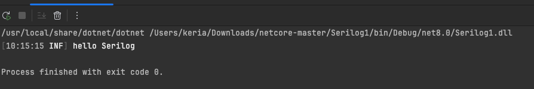
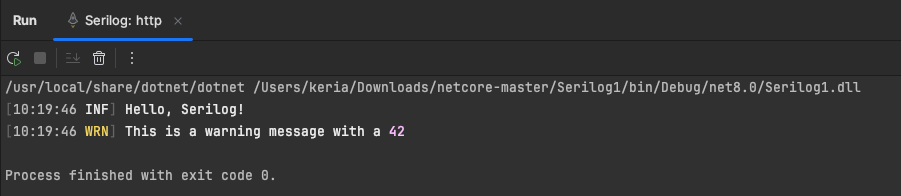
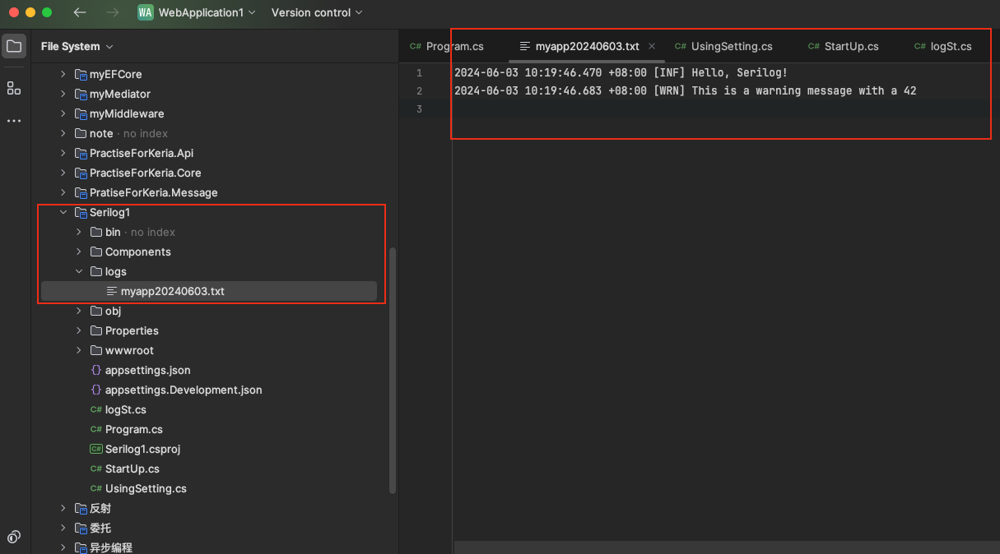
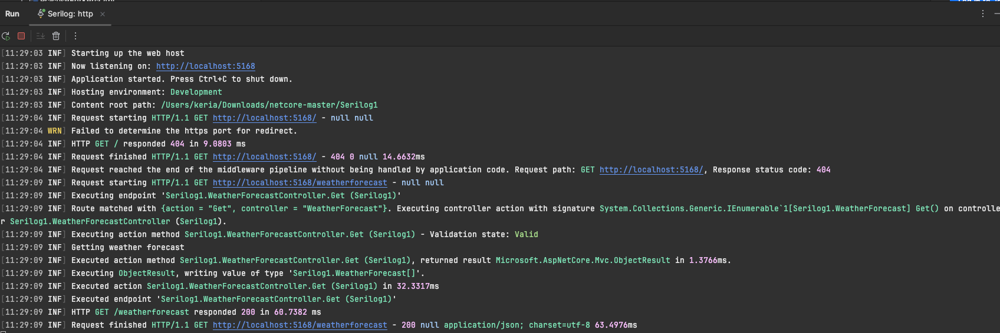
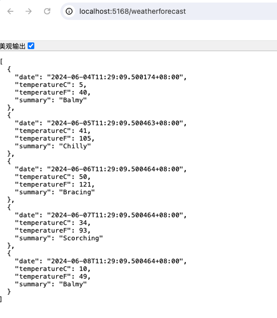
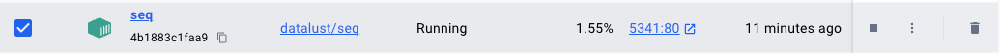
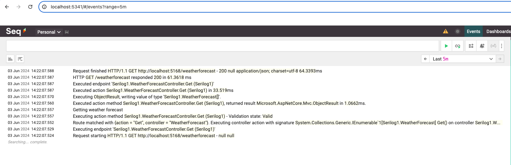
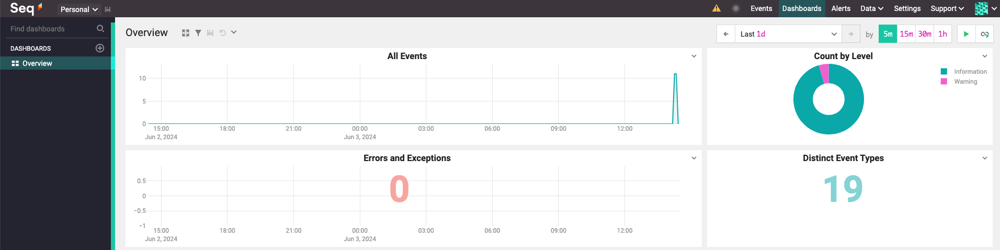

# 入门案例

1. 首先，确保项目中已经安装了 Serilog 的 NuGet 包：

   ```c#
   dotnet add package Serilog
   dotnet add package Serilog.Sinks.Console
   ```

2. 在 `Program.cs` 中配置和使用 Serilog：

   ```c#
   using Serilog;
   using System;
   
   class Program
   {
       static void Main(string[] args)
       {
           Log.Logger = new LoggerConfiguration()
               .WriteTo.Console()
               .CreateLogger();
   
           Log.Information("Hello, Serilog!");
   
           Log.CloseAndFlush();
       }
   }
   ```

   这个示例中，我们配置了 Serilog，指定将日志消息输出到控制台（`WriteTo.Console()`），然后记录了一条信息日志消息（`Log.Information("Hello, Serilog!");`）。最后，调用了 `Log.CloseAndFlush()` 来确保日志消息被正确地写入输出目标。

3. 运行程序后，在控制台中看到类似以下内容的输出：

   

这个示例非常基础，只涵盖了 Serilog 的最基本用法。可以通过添加其他 sink、配置日志级别、格式化日志消息等来进一步扩展和定制 Serilog 的使用。


# 进阶案例

下面是一个更进阶的 Serilog 示例，演示了如何配置多个日志目标（sinks）、设置日志级别、格式化日志消息以及使用结构化日志记录：

1. 首先，确保项目中已经安装了 Serilog 的 NuGet 包：

   ```c#
   dotnet add package Serilog
   dotnet add package Serilog.Sinks.Console
   dotnet add package Serilog.Sinks.File
   ```

2. 在 `Program.cs` 中配置和使用 Serilog：

   ```c#
   using Serilog;
   using System;
   
   class Program
   {
       static void Main(string[] args)
       {
           Log.Logger = new LoggerConfiguration()
               .MinimumLevel.Information() // 设置最低日志级别为 Information
               .WriteTo.Console() // 输出日志到控制台
               .WriteTo.File("logs/myapp.txt", rollingInterval: RollingInterval.Day) // 输出日志到文件，每天一个文件
               .CreateLogger();
   
           Log.Information("Hello, Serilog!");
           Log.Debug("This is a debug message");
           Log.Warning("This is a warning message with a {Number}", 42);
   
           Log.CloseAndFlush();
       }
   }
   ```

   在这个示例中，我们配置了 Serilog，设置了最低日志级别为 `Information`，这意味着只有 `Information`、`Warning`、`Error` 和 `Fatal` 级别的日志消息才会被记录。

   我们使用了两个日志目标（sinks）：一个将日志消息输出到控制台（`WriteTo.Console()`），另一个将日志消息输出到文件中（`WriteTo.File("logs/myapp.txt", rollingInterval: RollingInterval.Day)`）。文件日志每天会滚动生成一个新文件。

   此外，我们演示了如何使用不同的日志级别记录不同类型的日志消息，以及如何记录结构化数据（`Warning` 日志消息中的 `{Number}` 参数）。

3. 运行程序后，你应该在控制台中看到类似以下内容的输出：

   

   同时，你可以在 `logs/myapp.txt` 文件中找到类似的日志记录。

   

这个示例展示了如何配置和使用 Serilog 的一些高级功能，如设置日志级别、输出到多个日志目标、格式化日志消息以及记录结构化数据。

# 整合ASP.NET Core

天气预报log

### 1. 安装必要的 NuGet 包

```c#
dotnet add package Serilog.AspNetCore
dotnet add package Serilog.Sinks.Console
dotnet add package Serilog.Sinks.File
dotnet add package Serilog.Sinks.Seq
dotnet add package Serilog.Enrichers.Environment
```

### 2. 配置 Serilog

在 `Program.cs` 中配置 Serilog：

```c#
using Microsoft.AspNetCore.Hosting;
using Microsoft.Extensions.Hosting;
using Serilog;
using System;

public class Program
{
    public static int Main(string[] args)
    {
        Log.Logger = new LoggerConfiguration()
            //添加一些日志富集器（enrichers），以便在日志中包含环境名称和机器名等信息。
            .Enrich.FromLogContext()//从日志上下文中获取信息
            .Enrich.WithEnvironmentName()//添加环境名称
            .Enrich.WithMachineName()//添加机器名
            //定义日志的输出目标（sinks），包括控制台、文件和 Seq
            .WriteTo.Console()
            .WriteTo.File("logs/log-.txt", rollingInterval: RollingInterval.Day)
            .WriteTo.Seq("http://localhost:5341")//将日志输出到Seq
            .CreateLogger();

        try
        {
            Log.Information("Starting up the web host");
            CreateHostBuilder(args).Build().Run();
            return 0;
        }
        catch (Exception ex)
        {
            Log.Fatal(ex, "Host terminated unexpectedly");
            return 1;
        }
        finally
        {
            Log.CloseAndFlush();
        }
    }

    public static IHostBuilder CreateHostBuilder(string[] args) =>
        Host.CreateDefaultBuilder(args)
            .UseSerilog() // 使用 Serilog 作为日志记录器
            .ConfigureWebHostDefaults(webBuilder =>
            {
                webBuilder.UseStartup<Startup>();
            });
}
```

### 4. 配置 ASP.NET Core 中的 Serilog

在 `Startup.cs` 中添加 Serilog 相关配置：

```c#
using Microsoft.AspNetCore.Builder;
using Microsoft.AspNetCore.Hosting;
using Microsoft.AspNetCore.Http;
using Microsoft.Extensions.DependencyInjection;
using Microsoft.Extensions.Hosting;
using Serilog;

public class Startup
{
    public void ConfigureServices(IServiceCollection services)
    {
        services.AddControllers();
    }

    public void Configure(IApplicationBuilder app, IWebHostEnvironment env)
    {
        if (env.IsDevelopment())
        {
            app.UseDeveloperExceptionPage();
        }

        app.UseSerilogRequestLogging(); // 添加 Serilog 请求日志记录

        app.UseRouting();

        app.UseEndpoints(endpoints =>
        {
            endpoints.MapControllers();
        });
    }
}
```

### 5. 添加示例控制器

在 `Controllers` 文件夹中添加一个示例控制器 `WeatherForecastController.cs`：

```c#
using Microsoft.AspNetCore.Mvc;
using Microsoft.Extensions.Logging;
using System;
using System.Collections.Generic;
using System.Linq;

namespace SerilogAdvancedDemo.Controllers
{
    [ApiController]
    [Route("[controller]")]
    public class WeatherForecastController : ControllerBase
    {
        private static readonly string[] Summaries = new[]
        {
            "Freezing", "Bracing", "Chilly", "Cool", "Mild", "Warm", "Balmy", "Hot", "Sweltering", "Scorching"
        };

        private readonly ILogger<WeatherForecastController> _logger;

        public WeatherForecastController(ILogger<WeatherForecastController> logger)
        {
            _logger = logger;
        }

        [HttpGet]
        public IEnumerable<WeatherForecast> Get()
        {
            _logger.LogInformation("Getting weather forecast");

            var rng = new Random();
            return Enumerable.Range(1, 5).Select(index => new WeatherForecast
            {
                Date = DateTime.Now.AddDays(index),
                TemperatureC = rng.Next(-20, 55),
                Summary = Summaries[rng.Next(Summaries.Length)]
            })
            .ToArray();
        }
    }
}
```

### 6. 添加 WeatherForecast 模型

在 `Models` 文件夹中添加 `WeatherForecast.cs` 文件：

```c#
using System;

namespace SerilogAdvancedDemo
{
    public class WeatherForecast
    {
        public DateTime Date { get; set; }
        public int TemperatureC { get; set; }
        public int TemperatureF => 32 + (int)(TemperatureC / 0.5556);
        public string Summary { get; set; }
    }
}
```

7. 运行项目并访问/weatherforecast接口

   



# 安装Seq

### docker安装命令

```
docker run --name seq -d -e ACCEPT_EULA=Y -p 5341:80 datalust/seq
```

看到Seq成功安装



### 访问5341端口号Sql日志服务器



### Dashboards界面

