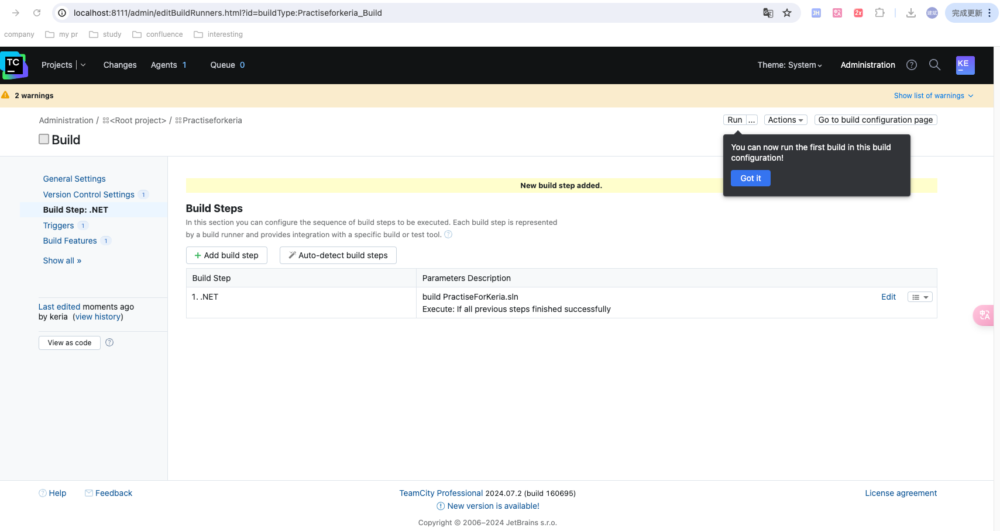
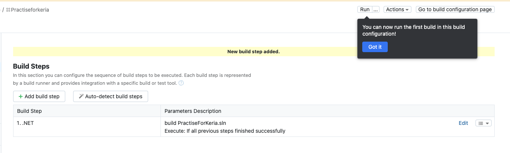
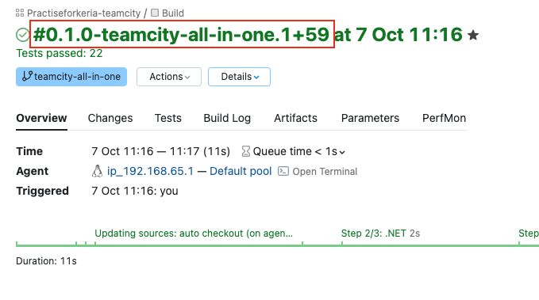
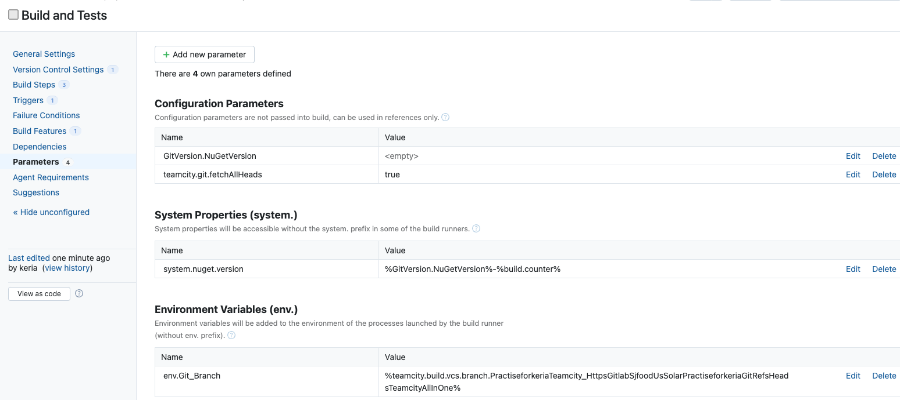
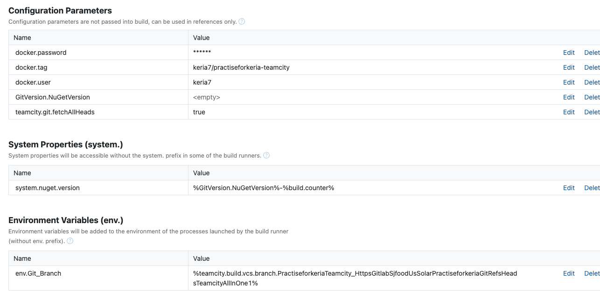
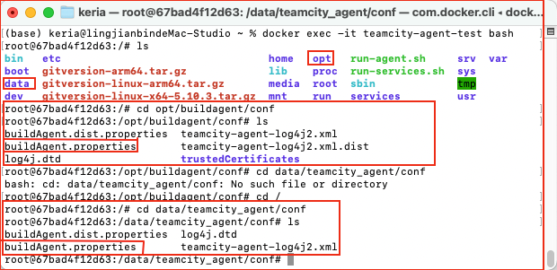
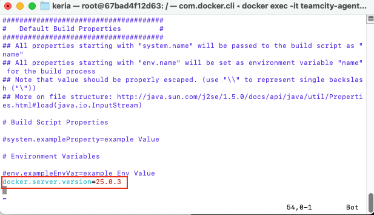
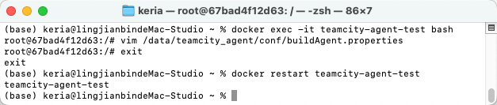
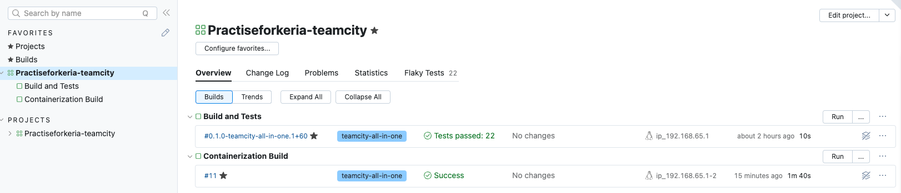

# 本地CI

## Build And Test

### Build

#### 第一步：拉取 Agent 镜像

Pull Jetbrains官方 TeamCity-Agent 镜像，其中自带一些运行环境如 .Net SDK 6.0.x，但是后续测试项目使用的是 8.0的SDK，需要额外安装环境。

```
docker pull jetbrains/teamcity-agent
```

#### 第二步：自定义镜像

由于默认的Agent镜像运行后无法切换到root账号，所以手动创建一个基于Agent的镜像，切换到root，同时提前安装一些工具软件。

新建文件夹，创建 DockerFile文件，内容如下：

```
##基于官方TeamCity代理镜像

FROM jetbrains/teamcity-agent

##设置环境变量

ENV docker.server.version=25.0.3

##切换到root用户以进行安装

USER root

##设置root用户密码

RUN echo "root:root" | chpasswd

##更新包列表并安装sudo和vim

RUN apt-get update && apt-get install -y sudo vim

##切换回teamcity-agent用户

USER teamcity

##确保Agent能够正常启动

RUN mkdir -p /opt/teamcity-agent/logs


```

#### 第三步：编译镜像文件

CD到含DockerFile文件夹，执行编译镜像命令

```
docker build -t custom-teamcity-agent-test .
```

#### 第四步：运行自定义镜像容器(我用的是MAC内置的agent，这里用的不是这行命令，命令在个人理解tag里)

使用自定义镜像创建容器

```
docker run -d -e SERVER_URL="<此处填写TeamCity地址>:<端口号>" --name="teamcity-agent-test" custom-teamcity-agent-test
```

`-e SERVER_URL` 参数是必须要指定TeamCity地址的，否则容器无法运行。

#### 第五步：安装额外环境

进入容器终端，安装 .NET SDK，配置环境

```
docker exec -it <容器ID> /bin/bash

# 进入终端后，分别执行安装 SDK 8.0 9.0
curl -sSL https://dotnet.microsoft.com/download/dotnet/scripts/v1/dotnet-install.sh | bash /dev/stdin --channel 8.0 --install-dir /usr/share/dotnet

curl -sSL https://dotnet.microsoft.com/download/dotnet/scripts/v1/dotnet-install.sh | bash /dev/stdin --channel 9.0 --install-dir /usr/share/dotnet
```

#### 第六步：重启容器

重新启动Agent容器，TeamCity正常识别 .Net SDK 8.0 和 9.0


###  个人理解







#### 注意

如果 TeamCity 服务器和 Agent 容器运行在同一台主机上，可以尝试将 `localhost` 替换为 `host.docker.internal`：

```
docker run -d -e SERVER_URL="http://host.docker.internal:8111" --name="teamcity-agent-test" custom-teamcity-agent-test
```

上面这行命令还是不太行，需要重新运行一个容器，把/var/run/docker.sock:/var/run/docker.sock**套接字**挂载到agent的容器里。不然会报unix:///var/run/docker.sock. Is the docker daemon running?错误

```
docker run -d -e SERVER_URL="http://host.docker.internal:8111" \
  --name="teamcity-agent-test2" \
  -v /var/run/docker.sock:/var/run/docker.sock \
  custom-teamcity-agent-test
```

`host.docker.internal` 是 Docker 提供的主机名，用于在 Docker 容器中访问主机的 IP 地址。


#### 什么是套接字？

##### Docker 套接字（Docker Socket）

- **定义**：Docker 套接字（通常是 `/var/run/docker.sock`）是 Docker 与其客户端（如命令行工具或 API）之间进行通信的接口。
- **作用**：它允许容器内的应用程序与 Docker 引擎进行交互，比如创建、启动、停止容器，或构建新镜像。

##### 为什么需要挂载 Docker 套接字

1. **动态操作**：当你的 CI/CD 工具（比如 TeamCity）在构建过程中需要创建新的容器（比如运行测试或构建服务）时，它需要与 Docker 引擎进行通信。
2. **共享 Docker 环境**：通过挂载 Docker 套接字，容器内的程序就可以直接运行 Docker 命令，像在宿主机上一样操作 Docker。这意味着 CI/CD 工具可以在运行构建时动态地管理容器。

##### 举个例子

- **没有挂载的情况**：如果你的 CI/CD 工具没有访问 Docker 套接字的权限，它就无法创建或管理容器，只能在已经存在的容器中运行代码。
- **挂载的情况**：当你挂载 Docker 套接字后，CI/CD 工具就可以执行诸如 `docker build`、`docker run` 等命令，来创建和启动新的容器。这使得自动化流程更加灵活和强大。

##### 套接字的意义

- **套接字**是一个用于进程间通信的机制，可以理解为一种“信道”，允许一个程序向另一个程序发送数据。在这里，它是 Docker 客户端和 Docker 服务端之间的通信渠道。


### Test

上述已经可以Build成功了，接下来需要Test也成功

### 第一步：容器内安装Mysql 

项目需要数据库环境为 `Mysql 8.0` 及以上，那么首先进入 `Agent` 容器的终端，先安装 `mysql-server`。

```
# 进入容器
docker exec -it <容器ID> /bin/bash
```

```
# 由于自定义镜像，默认切换为root账号，所以不需要提权操作
apt update
apt install mysql-server
apt install mysql-client
```

```
# 上述安装完成后，启动数据库
service mysql restart
```


### 第二步：配置

输入命令，配置数据库环境，设置一下密码的校验，移除匿名访问，允许 `root` 远程访问。

```
# 此命令为配置Mysql，回车后可能会要求你输入当前系统账号密码，我设置的密码是123456
mysql_secure_installation

# 后续配置项，提示输入语句如下：
Press y|Y for Yes, any other key for No: <此处是你的输入>
```

以下是配置流程

```
# 是否启用校验密码组件
Would you like to setup VALIDATE PASSWORD component?
Press y|Y for Yes, any other key for No: <此处输入 y 启用>
```

```
# 随后提示选择其中一个校验级别，分别为：LOW、MEDIUM、STRONG
There are three levels of password validation policy:
Please enter 0 = Low，1 = MEDIUM，2 = STRONG: <此处输入 0 回车最低级别>
```

```
# 可能会出现设置数据库 root 密码步骤，只是编译环境，设置个简单密码就行
New Password: <输入 123456 密码>
Re-enter new password: <重复输入>
```

```
# 是否移除匿名访问
Remove anonymous users? 
(Press y|Y for Yes, any other key for No): <此处输入 y 回车移除>
```

```
# 是否禁用 root 的远程登录
Disallow root login remotely？
(Press y|Y for Yes, any other key for No): <此处输入 n 回车取消禁用>
```

```
# 删除 test 数据库
Remote test database and access to it?
(Press y|Y for Yes, any other key for No): <此处输入 y 回车删除>
```

```
# 是否重新加载配置
Reload privilege tables now?
(Press y|Y for Yes, any other key for No): <此处输入 y 回车重新加载>
```

配置完毕。连接数据库，二次配置。

```
# 连接
mysql -u root -p

# 选择mysql数据库
use mysql;

# 修改密码复杂度
set global validate_password.policy=0;
set global validate_password.length=1;

# 如果想修改root密码，可以输入这个语句
alter user 'root'@'localhost' identified with mysql_native_password by '123456';

# 退出数据库
exit;
```

重新启动数据库，加载改动。

```
# 上述配置完成后，重新启动数据库
service mysql restart
```


## GitVersion版本控制



要实现以上效果。

拉取镜像：

```
docker pull gittools/gitversion:latest
```

运行镜像：

```
docker run --rm -v "/Users/keria/Desktop/myExamTopic/PractiseForKeria/PractiseForKeria":/repo gittools/gitversion:latest /repo
```

再在TeamCity上build step 配置一个Command Line ： script里填 `gitversion /output buildserver`

Parameters:



## Containerization Build

### 配置Build Step和Parameters

### Build Step

Command Line - Git Version

```
gitversion /output buildserver /updateassemblyinfo true
```

Docker - Docker Login

```
--username=%docker.user% --password=%docker.password%
```

Command Line - Docker Build Image

```
repository=$(echo $BUILD_NUMBER | sed 's^+^-^g')

docker build -f WebApiDockerfile -t %docker.tag%:$repository .
```

Command Line - Docker Push Image

```
repository=`echo %build.number%|sed 's^+^-^g'`

docker push %docker.tag%:$repository
```

Command Line - Docker Remove

```
repository=`echo %build.number%|sed 's^+^-^g'`

docker rmi %docker.tag%:$repository
```

### Parameters




### docker.server.version这个配置有坑

1. 进入容器：

   ```
   docker exec -it teamcity-agent-test bash
   ```

2. 编辑 `buildAgent.properties` 文件，通常位于 `/data/teamcity_agent/conf/`目录下：

   ```
   vim /data/teamcity_agent/conf/buildAgent.properties
   ```

   > [!CAUTION]
   >
   > 注意这里是data下，不是opt下，给这玩意坑了**三个小时**

   

   > [!NOTE]
   >
   > `buildAgent.properties` 文件在 TeamCity 构建代理中的作用是配置构建代理的属性和设置。这两个不同位置的 `buildAgent.properties` 文件通常有以下区别：
   >
   > ### 1. **`/opt/buildagent/conf/buildAgent.properties`**
   >
   > - 这个文件是代理的默认配置文件，通常用于设置构建代理的基本属性，如：
   >   - `name`：代理的名称。
   >   - `serverUrl`：TeamCity 服务器的 URL。
   >   - `workDir`：代理的工作目录。
   >   - `tempDir`：临时文件夹。
   >   - `auth`：认证信息。
   > - 这个文件是 TeamCity 安装时提供的默认配置，通常用于标准的安装和配置。
   >
   > ### 2.**`/data/teamcity_agent/conf/buildAgent.properties`**
   >
   > - 这个文件通常是由代理在运行时创建的配置文件。它包含运行时生成的代理设置或通过代理的管理界面配置的设置。
   > - 这个文件可能会包含特定于代理实例的设置，比如一些运行时参数，或者用户在 TeamCity 界面上对代理进行的配置。
   >
   > ### 总结
   >
   > - **默认配置 vs. 运行时配置**：`/opt/buildagent/conf/buildAgent.properties` 是默认配置，而 `/data/teamcity_agent/conf/buildAgent.properties` 是运行时的配置，通常用于特定于代理的设置。
   > - **自定义设置**：在实际使用中，通常建议在运行的代理配置文件中（如 `/data/teamcity_agent/conf/buildAgent.properties`）进行更改，以确保在容器更新或重启时不会丢失配置。

3. 添加或修改以下行：

   ```
   docker.server.version=25.0.3
   ```

   

   这个具体的版本号可以用 `docker info`命令查看，我的是25.0.3。

4. Esc 然后 :wq! 保存并退出。

5. 重启 Agent：

   在修改配置后，需要重启 TeamCity Agent 以使更改生效。可以使用以下命令重启容器：

   ```
   docker restart teamcity-agent-test
   ```

   


## 最终CI成果截图

这里Containerization没配gitVersion，不影响




# 本地CD

#### 1. 拉取 Octopus Deploy Docker 镜像

打开终端并运行以下命令以拉取最新的 Octopus Deploy 镜像：

```
docker pull octopusdeploy/octopusdeploy
```

在macOS 的 Apple Silicon（M1 或 M2）上使用 Docker 运行 Octopus Deploy 可能会遇到不兼容的问题，因为 Octopus Deploy 的官方 Docker 镜像主要为 x86_64 架构提供支持。以下是解决此问题的办法

**使用 Rosetta 2****

安装 Rosetta 2**： 打开终端并运行以下命令：

```
softwareupdate --install-rosetta
```

使用 Docker 的 `--platform` 参数指定使用 x86 架构：

没有配置settings就要加这一行指定--platform linux/amd64

设置 `ACCEPT_EULA` 环境变量来实现接受最终用户许可协议 (EULA)

```
docker run --name octopusserver -d \
  --platform linux/amd64 \
  -e ACCEPT_EULA=Y \
  -e OCTOPUS_DB_CONNECTION_STRING="Server=host.docker.internal;Database=PractiseForKeria;User Id=root;Password=123456;" \
  -e OCTOPUS_SERVER_BASE_URL="http://localhost:8080" \
  -p 8080:80 \
  octopusdeploy/octopusdeploy
```