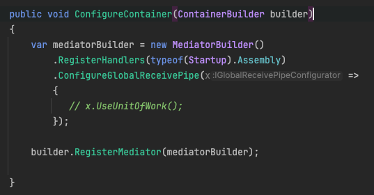
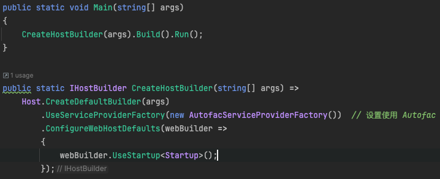

# 杂记

## 代码解释一



### 第一行: 方法定义

```c#
public void ConfigureContainer(ContainerBuilder builder)
```

这一行定义了一个名为 `ConfigureContainer` 的方法，该方法接受一个 `ContainerBuilder` 类型的参数。`ContainerBuilder` 是 Autofac 的核心类，用于注册和管理依赖注入容器中的服务。在 ASP.NET Core 应用中使用 Autofac 时，此方法通常用于添加和配置容器的服务。

### 第二行: 初始化 MediatorBuilder

```c#
var mediatorBuilder = new MediatorBuilder()
```

这里创建了一个 `MediatorBuilder` 的实例。`MediatorBuilder` 是 Mediator.Net 库中的一个类，用于配置中介者服务。它提供了一个链式调用的接口，允许您按照流畅的方式配置中介者的不同方面，如处理器注册、中间件等。

### 第三行: 注册处理器

```c#
    .RegisterHandlers(typeof(Startup).Assembly)
```

这部分代码将当前程序集（即包含 `Startup` 类的程序集）中所有合适的处理器自动注册到中介者中。这使得 Mediator.Net 能够发现并使用这些处理器来响应发送到中介者的消息。

`typeof(Startup).Assembly` 表达式返回一个表示当前程序集的 `System.Reflection.Assembly` 对象，这个程序集就是编译时包含 `Startup` 类的DLL或EXE文件。

通过这个表达式，Mediator.Net 的配置方法 `RegisterHandlers` 能够扫描这个程序集中所有合适的处理器类。具体来说，它会查找实现了特定接口或具有特定特征的类（如继承自某个基类、标记有特定属性的类），这些类被认为是消息处理器，并将它们自动注册到中介者服务中。

这样的自动注册机制极大地简化了配置工作，增加了应用程序的可扩展性，因为添加新的处理器时，无需手动更新配置代码，只需要确保它们在正确的程序集中，并符合自动注册的规则即可。这种机制依赖于.NET的反射功能，反射允许在运行时检查程序集中的类型信息。

### 第四行和第五行: 配置全局接收管道

```c#
    .ConfigureGlobalReceivePipe(x =>
    {
        // x.UseUnitOfWork();
    });
```

这里配置了一个全局的接收管道，这个管道定义了所有通过中介者接收的消息将要通过的中间件处理逻辑。`ConfigureGlobalReceivePipe` 方法允许您插入如日志记录、事务管理（单元工作）、验证等中间件。在注释中，示例提到了 `UseUnitOfWork()`，这通常是用来封装业务逻辑执行过程中的数据库操作，以保证数据操作的一致性和事务的完整性。此行被注释掉，意味着当前没有启用单元工作模式。

### 第六行: 注册中介者到 Autofac

```c#
builder.RegisterMediator(mediatorBuilder);
```

这一行将通过 `mediatorBuilder` 配置的中介者实例注册到 Autofac 容器中。这样做之后，您可以在应用的任何地方通过依赖注入获取 `IMediator` 接口的实例，该接口允许发送和接收消息


## 代码解释二



### 第三行：执行应用程序

```
CreateHostBuilder(args).Build().Run();
```

这行代码是启动 ASP.NET Core 应用程序的核心：

- `CreateHostBuilder(args)` 调用下面定义的方法，用来设置和配置应用程序的宿主（Host）。
- `.Build()` 方法构建应用程序的宿主。
- `.Run()` 方法运行应用程序，开始监听并处理入站的网络请求。


### 第五行：创建宿主构建器

```c#
public static IHostBuilder CreateHostBuilder(string[] args) =>
```

这是一个静态方法，返回一个 `IHostBuilder` 对象，用于构造和配置应用程序的宿主。这种方法通常用于设置应用程序的基本配置、服务和中间件。


### 第六至第十行：配置宿主

```c#
Host.CreateDefaultBuilder(args)
    .UseServiceProviderFactory(new AutofacServiceProviderFactory())  // 设置使用 Autofac
    .ConfigureWebHostDefaults(webBuilder =>
    {
        webBuilder.UseStartup<Startup>();
    });
```

这几行详细配置了宿主：

- `Host.CreateDefaultBuilder(args)` 创建并返回一个默认配置的宿主构建器。这包括配置日志记录、配置文件支持和其他基础设施。

- `.UseServiceProviderFactory(new AutofacServiceProviderFactory())` 指定宿主应使用 Autofac 作为其服务提供者工厂。Autofac 是一个流行的依赖注入 (DI) 容器，它提供比 .NET 内置的服务容器更复杂和灵活的功能。

- ```c#
  .ConfigureWebHostDefaults(webBuilder => {...})
  ```

   配置应用程序将用作 web 服务器的默认参数。

  ```c#
  webBuilder
  ```

   是一个配置器，用于设置 Web 服务的相关选项，如使用的服务器（Kestrel 等）、中间件等。

  - `webBuilder.UseStartup<Startup>();` 指定 `Startup` 类作为应用程序的启动类。这个类包含了配置应用程序所需服务和应用程序请求管道的逻辑。


# Handler框架

在使用中介者模式或者类似的消息/命令驱动架构中，`CommandHandler`、`EventHandler`和`RequestHandler`承担着不同的职责。这些处理器通常定义了对不同类型的消息或指令的响应逻辑。下面详细解释这三种类型的处理器及其在系统中的作用：

### 1. CommandHandler（命令处理器）

- **定义**：命令处理器专门用于处理命令。在软件架构中，命令通常是一种意图执行某种操作的消息，它不期望返回除成功或失败状态外的任何数据。
- **职责**：处理来自应用程序的特定命令，执行与命令相关的业务逻辑。例如，一个`CreateUserCommandHandler`可能处理添加新用户的操作。
- **特点**：命令处理通常涉及改变系统状态或触发某些业务逻辑，如数据的创建、修改或删除。

### 2. EventHandler（事件处理器）

- **定义**：事件处理器用于响应系统中发生的事件。事件是指系统中发生的一个事实，通常是由于某些操作导致的状态变更。
- **职责**：响应和处理特定事件。事件处理器可能会执行一系列的响应操作，如发送通知、更新相关数据等，但它们通常不改变事件本身所描述的状态。
- **特点**：事件处理通常是响应性的，用于从系统的一个部分向其他部分广播重要的状态变化，以便进行协调和反应。

### 3. RequestHandler（请求处理器）

- **定义**：请求处理器用于处理来自应用程序其他部分的请求，并返回响应。请求通常需要返回数据或执行结果给请求方。
- **职责**：执行请求的业务逻辑并返回所需的数据。例如，一个`GetUserDetailsRequestHandler`可能处理根据用户ID检索用户详细信息的请求。
- **特点**：请求处理通常包含读取数据或者执行不修改数据状态的操作，并需要返回结果给调用者。

### 使用场景举例

- **CommandHandler**：处理用户注册命令，执行注册逻辑，并通知其他系统部分用户已注册，但不返回用户信息。
- **EventHandler**：在用户更新其个人信息后，捕捉到一个用户信息已更新的事件，并触发一个发送电子邮件通知给用户的操作。
- **RequestHandler**：在用户请求其个人信息页面时，检索并返回用户的详细信息。