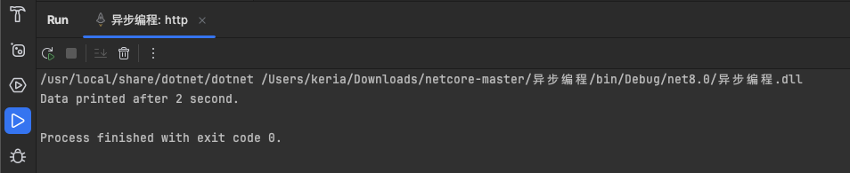

# 命名规范

- **类和方法名**：使用 PascalCase（大写开头的驼峰式命名），例如 `MyClass`, `CalculateValue`。
- **变量和参数名**：使用 camelCase（小写开头的驼峰式命名），例如 `localVariable`, `inputParameter`。
- **常量名**：通常使用全大写字母，并用下划线分隔，例如 `MAX_VALUE`, `DEFAULT_SIZE`。
- **接口名**：通常以 `I` 开头，后接 PascalCase，例如 `IEnumerable`, `IDisposable`。
- **属性名**：使用 PascalCase，例如 `BackColor`, `ForeColor`。
- **事件名**：也使用 PascalCase，例如 `Click`, `MouseMove`。


# 反射

下面是一个使用 C# 反射的简单示例，演示如何使用 `Type` 类来获取类型信息，并调用方法：

```
using System;
using System.Reflection;

public class Program
{
    public static void Main()
    {
        // 获取类型信息
        Type type = typeof(MyClass);
        Console.WriteLine("Methods in MyClass:");
        
        // 遍历类型的所有方法
        MethodInfo[] methods = type.GetMethods();
        foreach (MethodInfo method in methods)
        {
            Console.WriteLine("Method Name: " + method.Name);
        }

        // 创建MyClass的实例
        object obj = Activator.CreateInstance(type);

        // 调用方法
        MethodInfo methodInfo = type.GetMethod("SayHello");
        methodInfo.Invoke(obj, null);
    }
}

public class MyClass
{
    public void SayHello()
    {
        Console.WriteLine("Hello, Reflection!");
    }
}
```

在这个示例中，`MyClass` 类包含一个 `SayHello` 方法。通过反射，我们获取了这个类的类型信息，列出了其所有方法，并创建了 `MyClass` 的一个实例来动态调用 `SayHello` 方法。

输出结果如下图：


# 线程

线程是执行环境的一部分，可以使应用程序同时执行多个操作。在 C# 中，线程管理主要通过 `System.Threading` 命名空间来实现。

简单的线程创建和启动示例：

```
using System;
using System.Threading;

public class ThreadDemo
{
    public static void Main()
    {
        Thread thread = new Thread(new ThreadStart(RunThread));
        thread.Start();
    }

    private static void RunThread()
    {
        Console.WriteLine("Thread is running.");
    }
}
```

运行结果如下：


 # 委托

在Java中，与c#的委托最相似的概念是接口

- Java示例：

  - 首先，先定义一个功能接口，它具有一个接收字符串并返回 void 的方法：

  - ```
    @FunctionalInterface
    interface Action {
        void execute(String message);
    }
    ```

  - 然后，我们在主类中使用匿名内部类来实现这个接口

  - ```
    public class Test {
        public static void showMessage(String message) {
            System.out.println(message);
        }
    
        public static void main(String[] args) {
            // 使用匿名内部类而不是 Lambda 表达式
            Action action = new Action() {
                @Override
                public void execute(String message) {
                    Test.showMessage(message);
                }
            };
        
            action.execute("Hello, World from an anonymous class!");
        }
    
    }
    ```

  - 在这个示例中，`Action` 是一个功能接口，我们通过创建一个匿名内部类来实现这个接口。这个匿名内部类覆盖了 `execute` 方法，并在其中调用了静态方法 `showMessage`。在 `main` 方法中，我们创建了 `Action` 接口的一个实例，并调用了 `execute` 方法来显示消息。


- C#示例：

  - 

  ```
  public delegate void Action(string message); // 委托定义
  
  public class Program
  {
      public static void ShowMessage(string message)
      {
          Console.WriteLine(message);
      }
  
      public static void Main()
      {
          Action act = ShowMessage; // 委托实例
          act("Hello, World!"); // 委托调用
      }
  
  }
  ```

  - 在这个示例中，`Action` 委托封装了一个方法 `ShowMessage`，可以在程序中动态地调用。
  - 输出结果：
  - 

总结：委托这个概念云里雾里，日后还得多多学习。


# Lambda表达式和LINKQ

**Lambda 表达式**是一种简写的方法定义，可以用来创建匿名方法。这对于编写简洁的事件处理代码和 LINQ 查询非常有用。

**LINQ (Language Integrated Query)** 是一种查询语法，用于对数组、集合等数据源进行查询。

#### 示例：Lambda 表达式和 LINQ

```
using System;
using System.Collections.Generic;
using System.Linq;

public class Program
{
    public static void Main()
    {
        List<int> numbers = new List<int> { 1, 2, 3, 4, 5, 6 };

        // 使用 Lambda 表达式和 LINQ 查询偶数
        var evenNumbers = numbers.Where(n => n % 2 == 0);
    
        Console.WriteLine("Even numbers:");
        foreach (var num in evenNumbers)
        {
            Console.WriteLine(num);
        }
    }

}
```

在这个例子中，使用 Lambda 表达式 `n => n % 2 == 0` 来定义一个条件，这个条件检查集合中的数字是否为偶数。`Where` 是 LINQ 的一个方法，用于筛选符合条件的元素

输出结果如下图：


# 异步编程

**异步编程**是一种编程范式，用于非阻塞操作，特别是长时间运行的后台任务，如网络调用、文件操作等。

示例1：

```
using System;
using System.Threading.Tasks;

public class Program
{
    public static async Task Main()
    {
        await PrintDataAsync();
    }

    public static async Task PrintDataAsync()
    {
        await Task.Delay(2000); // 模拟耗时操作
        Console.WriteLine("Data printed after 2 second.");
    }

}
```

在这个例子中，`PrintDataAsync` 方法使用 `await Task.Delay(2000);` 来模拟异步等待 2 秒钟，之后输出一条消息。这种方式不会阻塞主线程，使得应用程序可以继续执行其他任务或响应用户操作。

输出结果：




示例2:

在一个方法的长时间等待过程中开始执行另一个较短的等待方法，并确保短时间的方法先完成

```
using System;
using System.Threading.Tasks;

public class Program
{
    public static async Task Main()
    {
        // 启动第一个异步任务但不立即等待其完成
        Task longRunningTask = PrintDataAsync();

        // 启动第二个异步任务并等待其完成
        await PrintDataAsync2();
    
        // 然后等待第一个任务完成
        await longRunningTask;
    }
    
    public static async Task PrintDataAsync()
    {
        await Task.Delay(5000); // 模拟耗时操作
        Console.WriteLine("Data printed after 5 seconds.");
    }
    
    public static async Task PrintDataAsync2()
    {
        await Task.Delay(1000); // 模拟较短的耗时操作
        Console.WriteLine("Data printed after 1 second.");
    }

}
```

1. **非阻塞任务启动**：`Task longRunningTask = PrintDataAsync();` 这行代码启动了一个长时间运行的异步任务，但是没有使用 `await`，因此不会阻塞代码的进一步执行。这意味着程序会继续运行到下一行。
2. **立即等待短任务**：接下来，`await PrintDataAsync2();` 启动并等待一个较短的异步任务完成。由于这是第一个等待(`await`)调用，它将确保在继续执行之前这个任务已经完成，即打印“Data printed after 1 second”。
3. **等待长任务完成**：最后，通过 `await longRunningTask;` 等待最初启动的长任务完成。这保证了即使它已经开始执行了，也会在此行代码处等待其完成，直到打印“Data printed after 5 seconds”。

输出结果：


这种方式允许两个任务几乎同时开始，但控制了完成（及其对应输出）的顺序，确保了短时任务的输出先于长时任务的输出。这是一种常用的并发编程技巧，特别适用于处理需要并行处理多个时间长度不一的任务的场景。