# 

# 项目架构笔记

## 概述
本文档旨在提供关于项目中三个主要模块：Core模块、API模块和Message模块的详细描述和理解。每个模块的职责将被清晰地界定，以支持项目的可维护性和扩展性。

## API模块

### 职责

- **请求处理**：接收外部的请求并返回响应。
- **身份验证和授权**：确保API请求的安全性。

### 组件

- **Controllers**：处理进入的HTTP请求，调用Core模块的服务。

```c#
[ApiController]
[Route("[controller]")]
public class ProductsController : ControllerBase {
    private readonly IProductService _productService;

    public ProductsController(IProductService productService) {
        _productService = productService;
    }
    
    [HttpGet("{id}")]
    public ActionResult<Product> GetProduct(int id) {
        var product = _productService.GetProductById(id);
        if (product == null) {
            return NotFound();
        }
        return Ok(product);
    }

}
```


## Core模块

### 职责
- **业务逻辑处理**：实现应用程序的核心业务逻辑。
- **数据持久化**：管理所有数据库交互，包括数据的CRUD操作。
- **领域模型定义**：定义业务领域内的实体和它们的行为。

### 组件
- **Domain**：包含所有领域实体和领域服务。
- **Services**：业务逻辑的实现地，服务层包含应用程序的主要功能。
- **Data**：数据访问层，包括数据库模型和仓库实现。
- **DbUp**：负责数据库迁移和版本控制。
- **Handler**：处理业务逻辑的执行，如命令和查询的处理器。
- **Mapping**：负责数据转换和对象映射的设置，通常用于Domain对象与DTO或视图模型的转换。
- **Settings**：应用程序的配置设置，可能包括数据库连接字符串等。
- **EnumS**：定义在整个应用程序中使用的枚举类型。

### 示例代码
```csharp
public class ProductService : IProductService {
    private readonly IRepository<Product> _productRepository;

    public ProductService(IRepository<Product> productRepository) {
        _productRepository = productRepository;
    }

    public Product GetProductById(int id) {
        return _productRepository.FindById(id);
    }
}
```


## Message模块

### 职责

- **数据传输**：定义和使用数据传输对象（DTOs）来传递数据。
- **消息传递**：处理和传递消息队列中的消息。

### 组件

- **DTOs**：数据传输对象，用于封装从API传输到客户端的数据。

- **Commands**、**Events**、**Requests**：处理应用程序内部的命令、事件和请求的定义，这些通常涉及业务操作的触发和处理。

- **Responses**：定义API或服务对外部请求的响应结构。

- **MiddleWares**：中间件组件，处理HTTP请求的流，如身份验证、错误处理等。

- **Extensions**：扩展方法集，常用于跨多个模块共享的功能，如HTTP上下文、依赖注入容器配置等。

- **Attributes**：自定义属性，可能用于控制访问、路由配置等。

- **Bo**：业务对象，用于在业务层和表示层之间传递数据，可以视具体情况决定放置于 Core 或 Message。

  

# 仓储模式

**仓储模式（Generic Repository Pattern）**：通过定义**一个泛型接口来处理所有实体类型的数据操作**，从而减少重复代码并提升代码复用性。

## 核心理念

的是封装存储逻辑，使得应用程序不直接与数据访问逻辑交互，而是通过一个中介层（即仓储）来操作数据。这样做的好处包括：

1. **解耦**：应用逻辑和数据访问逻辑分离，增加了代码的模块化。
2. **可维护性**：集中数据访问逻辑使得维护和修改更加容易。
3. **可测试性**：通过仓储接口，可以更方便地对业务逻辑进行单元测试，尤其是可以用模拟（Mocking）技术来替换实际的数据访问代码

## 接口方法解析

1. **基本 CRUD 操作**：
   - `InsertAsync`, `UpdateAsync`, `DeleteAsync`：基础的增、改、删操作，适用于处理单个实体。
   - `InsertAllAsync`, `UpdateAllAsync`, `DeleteAllAsync`：批量操作，适用于处理多个实体。
2. **查询操作**：
   - `GetByIdAsync`：通过ID获取单个实体。
   - `GetAllAsync`, `ToListAsync`：获取所有实体或根据条件获取实体列表。
   - `SingleOrDefaultAsync`, `FirstOrDefaultAsync`：根据指定条件查询单个实体。
   - `AnyAsync`：检查是否存在任何符合条件的实体。
   - `CountAsync`：计算符合条件的实体数量。
3. **高级查询与批处理**：
   - `SqlQueryAsync`：执行SQL查询并返回实体集合，适用于复杂查询。
   - `Query`, `QueryNoTracking`：提供对数据库的查询能力，`QueryNoTracking` 用于只读场景，以提升性能。
   - `BatchInsertAsync`, `BatchUpdateAsync`, `BatchDeleteAsync`：批量插入、更新和删除，这些操作用于处理大量数据，提高性能。
4. **数据库访问**：
   - `Database`：提供对底层数据库上下文的访问，以便执行那些不适合通过标准CRUD操作处理的任务。

## 方法签名解析

```c#
ValueTask<TEntity?> GetByIdAsync<TEntity>(object id, CancellationToken cancellationToken = default)
    where TEntity : class, IEntity;
```

1. **`ValueTask<TEntity?>`**：
   - `ValueTask` 是 .NET 中的一个结构类型，用于封装一个可能已经完成的异步操作。它是 `Task` 的一个轻量级替代，用于提高性能，在异步操作频繁且结果立即可用的场景下尤其有用。这里的 `ValueTask` 返回一个 `TEntity` 类型的结果。
   - `TEntity?` 表示返回的 `TEntity` 类型的对象是可空的（nullable），意味着如果没有找到对应的实体，则可能返回 `null`。
2. **`GetByIdAsync<TEntity>`**：
   - 这是一个泛型方法，`TEntity` 是方法的类型参数。这意味着该方法可以用于任何实现了 `IEntity` 接口的类的实例。
   - 泛型使得该方法非常灵活，可以用于不同的实体类型，而不需要为每种实体类型编写重复的代码。
3. **`object id`**：
   - 这个参数是用于查找实体的标识符，它被定义为 `object` 类型，这使得方法可以接受任何类型的 ID，如 `int`、`Guid` 等，提高了方法的通用性。
   - 通过将 ID 参数类型定义为 `object`，该方法可以适用于使用不同数据类型作为主键的实体。
4. **`CancellationToken cancellationToken = default`**：
   - `CancellationToken` 允许调用者可以通知该方法应该取消正在进行的工作。这是异步编程中的一种常见实践，用于提高应用程序的响应性和控制。
   - `= default` 表示如果调用者没有提供一个具体的 `CancellationToken` 实例，方法会使用一个默认的 `CancellationToken`，即 `CancellationToken.None`，这意味着在默认情况下，操作不可被取消。
5. **`where TEntity : class, IEntity`**：
   - 这是一个泛型约束，它限定了 `TEntity` 必须是一个类，并且必须实现 `IEntity` 接口。
   - `class` 约束确保了 `TEntity` 是一个引用类型，这是处理数据库实体的一种常见需求。
   - `IEntity` 约束确保了 `TEntity` 至少具有 `IEntity` 接口定义的那些功能或属性，通常这包括了如实体的 ID 等基本属性，这样 `IRepository` 就可以正确地处理这些实体。

### ValueTask和Task的区别

- **选择 `Task`**：如果一个方法经常处于等待状态或不频繁调用，使用 `Task` 是比较好的选择。`Task` 的使用非常广泛，已经被优化用于处理大多数异步操作。

- **选择 `ValueTask`**：如果你的方法在大多数情况下能同步返回结果，或者异步操作非常快就可以完成，那么 `ValueTask` 是一个更好的选择。此外，对于高频率调用的短小方法，`ValueTask` 可以减少内存分配，从而提高性能。

  ### 查询操作（Read）

  - **查询单个元素**（如 `GetByIdAsync`）：如果数据访问层能够在大多数情况下快速从缓存中检索数据，使用 `ValueTask` 可以是一个好选择，因为它可能直接同步返回结果。这种情况下，`ValueTask` 的性能优势最为明显。
  - **查询多个元素**（如 `GetAllAsync` 或基于条件的查询）：这类操作通常涉及到更复杂的数据处理和可能的磁盘I/O操作，因此使用 `Task` 更为合适，因为它们不太可能同步完成，并且 `Task` 在处理这类操作时已经非常成熟和优化。

  ### 修改和写入操作（Create, Update, Delete）

  - **插入、更新、删除单个或少量记录**（如 `InsertAsync`, `UpdateAsync`, `DeleteAsync`）：虽然这些操作有时候可以快速完成，尤其是在涉及少量数据并且操作高效的数据库系统中，但它们通常涉及到磁盘I/O操作，这意味着它们更可能是异步的。因此，通常建议使用 `Task`。
  - **批量插入、更新、删除**（如 `BatchInsertAsync`, `BatchUpdateAsync`, `BatchDeleteAsync`）：这类操作几乎总是涉及复杂的数据处理和I/O操作，建议使用 `Task`，因为它们不太可能同步完成。

  > [!CAUTION]
  >
  > 通常，为了简化代码管理和避免潜在的错误，开发倾向于默认使用 `Task`，只在性能分析明确指出使用 `ValueTask` 有明显优势的情况下才考虑替换。

  

# EFCore数据库配置

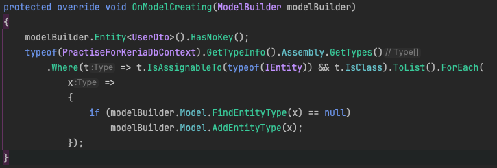

### 解析

这段代码是在OnModeCreating中动态注册所有实现了IEntity接口的实体类。

### 逻辑步骤分析

1. **获取程序集中的所有类型**:

   ```c#
   typeof(PractiseForKeriaDbContext).GetTypeInfo().Assembly.GetTypes()
   ```

   这一行代码获取包含 `PractiseForKeriaDbContext` 类的程序集中定义的所有类型。`GetTypeInfo()` 和 `Assembly` 属性被用来访问当前类所在的程序集，而 `GetTypes()` 方法则返回这个程序集中定义的所有类型（包括类、接口等）。

2. **筛选实现了 `IEntity` 接口的类**:

   ```c#
   .Where(t => t.IsAssignableTo(typeof(IEntity)) && t.IsClass)
   ```

   这个 LINQ 查询筛选出所有实现了 `IEntity` 接口的类。`IsAssignableTo(typeof(IEntity))` 检查一个类型是否可以赋值给 `IEntity` 类型，这包括直接实现了 `IEntity` 接口或间接继承自实现了该接口的基类的所有类。`t.IsClass` 确保只选择类（而非接口或结构体）。

3. **转换为列表并遍历**:

   ```c#
   .ToList().ForEach(x =>
   ```

   `ToList()` 方法将筛选结果转换为列表，`ForEach` 是对列表中的每一个元素执行一段指定的操作。

4. **动态注册实体类型**:

   ```c#
   {
       if (modelBuilder.Model.FindEntityType(x) == null)
           modelBuilder.Model.AddEntityType(x);
   });
   ```

   在这个 `ForEach` 块中，对于列表中的每一个类型 `x`，首先检查它是否已经被注册到模型中。`modelBuilder.Model.FindEntityType(x)` 会搜索当前数据模型是否已包含该类型，如果返回 `null`，说明该类型尚未注册。`modelBuilder.Model.AddEntityType(x)` 则将未注册的类型添加到数据模型中。


# 参考考核项目时遇到的问题

## 1.问题一：The Email field is required！

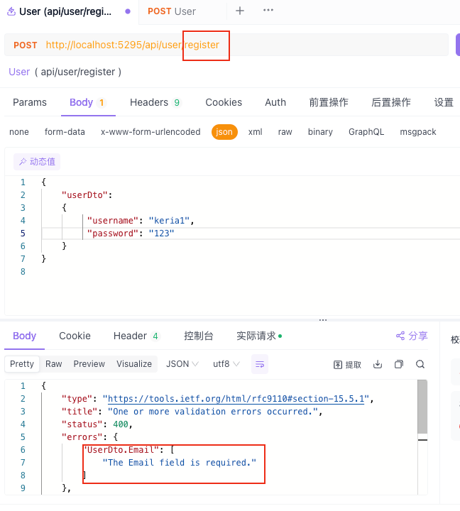

问题描述：在我的数据库表中，email的值明明可以为空，为什么提交请求时却要求必须有值呢？

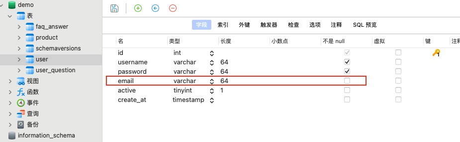

这个问题涉及到**数据绑定**的内容

### `[ApiController]` 的行为

在ASP.NET Core中使用 `[ApiController]` 属性时，该属性启用了一些默认行为，这些行为旨在简化API的开发和提高代码的一致性与可维护性。

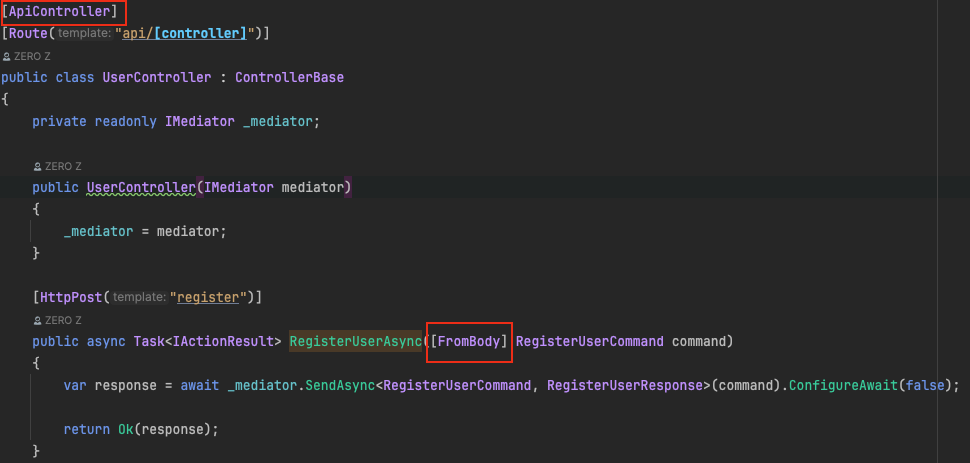

而在模型UserDto中，可以看到Email标着下黄波浪线，Non-nullable property 'Email' is uninitialized. Consider declaring the property as nullable.意思是不可为 null 的属性“电子邮件”未初始化。 考虑将该属性声明为可为空。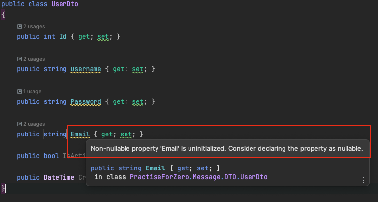

当控制器类上标注了 `[ApiController]` 属性，ASP.NET Core会自动验证传入的数据模型。如果模型不满足验证规则（比如数据注解要求的`[Required]`、`[Range]`、`[EmailAddress]`等），则会自动生成一个400 Bad Request响应。

简单来说，就是如果控制器中加了`[apicontroller]`，而传的参数又是**引用类型**时，则必须要为它添加一个默认值，或者把它设置为可空。

### 引用类型参数必须有值的原因

当你的控制器方法接受一个复杂类型的参数（比如一个类的实例），并且该参数是从请求体中绑定的，`[ApiController]` 属性会要求这个参数必须在请求体中存在。如果请求中没有提供这个参数的任何数据，模型绑定过程将无法创建这个参数的实例，因此无法进行进一步的验证，导致验证失败。

### 解决办法

#### 办法一

把email设置为可空：在`string`后面加一个？，表示email可空。

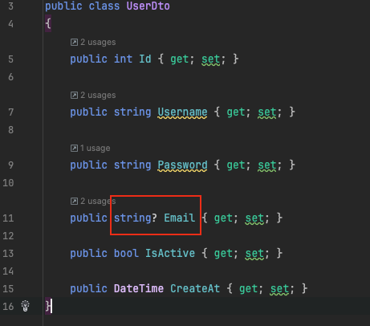

此时我提交的json字符串：{ 

​    `"userDto":` 

​    `{`

​         `"username": "keria1",` 

​         `"password": "123"`

​    `}` 

`}`

可以看到，数据被成功的添加了进去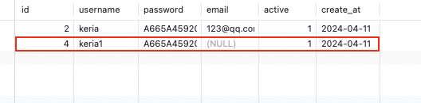


#### 办法 二

给email设置默认值

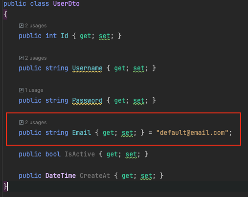

此时我提交的json字符串

`{` 

​    `"userDto":` 

​    `{`

​         `"username": "keria2",` 

​         `"password": "123"`

​    `}` 

`}`

可以看到，数据被成功的添加了进去

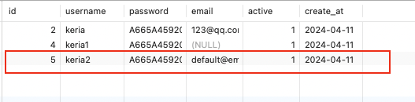

#### 办法三

在构造函数中设置默认值

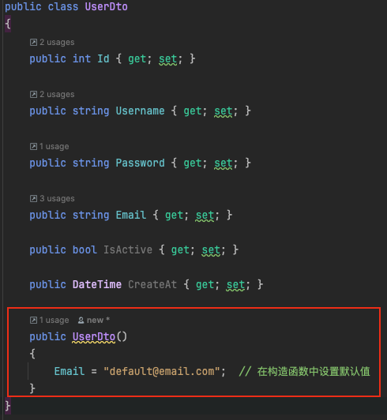

此时我的提交的json字符串

`{` 

​    `"userDto":` 

​    `{`

​         `"username": "keria3",` 

​         `"password": "123"`

​    `}` 

`}`

可以看到数据也被成功的添加了进去

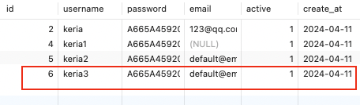


# ASP.NET Core 数据绑定特性

在ASP.NET Core中，有多种特性可以用来指定HTTP请求中数据的来源。这些特性帮助开发者明确每个参数应如何被解析和绑定，从而使控制器代码更清晰、易于维护。

## 1. FromQuery 特性

- **用途**：从请求的查询字符串中提取参数值。
- **常用场景**：通常用于GET请求，这些请求的参数通过查询字符串传递。
- **示例**：
  
  ```csharp
  [HttpGet]
  public IActionResult GetData([FromQuery] string parameter1, [FromQuery] int parameter2) {
      // 访问 /api/data?parameter1=keria777&parameter2=777
  }

## 2. FromBody 特性

- **用途**：从请求体中提取参数值。

- **常用场景**：用于POST、PUT、DELETE等请求，这些请求通过请求体传递参数。

- 示例

  ：

  ```
  csharpCopy code
  [HttpPost]
  public IActionResult PostData([FromBody] SomeModel model) {
      // 请求体包含 JSON: { "property1": "keira777", "property2": 777 }
  }
  ```

## 3. FromRoute 特性

- **用途**：从请求的URL路由中提取参数值。

- **常用场景**：适用于RESTful API，参数直接嵌入在URL中。

- 示例

  ：

  ```
  csharpCopy code
  [HttpGet("api/{id}")]
  public IActionResult GetById([FromRoute] int id) {
      // 访问 /api/777
  }
  ```

## 4. FromHeader 特性

- **用途**：从请求的头部中提取参数值。

- **常用场景**：适用于需要从HTTP头部获取信息的场景，如认证。

- 示例

  ：

  ```
  csharpCopy code
  [HttpGet]
  public IActionResult GetByHeader([FromHeader] string authorization) {
      // 请求头包含 Authorization: Bearer tokenabc
  }
  ```

## 5. FromForm 特性

- **用途**：从表单数据中提取参数值。

- **常用场景**：用于POST请求中的表单提交。

- 示例

  ：

  ```
  csharpCopy code
  [HttpPost]
  public IActionResult PostFormData([FromForm] string username, [FromForm] string password) {
      // 表单数据为 username=keria&password=777
  }
  ```

## 6. FromServices 特性

- **用途**：从服务容器中自动注入服务实例。

- **常用场景**：适用于需要依赖注入服务实例的操作，如使用日志记录。

- 示例

  ：

  ```
  csharpCopy code
  [HttpGet]
  public IActionResult GetFromService([FromServices] ILogger<MyController> logger) {
      // 使用注入的ILogger<MyController>
  }
  ```

通过使用这些特性，开发者可以确保控制器方法的参数正确地绑定来自HTTP请求的各种数据，从而提高了应用的安全性和效率。