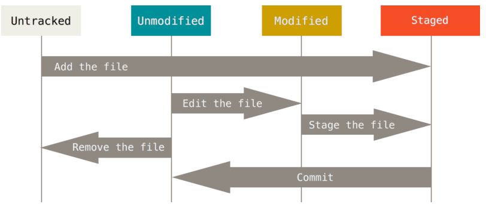
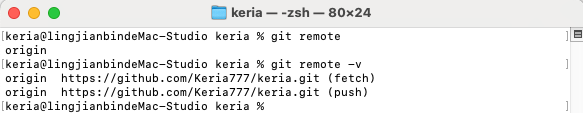
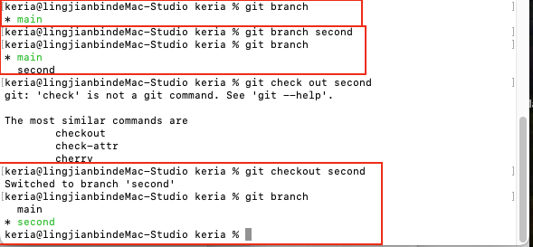
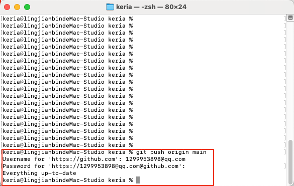
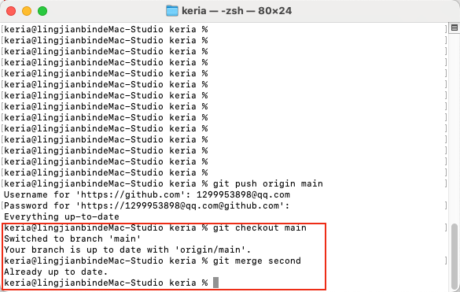
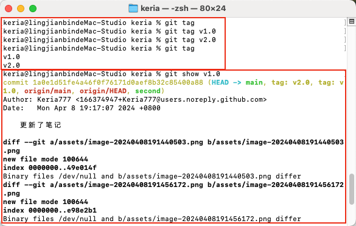
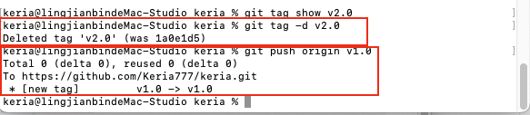
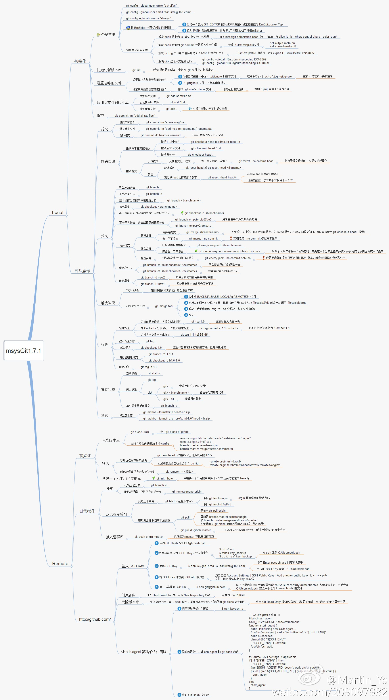

# 本地仓库操作

- 配置仓库

  ```
  git init  初始化仓库
  git clone [url]  克隆远程仓库
  git config --global user.name "keria"  设置用户的名字信息
  git config --global user.email "1299953898@qq.com"  设置用户邮箱信息
  git config --list  查看配置信息
  ```

- 提交代码

  代码从：工作区—>git add—>暂存区—>git commit—>版本库

  ```
  git status  查看文件状态
  ```

  git工作区的文件有两种状态：

  - Untracked 未跟踪（未被纳入版本控制）

  - tracked 已跟踪（被纳入版本控制）

    - 1. Unmodified 未修改状态

      2. Modified 已修改状态

      3. Staged 已暂存状态

         > [!NOTE]
         >
         > 文件的状态会随着执行的git命令发生变化

         如下图所示：
         
         
         
         
  
  ```
  git add *  将文件加入暂存区
  git add .  将文件加入暂存区（与git add *不同的是，git add .包含了隐藏文件或目录，通常版					 本控制实践中推荐使用‘git add .‘以避免忽略重要文件）
  ```
  
  - 忽略文件：
  
    - 概念：一些文件无需纳入`Git`管理，并且也不希望它们总出现在为跟踪文件列表
  
    - 实现：在仓库中新建名为`.gitignore`文件，并在此文件中配置
  
    - 文件`.gitignore`的格式规范如下
  
      - 所有空行或者以 `#` 开头的行都会被 Git 忽略。
      - 可以使用标准的 glob 模式（`shell`所使用的简化了的郑泽表达式）匹配，它会递归地应用在整个工作区中。
      - 匹配模式可以以（`/`）开头防止递归。
      - 匹配模式可以以（`/`）结尾指定目录。
      - 要忽略指定模式以外的文件或目录，可以在模式前加上叹号（`!`）取反。
  
      > - 正常情况下一个仓库可能只在跟目录下有一个`.gitignore`文件，它递归地应用到整个仓库中
      > - 然而，子目录下也可以有额外的`.gitignore`文件
      > - 子目录中的`.gitignore`文件中的规则只作用在它所在的目录中
  
  
  
  ```
  git reset  将文件从暂存区返回或切换到指定的版本
  git log  查看日志
  ```
  
  一般可以先通过git log查看日志，通过日志里的版本号，再git reset -hard 版本号回溯
  
  
  
  
  
  ```
  git commit -m "message"  将暂存区的文件提交到版本库
  ```


# 远程仓库操作

```
git remote  查看远程仓库
git remote -v  查看远程仓库详细信息
```



​		-v 是 --verbose 提供了“详细模式”，fetch抓取最新操作，push推送操作


```
git remote add  添加远程仓库
git clone  从远程仓库克隆
git pull  从远程仓库有拉取
git push  推送到远程仓库
```


# 分支操作

```
git branch	查看分支
git branch [name]	创建分支
git checkout [name]  切换分支
```



```
git push [shortName] [name]  推送至远程仓库分支
```



```
git merge [name]  合并分支
```



​		首先切换到main分支，再把second分支合并到main分支。

​		如果更改不冲突，则完成。如果存在冲突，会在有问题的文件中留下标记来显示冲突；

```
git diff  显示两个提交/文件/分支之间的差异
```


 # 标签操作

```
git tag  查看所有标签
git tag [tagName]  创建标签
git show [tagName]  查看指定标签信息
git tag -d [tagName]  删除标签
git push origin [tagName]  推送标签
```





# git备忘单

