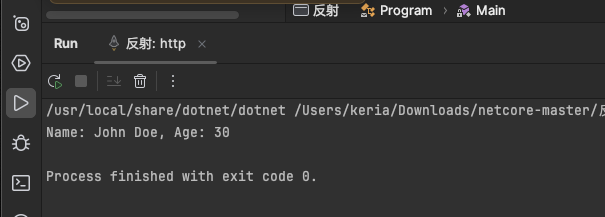

反射是一个非常强大的编程特性，它允许运行时检查类型的元数据、访问对象的属性、调用方法，以及创建和操作类型的实例。在 .NET 中，反射功能主要由 `System.Reflection` 命名空间提供，它是构建动态功能的关键技术之一。

### 反射的主要用途：

1. **动态类型信息**： 反射使得程序可以在运行时检索关于装载的程序集、模块和类型的详细信息。你可以通过反射获取任何类型的所有方法、字段、属性和事件等信息。
2. **动态实例创建**： 反射可以用来在运行时创建对象实例，即使你在编写代码时不知道对象类型。这常用于插件架构或者应用程序需要加载和使用来自外部程序集的类型。
3. **方法调用**： 反射提供了调用对象的方法的能力，即便这些方法在编写原始代码时并不可用。这可以应用在需要动态绑定方法的场合。
4. **访问和修改属性**： 反射可以用来读取或修改私有、保护或公共属性和字段的值，这通常在需要对对象的状态进行深入监控或修改时使用。
5. **自定义特性（Attributes）**： 反射可以读取附加在类、方法、属性等上的自定义特性，这在很多高级编程任务中，如 API 设计或测试框架中，都非常有用。

### 反射的示例代码

以下是一个简单的 C# 示例，展示如何使用反射来获取类型信息，创建对象，调用方法，以及访问字段和属性：

```
using System;
using System.Reflection;

public class Person
{
    public string Name { get; set; }
    private int Age { get; set; }

    public Person()
    {
        Name = "Unknown";
        Age = 0;
    }

    public void SetAge(int age)
    {
        Age = age;
    }

    public void DisplayInfo()
    {
        Console.WriteLine($"Name: {Name}, Age: {Age}");
    }
}

class Program
{
    static void Main()
    {
        // 使用反射获取类型信息
        Type personType = typeof(Person);

        // 创建 Person 类的实例
        object personInstance = Activator.CreateInstance(personType);

        // 获取并设置属性
        PropertyInfo nameProp = personType.GetProperty("Name");
        nameProp.SetValue(personInstance, "John Doe");

        // 调用方法
        MethodInfo setAgeMethod = personType.GetMethod("SetAge");
        setAgeMethod.Invoke(personInstance, new object[] { 30 });

        // 调用 DisplayInfo 方法显示信息
        MethodInfo displayInfoMethod = personType.GetMethod("DisplayInfo");
        displayInfoMethod.Invoke(personInstance, null);
    }
}
```

在这个例子中，`Person` 类有两个属性和一个显示信息的方法。程序通过反射创建了 `Person` 的一个实例，设置了其属性，并调用了它的方法。

输出结果：



### 反射的注意事项

虽然反射是一个非常强大的功能，它也带来了一些性能考虑。反射操作通常比直接代码执行要慢，因为它需要在运行时解析类型信息。此外，反射也可以绕过类型的访问级别，如访问私有字段，这可能会破坏封装性。因此，合理使用反射，避免在性能敏感的应用中过度依赖反射是非常重要的。

总之，反射提供了极大的灵活性，使得开发者可以编写更通用、更动态的代码，但这也需要在易用性和性能之间做出平衡。