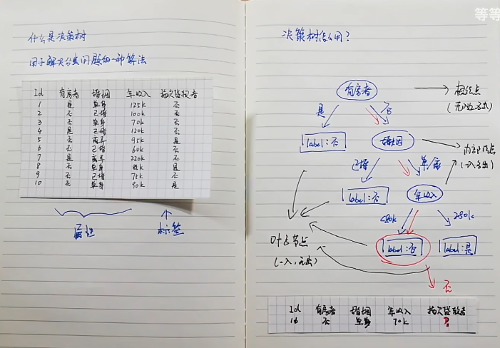
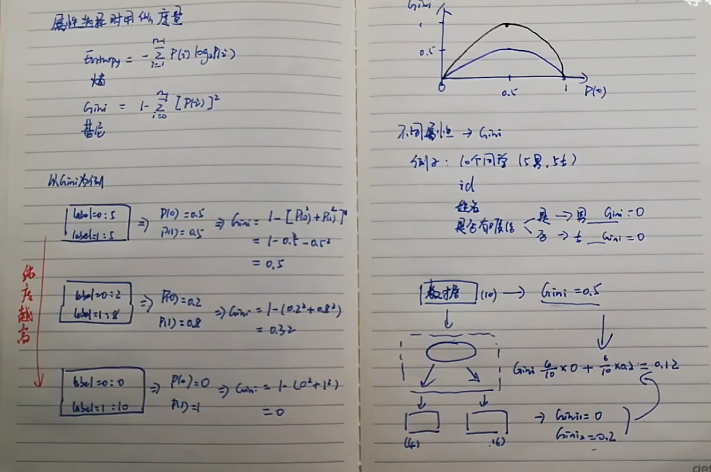
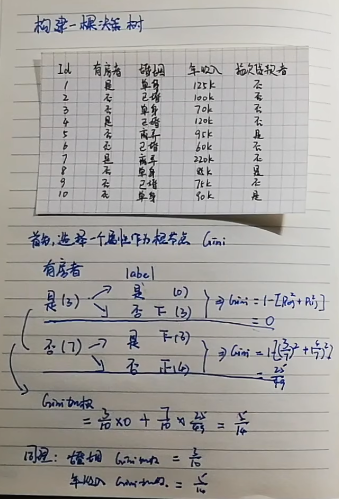
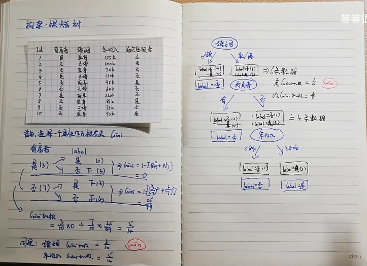

# 决策树（Decision Tree）

决策树是一种常用的**机器学习算法**，主要用于**分类和回归任务**。它通过模拟人类的决策过程，将数据一层一层地划分，最终形成一个类似“树”的结构：

- 每一个**内部节点**代表一个特征的判断；
- 每一个**叶子节点**代表一个决策结果或预测值。

---

## 属性选择用什么度量？

常见的度量标准包括：

- **熵（Entropy）**
- **基尼系数（Gini Index）**

> 熵或基尼系数越低，表示“纯度”越高。  
> 因此，在选择划分属性时，通常选择**使得熵或基尼系数最小**的属性进行划分。

---

## 基尼加权值示例

以下是一个基于样本特征（如有无房、婚姻、年收入）和标签（是否拖欠贷款）的基尼加权值计算示例：

- 属性包括：id、有房、婚姻、年收入
- 标签为：是否拖欠贷款者

最终结果：在“有无房”、“婚姻”、“年收入”三个属性中，**婚姻的基尼加权值最小**，因此可以选择“婚姻”作为**根节点**。

---

## 决策树的三种常见算法

| 算法 | 特点               | 划分依据                         |
| ---- | ------------------ | -------------------------------- |
| ID3  | 经典算法，较早提出 | **信息增益（Information Gain）** |
| C4.5 | ID3 的改进版本     | **信息增益比（Gain Ratio）**     |
| CART | 可用于分类和回归   | **基尼系数（Gini Index）**       |

---