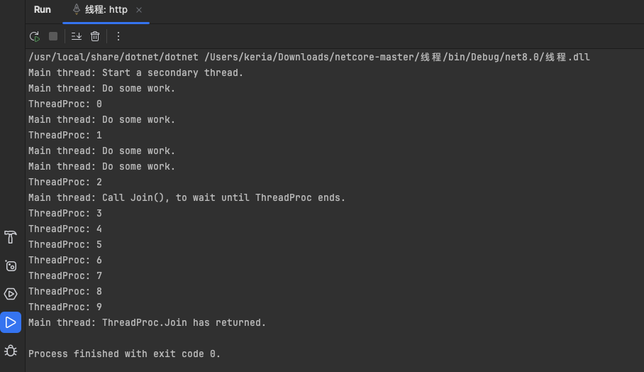

在计算机科学中，线程是操作系统能够进行运算调度的最小单位。它被包含在进程之中，是进程中的实际运行单位。线程自身基本上不拥有系统资源（如内存空间），只拥有一点在运行中必不可少的资源（如程序计数器、一组寄存器和栈），但它与同属一个进程的其他线程共享进程所拥有的全部资源。

### 线程的主要特点

**1. 轻量级的处理任务**： 线程的创建和销毁的成本远低于进程。线程间的切换不涉及整个进程上下文的切换，相比进程切换，资源消耗更少，开销更小。

**2. 资源共享**： 线程在同一个进程下执行，并共享相同的进程资源如内存空间和文件资源等。这使得线程间的通信更为简便，但也容易引发同步和数据一致性的问题。

**3. 独立调度和运行**： 尽管线程共享进程资源，但它们是被独立调度和执行的。每个线程有自己的执行路径。

**4. 并行执行**： 在多核处理器上，多线程可以实现真正的并行执行，提高应用程序的执行效率和响应速度。

### 线程的使用场景

**1. 异步处理**： 在进行I/O操作，如读写文件、网络通信等操作时，使用线程可以避免这些长时间操作阻塞主线程，提高应用程序的响应。

**2. 提高效率**： 在复杂的或需长时间计算的任务中，通过线程分担任务可以有效利用 CPU 资源，加快处理速度。

**3. 用户界面保持响应**： 在图形用户界面(GUI)应用程序中，可以将耗时的运算放在一个单独的线程中处理，避免界面冻结。

### 线程的管理与问题

在使用线程时，程序设计者需要处理几个关键问题，包括：

**1. 线程同步**： 为避免多个线程在访问资源时产生冲突，需要通过锁（如互斥锁）、信号量等同步工具来确保线程安全。

**2. 死锁**： 线程间的不当资源请求和锁定策略可能导致死锁，使得涉及的线程都无法向前执行。

**3. 线程的创建和销毁开销**： 虽然线程比进程轻，但不当的创建和销毁也可能消耗过多资源。在需要频繁创建和销毁线程的场景下，线程池是一个好的选择。

### 示例：C# 中的线程使用

下面是一个 C# 程序的示例，演示了如何创建和启动线程：

```
using System;
using System.Threading;

public class Program
{
    public static void ThreadProc()
    {
        for (int i = 0; i < 10; i++)
        {
            Console.WriteLine("ThreadProc: {0}", i);
            // 暂停一秒
            Thread.Sleep(1000);
        }
    }

    public static void Main()
    {
        Console.WriteLine("Main thread: Start a secondary thread.");
        // 创建一个线程
        Thread t = new Thread(new ThreadStart(ThreadProc));
        // 启动线程
        t.Start();

        for (int i = 0; i < 4; i++)
        {
            Console.WriteLine("Main thread: Do some work.");
            Thread.Sleep(500);
        }

        Console.WriteLine("Main thread: Call Join(), to wait until ThreadProc ends.");
        t.Join();
        Console.WriteLine("Main thread: ThreadProc.Join has returned.");
    }
}
```

在这个例子中，`ThreadProc` 是线程执行的代码，`Main` 方法中创建了一个线程来运行 `ThreadProc` 方法，并等待该线程结束。

输出结果：



总结来说，线程是实现多任务并行处理的有效方式，可以极大地提高程序的性能和响应速度。然而，正确地管理线程，特别是在涉及多线程共享资源的情况下，是一个挑战，需要仔细设计程序架构和处理同步问题。